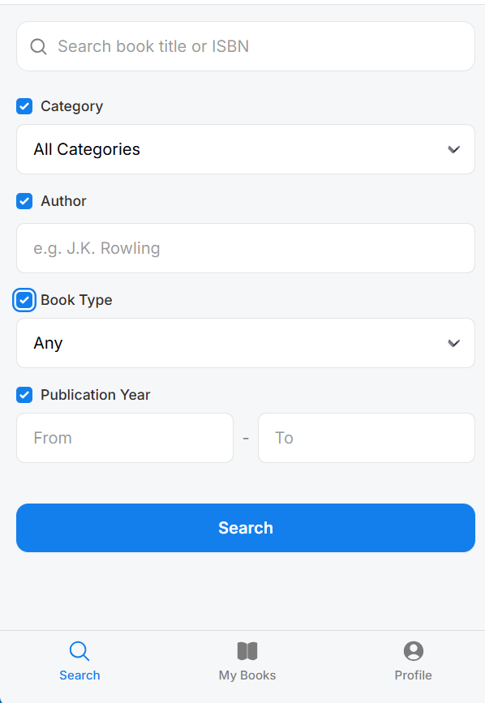
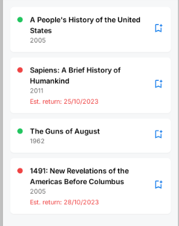

# User Stories für Schulbbiliothek Beispiel

## User Stories für Buchsuche, Reservierung

Möglichkeit über Mobile - App nach verfügbaren Bücher zu suchen und diese auch zu reservieren.

### User - Story: Buchsuche

Als Schüler möchte ich mit Hilfe der App, nach Büchern die in der Schulbibliothek verfügbar sind und die ich für den Unterricht benötige suchen und zu reservieren, damit ich sicher sein kann, ob das Buch in der Schulbibliothek existiert, verfügbar ist und ich durch die Reservierung sicher sein kann, dass ich dieses auch tatsächlich ausleihen kann.

#### Akzeptanzkriterien

- Über ein **Suchfeld** kann ich 
    - den **Buchtitel** eingeben
    - die **ISBN** des Buches eingeben
    - nach **Kategorien** suchen können (z.B. Design Patterns) - als DropDown Feld
    - nach einem bestimmten **Autor** suchen können
    - **Buchart** (z.B. Taschenbuch, Gebunden) - als DropDown Feld
    - nach **Erscheinungsjahr** - Bereichsangabe (von-bis)
- Über eine Checkbox können die Bereichskritierien Kategorie, Autor, Buchart und Erscheinungsjahr aktiviert/deaktiviert werden
- Bei Aktivierung mehrerer Suchkritierien werden diese mit einer logischen UND Verknüpfung bei der Suchanfrage hinzugefügt
- Ausgabe der Suchergebniss mit folgenden Inhalten als Liste:
    - Buchtitel
    - Erscheinungsdatum
    - **Verfügbarkeit** (Als grünes/rotes Ampel-Icon)
    - Wenn nicht verfügbar: Datum wann es wieder **voraussichtlich verfügbar** ist
  - Wird kein Buch mit den Suchkritieren gefunden, soll eine Meldung ausgegeben werden (z.B. `Keine Ergebenisse mit den angegebenen Suchkriterien gefunden`)
-  Es soll eine **unscharfe Suche** bei Buchtitel und Autor ermöglicht werden (Text in Sucheingabe muss nicht exakt übereinstimmen - Teiltext genügt (`%Teiltext%`)
-  Durch Klick auf ein Icon in der Zeile des Buches kann ich das Buch **reservieren**

### Mockups

generiert anhand definierter Userstory

#### Suche

#### Resultlist

