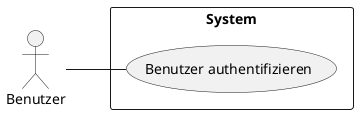
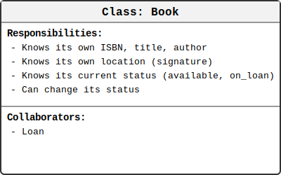
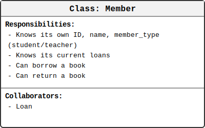
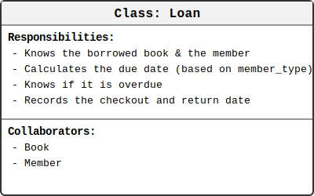
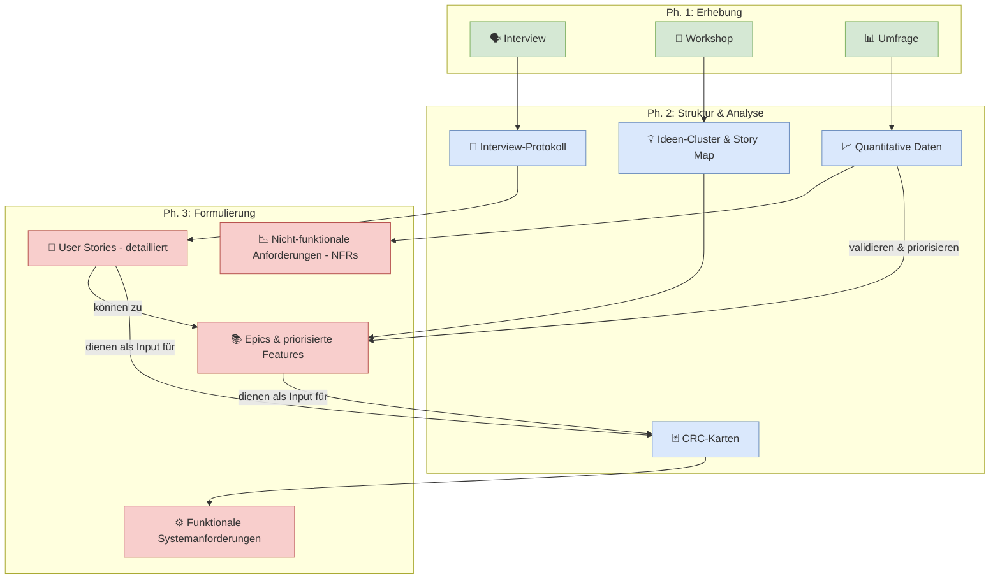
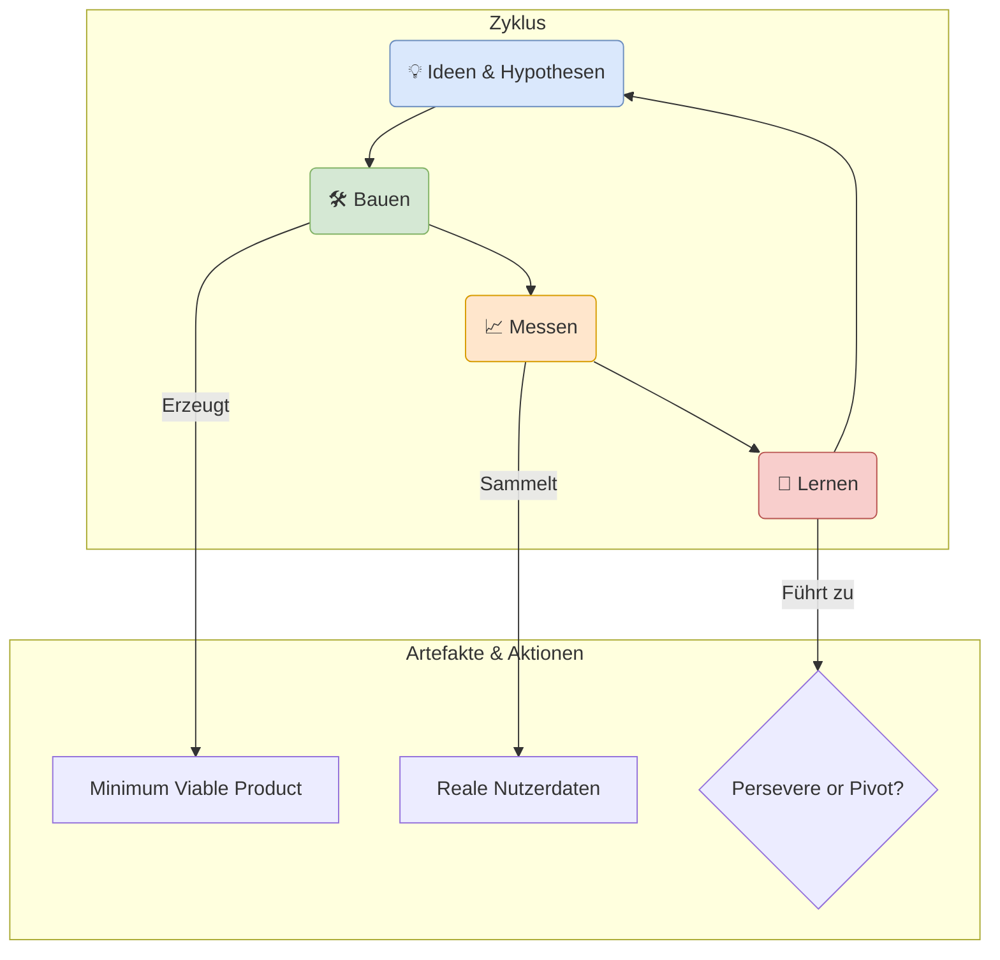
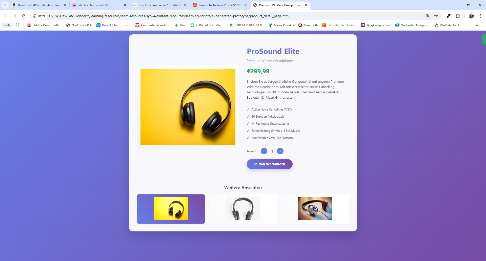
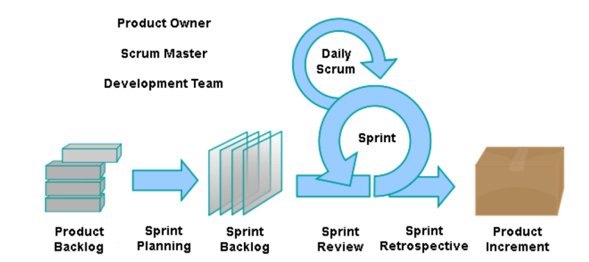
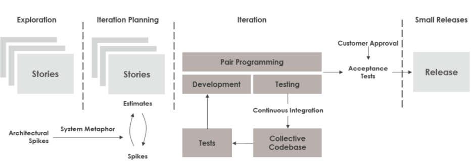
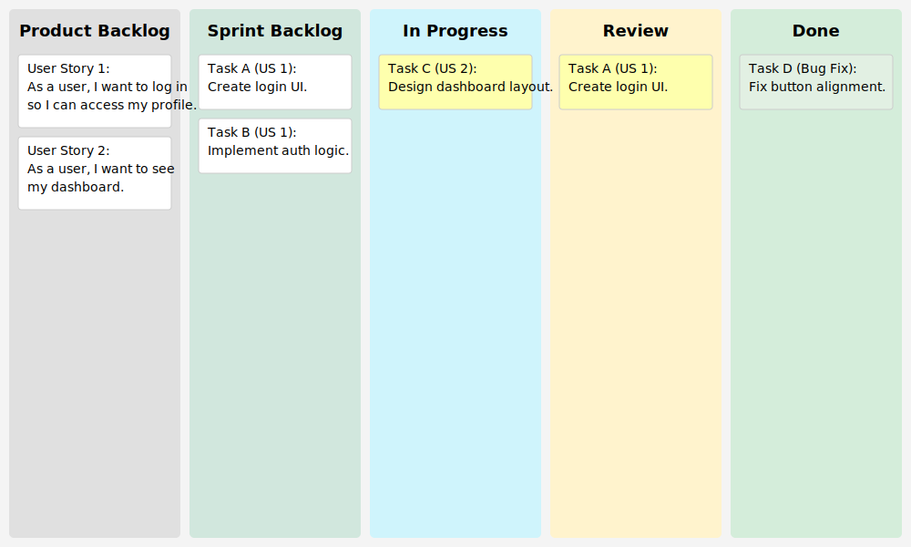

<h1> Projektmanagement und Systemkonzeption</h1>


<div style="width: 100%;">
    <div style="margin-left:1cm; margin-right:1.5cm; text-align: center;">
    <h2>Version History</h2>
    <table style="border solid 1px;width: 100%;">
    <th style="text-align:left">Version</th>
    <th>Änderungen</th>
    <th style="text-align:right">Autor</th>
     <tr>
    <td style="text-align:left">2025-10-05</td>
    <td style="text-align:left">Kapitel 3.2 in "Methoden der klassischen Anforderungserhebung und -beschreibung" umbenannt. <br><strong>Neues Kapitel 3.2.3.3.</strong> Dot-Voting (Punktabklebung) <br> <strong>Neues Kapitel 3.4</strong> "Anforderungsfindung im Startup-Kontext: Lean & MVP" eingefügt (<i>alle anschließenden Kapitel um ein nach hinten gerückt)</i></td>
    <td style="text-align:right">KUW</td>
    </tr>
     <tr>
    <td style="text-align:left">2025-10-04</td>
    <td style="text-align:left">Kapitel 3.2.1 (Erhebungstechniken) um CRC-Karten ergänzt.<br>Kapitel 3.3 (Von Erhebung zur Anforderungsbesdchreibung) eingefügt und nachfolgende Kapitel verschoben. </td>
    <td style="text-align:right">KUW</td>
    </tr>
     <tr>
    <td style="text-align:left">2025-09-17</td>
    <td style="text-align:left">Kapitel 3.2.2.2 UseCases (Anwendungsfälle) im Detail: <br>Use Case Diagramm hinzugefügt.</td>
    <td style="text-align:right">KUW</td>
    </tr>
    <tr>
    <td style="text-align:left">2025-09-04</td>
    <td style="text-align:left">Kapitelstruktur und Inhalte stark erweitert: 2.2 Historischer Kontext; 2.3 Vergleich traditionell vs. agil (Tabelle) und 2.4 Wahl der Methode inkl. Szenarien; 3.3 ausgearbeitet (Wireframes/Mockups, Usability & Barrierefreiheit, Prototyping), 3.4 Prozess der benutzerorientierten Konzeptentwicklung und 3.5 Tools/Dokumentationsstrategien ergänzt; 4.x erweitert (Scrum, Kanban, XP, Hybride Modelle, Sprint-Planung, Schätzung, Architektur-Einfluss); 5.x erweitert (Architekturmuster, Clean Architecture, API-Design inkl. API‑First und Best Practices).</td>
    <td style="text-align:right">KUW</td>
    </tr>
    <tr>
    <td style="text-align:left">2025-08-15</td>
    <td style="text-align:left">v1.3 – Kapitel 3.3 „Benutzerorientierte Konzeptentwicklung“ mit Unterkapiteln (Personas, Use Cases, Wireframes, Prototyping etc.) und Vergleich zwischen agil/statisch hinzugefügt.</td>
    <td style="text-align:right">KUW</td>
    </tr>
    <tr>
    <td style="text-align:left">2025-08-13</td>
    <td style="text-align:left">v1.2 – Glossar erweitert, detaillierte Beschreibung der Erhebungstechniken (Interview, Workshop, Fragebogen) ergänzt</td>
    <td style="text-align:right">KUW</td>
    </tr>
    <tr>
    <td style="text-align:left">2025-08-12</td>
    <td style="text-align:left">v1.1 – Kapitel 1–3 erstellt</td>
    <td style="text-align:right">KUW</td>
    </tr>
    <tr>
    <td style="text-align:left">2025-08-12</td>
    <td style="text-align:left">v1.0 – Initiale Erstellung</td>
    <td style="text-align:right">KUW</td>
    </tr>
    </table>
    </div>
</div>

<div style="page-break-after: always"></div>

<h2> Inhaltsverzeichnis</h2>

- [1. Einleitung und Gesamtüberblick](#1-einleitung-und-gesamtüberblick)
  - [1.1. Überblick und Zielsetzung in diesem Unterrichtsjahr](#11-überblick-und-zielsetzung-in-diesem-unterrichtsjahr)
- [2. Grundlagen und Theoretische Einführung](#2-grundlagen-und-theoretische-einführung)
  - [2.1. Definition zentraler Begriffe im Projekt- und Anforderungsmanagement](#21-definition-zentraler-begriffe-im-projekt--und-anforderungsmanagement)
  - [2.2. Historischer Kontext und Entwicklung der Methoden](#22-historischer-kontext-und-entwicklung-der-methoden)
  - [2.3. Vergleich verwandter Ansätze und Querverbindungen](#23-vergleich-verwandter-ansätze-und-querverbindungen)
  - [2.4. Wahl der richtigen Methode: Agil vs. Traditionell](#24-wahl-der-richtigen-methode-agil-vs-traditionell)
    - [2.4.1. Beispielszenarien](#241-beispielszenarien)
- [3. Requirementmanagement](#3-requirementmanagement)
  - [3.1. Einführung in das Requirementmanagement](#31-einführung-in-das-requirementmanagement)
  - [3.2. Methoden der Anforderungserhebung und -beschreibung](#32-methoden-der-anforderungserhebung-und--beschreibung)
    - [3.2.1. Wichtige Erhebungstechniken](#321-wichtige-erhebungstechniken)
    - [3.2.2. Wichtige Beschreibungstechniken](#322-wichtige-beschreibungstechniken)
    - [3.2.3. Techniken zur Priorisierung von Anforderungen](#323-techniken-zur-priorisierung-von-anforderungen)
  - [3.3. Von der Erhebung zur Anforderungsbeschreibung](#33-von-der-erhebung-zur-anforderungsbeschreibung)
    - [3.3.1. Der Transformationsprozess: Von Rohdaten zu Requirements](#331-der-transformationsprozess-von-rohdaten-zu-requirements)
    - [3.3.2. Vom Interview zur strukturierten Anforderung](#332-vom-interview-zur-strukturierten-anforderung)
    - [3.3.3. Vom Workshop zu User Stories und Epics](#333-vom-workshop-zu-user-stories-und-epics)
  - [3.3.4. Von der Umfrage zur quantitativen Anforderung](#334-von-der-umfrage-zur-quantitativen-anforderung)
  - [3.3.5. Von CRC-Karten zu Systemanforderungen](#335-von-crc-karten-zu-systemanforderungen)
    - [3.3.6. Zusammenfassung: Den richtigen Transformationspfad wählen](#336-zusammenfassung-den-richtigen-transformationspfad-wählen)
  - [3.4. Anforderungsfindung im Startup-Kontext: Lean \& MVP](#34-anforderungsfindung-im-startup-kontext-lean--mvp)
    - [3.4.1. Der "Build-Measure-Learn"-Zyklus](#341-der-build-measure-learn-zyklus)
    - [3.4.2. Vom Business Model Canvas zur testbaren Hypothese](#342-vom-business-model-canvas-zur-testbaren-hypothese)
    - [3.4.3. Methoden zur Hypothesen-Validierung: Vom Interview zum MVP](#343-methoden-zur-hypothesen-validierung-vom-interview-zum-mvp)
  - [3.5. Gestaltung der Benutzererfahrung (User Experience Design)](#35-gestaltung-der-benutzererfahrung-user-experience-design)
    - [3.5.1. Vom Plan zum Bild: Wireframes \& Mockups](#351-vom-plan-zum-bild-wireframes--mockups)
    - [3.5.2. Die Kunst der Einfachheit: Usability \& Barrierefreiheit](#352-die-kunst-der-einfachheit-usability--barrierefreiheit)
    - [3.5.3. Bauen, Testen, Lernen: Modernes Prototyping](#353-bauen-testen-lernen-modernes-prototyping)
  - [3.6. Der Prozess der benutzerorientierten Konzeptentwicklung](#36-der-prozess-der-benutzerorientierten-konzeptentwicklung)
    - [3.6.1. Einordnung in Vorgehensmodelle](#361-einordnung-in-vorgehensmodelle)
  - [3.7. Tools und Dokumentationsstrategien](#37-tools-und-dokumentationsstrategien)
    - [3.7.1. Werkzeuge (Tools)](#371-werkzeuge-tools)
    - [3.7.2. Dokumentationsstrategien](#372-dokumentationsstrategien)
- [4. Kapitel: Projektmanagement-Methoden erweitern](#4-kapitel-projektmanagement-methoden-erweitern)
  - [4.1. Agile Methoden (Scrum, Kanban, XP Programming)](#41-agile-methoden-scrum-kanban-xp-programming)
    - [4.1.1. Scrum: Das Framework für komplexe Produkte](#411-scrum-das-framework-für-komplexe-produkte)
    - [4.1.2. Kanban: Der Weg zur kontinuierlichen Verbesserung](#412-kanban-der-weg-zur-kontinuierlichen-verbesserung)
    - [4.1.3. Extreme Programming (XP): Technische Exzellenz im Alltag](#413-extreme-programming-xp-technische-exzellenz-im-alltag)
  - [4.2. Hybride Modelle](#42-hybride-modelle)
    - [4.2.1. Der Scrum-Fall: Agilität im strukturierten Rahmen](#421-der-scrum-fall-agilität-im-strukturierten-rahmen)
    - [4.2.2. Das Scrumban-Modell: Die Brücke zwischen Scrum und Kanban](#422-das-scrumban-modell-die-brücke-zwischen-scrum-und-kanban)
    - [4.2.3. Scrum + XP: Engineering-Praktiken im Scrum-Framework](#423-scrum--xp-engineering-praktiken-im-scrum-framework)
  - [4.3. Planung von Iterationen und Sprints](#43-planung-von-iterationen-und-sprints)
    - [4.3.1. Der Ablauf des Sprint Plannings](#431-der-ablauf-des-sprint-plannings)
    - [4.3.2. Schätzung des Aufwands: Story Points und Planning Poker](#432-schätzung-des-aufwands-story-points-und-planning-poker)
    - [4.3.3. Der Einfluss der Systemarchitektur auf die Sprint-Planung](#433-der-einfluss-der-systemarchitektur-auf-die-sprint-planung)
    - [4.3.4. Hybride Einflüsse auf das Sprint Planning (Kanban + XP)](#434-hybride-einflüsse-auf-das-sprint-planning-kanban--xp)
- [5. Kapitel: Software Architektur und Entwurf](#5-kapitel-software-architektur-und-entwurf)
  - [5.1. Technische Architekturmuster im Überblick](#51-technische-architekturmuster-im-überblick)
    - [5.1.1. Der Einfluss der Projektmethode auf die Architektur](#511-der-einfluss-der-projektmethode-auf-die-architektur)
    - [5.1.2. Architekturmuster im Kontext der Projektmethodik](#512-architekturmuster-im-kontext-der-projektmethodik)
    - [5.1.3. Fazit](#513-fazit)
  - [5.2. Ausgewählte SW-Architekturen im Detail](#52-ausgewählte-sw-architekturen-im-detail)
    - [5.2.1. Die Clean Architecture](#521-die-clean-architecture)
  - [5.3. Systementwurf und API-Design: Vom Architektur-Blueprint zur iterativen Umsetzung](#53-systementwurf-und-api-design-vom-architektur-blueprint-zur-iterativen-umsetzung)
    - [5.3.1. Die Rolle des API-Designs im agilen Prozess](#531-die-rolle-des-api-designs-im-agilen-prozess)
    - [5.3.2. API-First-Ansatz: Die Schnittstelle als Vertrag](#532-api-first-ansatz-die-schnittstelle-als-vertrag)
    - [5.3.3. Praktisches Beispiel: Evolution einer API mit der Clean Architecture](#533-praktisches-beispiel-evolution-einer-api-mit-der-clean-architecture)
    - [5.3.4. Prinzipien guten API-Designs: Unsere Web-API unter der Lupe](#534-prinzipien-guten-api-designs-unsere-web-api-unter-der-lupe)
- [6. Kapitel: Testen und Qualitätssicherung](#6-kapitel-testen-und-qualitätssicherung)
  - [6.1. Grundlagen des Softwaretestens: Die Testpyramide](#61-grundlagen-des-softwaretestens-die-testpyramide)
    - [6.1.1. Unit-Tests (Komponententests)](#611-unit-tests-komponententests)
    - [6.1.2. Integrationstests](#612-integrationstests)
    - [6.1.3. Systemtests (End-to-End-Tests)](#613-systemtests-end-to-end-tests)
- [7. Kapitel: Integration in das Semesterprojekt](#7-kapitel-integration-in-das-semesterprojekt)
- [8. Zusammenfassung und Ausblick](#8-zusammenfassung-und-ausblick)
- [9. Glossar](#9-glossar)
- [10. Anhang](#10-anhang)

<div style="page-break-after: always;"></div>

# 1. Einleitung und Gesamtüberblick

## 1.1. Überblick und Zielsetzung in diesem Unterrichtsjahr

Willkommen im neuen Schuljahr! In diesem Fach werden wir uns intensiv mit den Kernkompetenzen des **Projektmanagements** und der **Systemkonzeption** beschäftigen. Unser Hauptziel ist es, Sie zu befähigen, überschaubare Projekte im Bereich der Software- und Systementwicklung systematisch zu planen, umzusetzen und erfolgreich abzuschließen.

Stellen Sie sich vor, Sie bauen ein komplexes Modell, z. B. ein detailreiches LEGO-Set. Sie würden nicht einfach anfangen, Steine zufällig aufeinanderzusetzen. Stattdessen folgen Sie einer Anleitung, arbeiten sich Schritt für Schritt vor und prüfen regelmäßig, ob alles passt. Genau das tun wir auch im Projektmanagement: Wir folgen einem Plan, um ein digitales Produkt – sei es eine Software, eine App oder ein ganzes IT-System – zu entwickeln.

**Die zentralen Themen dieses Jahres umfassen:**

- **Requirementmanagement:** Wie finden wir heraus, was ein Kunde wirklich will? Wir lernen, Anforderungen präzise zu erheben und zu beschreiben.
- **Projektmanagement:** Wie planen und steuern wir ein Projekt? Wir behandeln Methoden zur Planung von Teilzielen, zum Management von Tests und zur Reaktion auf Änderungen.
- **Systemkonzeption:** Wie entwerfen wir robuste und sichere Systeme? Wir beschäftigen uns mit aktuellen Technologien, Prozessmodellen und der Qualitätssicherung.

Am Ende dieses Jahres sollen Sie in der Lage sein, für ein überschaubares Softwareprojekt die Anforderungen zu analysieren, ein benutzerorientiertes Konzept zu entwickeln, die Umsetzung zu planen, den Fortschritt zu validieren und das Ergebnis sauber zu dokumentieren.

> <span style="font-size: 1.5em">:bulb:</span> **Merksatz:** Gutes Projektmanagement ist wie eine detaillierte Landkarte. Sie zeigt uns nicht nur das Ziel, sondern auch den besten Weg dorthin, inklusive möglicher Hindernisse und Alternativrouten.

<div style="page-break-after: always;"></div>

# 2. Grundlagen und Theoretische Einführung

## 2.1. Definition zentraler Begriffe im Projekt- und Anforderungsmanagement

Um erfolgreich über Projektmanagement und Systemkonzeption sprechen zu können, müssen wir zunächst eine gemeinsame Sprache finden. Stellen Sie sich vor, Sie kochen ein Gericht nach einem neuen Rezept. Begriffe wie "sautieren", "blanchieren" oder "julienne" müssen klar sein, damit das Ergebnis gelingt. In der Softwareentwicklung ist es genauso.

Hier sind die wichtigsten Grundbegriffe, die uns durch das gesamte Jahr begleiten werden:

- **Projekt:** Ein zeitlich begrenztes Vorhaben mit einem definierten Anfang und Ende, das ein einmaliges Produkt, eine Dienstleistung oder ein Ergebnis erzeugt. Ein Projekt hat spezifische Ziele, ein festes Budget und begrenzte Ressourcen.
  - *Beispiel:* Die Entwicklung einer neuen App für die Schulbibliothek bis zum Ende des Semesters.

- **Anforderung (Requirement):** Eine Bedingung oder Fähigkeit, die von einem System oder einer Systemkomponente erfüllt werden muss, um einen Vertrag, einen Standard, eine Spezifikation oder andere formell auferlegte Dokumente zu erfüllen. Man unterscheidet hauptsächlich zwischen:
  - **Funktionale Anforderungen:** Beschreiben, **was** das System tun soll (z.B. "Der Benutzer muss sich mit E-Mail und Passwort anmelden können.").
  - **Nicht-funktionale Anforderungen:** Beschreiben, **wie** das System etwas tun soll (z.B. "Die Anmeldung muss in weniger als 2 Sekunden erfolgen.").

- **Stakeholder:** Jede Person, Gruppe oder Organisation, die von den Aktivitäten oder dem Ergebnis eines Projekts betroffen ist, es beeinflussen kann oder ein Interesse daran hat.
  - *Beispiel:* Auftraggeber, Endbenutzer, Entwickler, Projektmanager, aber auch der Betriebsrat oder die Schulleitung.

- **Requirement-Engineering:** Ein systematischer Prozess zur Ermittlung, Dokumentation, Validierung und Verwaltung von Anforderungen für ein System. Es ist die Brücke zwischen den Wünschen der Stakeholder und der technischen Umsetzung.

- **Projektmanagement:** Die Anwendung von Wissen, Fähigkeiten, Werkzeugen und Techniken auf Projektaktivitäten, um die Projektanforderungen zu erfüllen. Es umfasst die Planung, Steuerung, Überwachung und den Abschluss von Projekten.

> <span style="font-size: 1.5em">:mag:</span> **Vertiefung:** Der Begriff **Requirement-Management** ist ein Teilbereich des **Requirement-Engineerings**. Während sich das Engineering auf den gesamten Prozess von der Erhebung bis zur Validierung konzentriert, fokussiert sich das Management speziell auf die Verwaltung, Priorisierung und Nachverfolgung der Anforderungen über den gesamten Projektlebenszyklus.

Diese Begriffe bilden das Fundament für alles Weitere. Es ist entscheidend, sie zu verstehen und korrekt zu verwenden.

## 2.2. Historischer Kontext und Entwicklung der Methoden

Die Methoden des Projektmanagements sind nicht über Nacht entstanden. Sie sind das Ergebnis einer langen Entwicklung, die Hand in Hand mit der industriellen und technologischen Revolution ging.

Stellen Sie sich den Bau der Pyramiden vor. Auch das war ein gigantisches Projekt, das Planung, Koordination von Arbeitskräften und Ressourcenmanagement erforderte, auch wenn die Methoden damals noch nicht formalisiert waren.

Die moderne Geschichte des Projektmanagements beginnt jedoch im 20. Jahrhundert:

- **Frühes 20. Jahrhundert:** Pioniere wie **Henry Gantt** entwickeln erste Werkzeuge zur Visualisierung von Projektfortschritten. Das nach ihm benannte **Gantt-Diagramm** ist bis heute ein Standardwerkzeug zur Darstellung von Zeitplänen.

- **Mitte des 20. Jahrhunderts (Kalter Krieg):** Große Militär- und Raumfahrtprojekte (z.B. das Polaris-Raketenprogramm der US Navy) treiben die Entwicklung voran. Methoden wie **PERT** (Program Evaluation and Review Technique) und die **Critical Path Method (CPM)** entstehen, um komplexe, voneinander abhängige Aufgaben zu planen und zu steuern.

- **Die "Softwarekrise" der 1960er und 70er Jahre:** Mit der zunehmenden Komplexität von Software stießen Entwickler an ihre Grenzen. Projekte waren oft verspätet, überschritten das Budget oder scheiterten komplett. Als Reaktion darauf entstand das **Wasserfallmodell**, ein streng sequenzieller Ansatz, bei dem eine Phase nach der anderen abgeschlossen wird (Analyse -> Design -> Implementierung -> Test).

- **Die agile Revolution (ab den 1990ern):** Man erkannte, dass das starre Wasserfallmodell für die dynamische Welt der Softwareentwicklung oft zu unflexibel ist. Als Antwort darauf wurden agile Methoden entwickelt. Das **Agile Manifest** (2001) formulierte die zentralen Werte:
  - **Individuen und Interaktionen** mehr als Prozesse und Werkzeuge
  - **Funktionierende Software** mehr als umfassende Dokumentation
  - **Zusammenarbeit mit dem Kunden** mehr als Vertragsverhandlung
  - **Reagieren auf Veränderung** mehr als das Befolgen eines Plans

  Bekannte agile Frameworks sind **Scrum** und **Kanban**.

> <span style="font-size: 1.5em">:bulb:</span> **Merksatz:** Die Entwicklung des Projektmanagements ist eine Reise von starren, plan-getriebenen Modellen (wie dem Wasserfallmodell) hin zu flexiblen, iterativen Ansätzen (wie Scrum), die besser auf die Unvorhersehbarkeit moderner Projekte reagieren können.

Diese historische Perspektive hilft uns zu verstehen, warum es heute so viele verschiedene Methoden gibt und welche für welches Problem am besten geeignet ist.

## 2.3. Vergleich verwandter Ansätze und Querverbindungen

Nachdem wir die historische Entwicklung betrachtet haben, ist es wichtig, die beiden großen Philosophien im modernen Projektmanagement direkt zu vergleichen: **traditionelle (plan-getriebene) Ansätze** wie das Wasserfallmodell und **agile (veränderungs-getriebenen) Ansätze** wie Scrum.

Stellen Sie es sich wie den Bau eines Hauses vor:
- **Traditionell (Wasserfall):** Sie erstellen einen detaillierten Bauplan, bevor der erste Spatenstich erfolgt. Jede Wand, jedes Fenster und jede Steckdose ist exakt vorgeplant. Änderungen während des Baus sind extrem teuer und kompliziert.
- **Agil (Scrum):** Sie bauen das Haus Raum für Raum. Nach jedem fertiggestellten Raum ziehen Sie mit dem Bauherrn ein, holen Feedback ein und passen den Plan für den nächsten Raum an. Vielleicht stellt sich heraus, dass eine größere Küche wichtiger ist als ein formelles Esszimmer.

Hier ist ein direkter Vergleich der wichtigsten Merkmale:

| Merkmal | Traditionelles Modell (z.B. Wasserfall) | Agiles Modell (z.B. Scrum) |
| :--- | :--- | :--- |
| **Planung** | Detaillierte Vorausplanung des gesamten Projekts | Grobe Vision am Anfang, detaillierte Planung in kurzen Zyklen (Sprints) |
| **Anforderungen** | Werden zu Beginn vollständig definiert und "eingefroren" | Sind dynamisch und können sich während des Projekts ändern |
| **Prozess** | Sequenziell: Eine Phase muss abgeschlossen sein, bevor die nächste beginnt | Iterativ & Inkrementell: Das Produkt wird in kleinen, funktionsfähigen Teilen entwickelt |
| **Dokumentation** | Umfassend und ein zentraler Bestandteil des Prozesses | Fokussiert auf das Nötigste; funktionierende Software ist wichtiger |
| **Kunden-Einbindung**| Hauptsächlich am Anfang (Anforderungen) und am Ende (Abnahme) | Kontinuierliche Zusammenarbeit und regelmäßiges Feedback |
| **Umgang mit Änderungen**| Änderungen sind schwierig und teuer; werden möglichst vermieden | Änderungen sind willkommen und ein integraler Bestandteil des Prozesses |
| **Ideal für...** |  Projekte mit sehr stabilen, vorab definierten Anforderungen (z.B. die Firmware für einen Herzschrittmacher) | Projekte, bei denen sich die Anforderungen wahrscheinlich ändern werden (z.B. die Entwicklung einer neuen Social-Media-App) |

> <span style="font-size: 1.5em">:warning:</span> **Achtung:** Kein Ansatz ist per se "besser" als der andere. Die Wahl der richtigen Methode hängt immer vom Projekt, dem Team, dem Kunden und dem Umfeld ab. In der Praxis existieren oft auch **hybride Modelle**, die Elemente aus beiden Welten kombinieren (z.B. [water-scrum-fall-model](https://www.online-projektmanagement.info/agiles-projektmanagement-scrum-methode/scrum-versus-wasserfallmodell/water-scrum-fall/)])

Dieses Verständnis der grundlegenden Unterschiede ist entscheidend, um im Laufe des Jahres die verschiedenen Techniken und Werkzeuge korrekt einordnen zu können.

## 2.4. Wahl der richtigen Methode: Agil vs. Traditionell

Wie wir in Kapitel 2.3 gesehen haben, gibt es keinen "besten" Ansatz für alle Projekte. Die Entscheidung zwischen einem traditionellen, plan-getriebenen Vorgehen (wie dem Wasserfallmodell) und einem agilen, veränderungs-getriebenen Ansatz (wie Scrum) ist eine der wichtigsten Weichenstellungen zu Beginn eines Projekts. Die falsche Wahl kann zu Frustration, Verzögerungen und im schlimmsten Fall zum Scheitern des Projekts führen.

Stellen Sie sich vor, Sie planen eine Reise. Wenn das Ziel ein bekanntes, gut erreichbares All-Inclusive-Resort ist, können Sie die gesamte Reise von Flug über Hotel bis zu den Ausflügen im Voraus exakt durchplanen (traditioneller Ansatz). Wenn Sie jedoch mit einem Rucksack durch ein unbekanntes Land reisen, planen Sie vielleicht nur die erste Unterkunft und entscheiden dann spontan und flexibel, wohin es als Nächstes geht (agiler Ansatz).

Um die richtige Entscheidung für Ihr Projekt zu treffen, sollten Sie die folgenden Schlüsselfaktoren bewerten:

| Faktor | Traditionell (Wasserfall) ist besser geeignet, wenn... | Agil (Scrum) ist besser geeignet, wenn... |
| :--- | :--- | :--- |
| **Anforderungen** | ...die Anforderungen von Anfang an klar, detailliert und stabil sind. Änderungen sind unwahrscheinlich oder müssen streng kontrolliert werden. | ...die Anforderungen zu Beginn unklar sind, sich wahrscheinlich ändern werden oder erst im Laufe des Projekts entdeckt werden. |
| **Kunde & Stakeholder** | ...der Kunde eine detaillierte Planung und einen festen Preis zu Beginn wünscht und nur zu definierten Meilensteinen verfügbar ist. | ...der Kunde bereit und in der Lage ist, kontinuierlich und eng mit dem Entwicklungsteam zusammenzuarbeiten und regelmäßig Feedback zu geben. |
| **Projektumfeld** | ...das Umfeld stabil und vorhersehbar ist. Es gibt wenige externe Abhängigkeiten oder technologische Unsicherheiten. | ...das Projekt in einem dynamischen, sich schnell ändernden Markt stattfindet oder neue, unerprobte Technologien verwendet werden. |
| **Team & Kultur** | ...das Team an klare Hierarchien und detaillierte Arbeitsanweisungen gewöhnt ist. Die Rollen sind klar getrennt. | ...das Team selbstorganisiert, interdisziplinär und entscheidungsfreudig ist. Eine offene Kommunikations- und Fehlerkultur wird gelebt. |
| **Risikomanagement** | ...das Hauptrisiko in der Nichteinhaltung des initialen Plans (Zeit, Budget, Umfang) liegt. Das Ziel ist Planerfüllung. | ...das Hauptrisiko darin besteht, am Ende ein Produkt zu liefern, das der Markt nicht will. Das Ziel ist die Maximierung des Kundenwerts. |

> <span style="font-size: 1.5em">:bulb:</span> **Merksatz:** Die Faustregel lautet: Je **unklarer** das Ziel und je **dynamischer** das Umfeld, desto eher eignet sich ein **agiler** Ansatz. Je **klarer** das Ziel und je **stabiler** das Umfeld, desto eher kann ein **traditioneller** Ansatz erfolgreich sein.

In der realen Welt sind die Grenzen oft fließend. Viele Organisationen nutzen daher **hybride Modelle**, die versuchen, das Beste aus beiden Welten zu vereinen – zum Beispiel eine grobe, traditionelle Rahmenplanung für das Gesamtprojekt, aber eine agile Umsetzung der einzelnen Arbeitspakete.

### 2.4.1. Beispielszenarien

Um die Theorie greifbarer zu machen, betrachten wir drei typische Softwareentwicklungsprojekte und analysieren, welcher Ansatz am besten passt.


#### Szenario 1: Firmware für ein medizinisches Gerät (z.B. ein Blutzuckermessgerät)

*   **Projektbeschreibung:** Ein Unternehmen entwickelt eine neue Generation von Blutzuckermessgeräten. Die Software (Firmware) auf dem Gerät muss absolut zuverlässig und fehlerfrei funktionieren. Die Anforderungen sind durch medizinische Standards und gesetzliche Vorschriften (z.B. MPG - Medizinproduktegesetz) streng vorgegeben.

*   **Analyse der Faktoren:**
    *   **Anforderungen:** Extrem stabil und von Anfang an im Detail bekannt. Änderungen sind nach der Zulassung kaum noch möglich.
    *   **Kunde & Stakeholder:** Die "Kunden" sind Regulierungsbehörden und Patienten. Die Anforderungen sind nicht verhandelbar.
    *   **Projektumfeld:** Sehr stabil, aber hoch reguliert. Sicherheit und Nachweisbarkeit sind wichtiger als Geschwindigkeit.
    *   **Risikomanagement:** Das größte Risiko ist ein Softwarefehler, der zu einer falschen Messung und damit zu einer Gesundheitsgefährdung des Patienten führen könnte. Jeder Entwicklungsschritt muss lückenlos dokumentiert und getestet werden.

*   **Empfohlene Methode: Traditionelles Vorgehen (Wasserfallmodell)**
    *   **Begründung:** Ein sequenzieller Prozess mit klaren Phasen (Analyse, Design, Implementierung, rigorose Tests, Dokumentation) ist hier unerlässlich. Die strengen, unveränderlichen Anforderungen und der Fokus auf Sicherheit und lückenlose Dokumentation machen das Wasserfallmodell zur idealen Wahl. Agilität wäre hier kontraproduktiv und würde die notwendigen Zulassungsprozesse erschweren.

---

#### Szenario 2: Entwicklung einer neuen Social-Media-App für eine junge Zielgruppe

*   **Projektbeschreibung:** Ein Startup möchte eine innovative App entwickeln, die Funktionen von TikTok und Instagram kombiniert, um eine Nische im Markt zu besetzen. Zu Beginn gibt es nur eine grobe Idee, aber kein klares Bild von den finalen Features. Der Erfolg hängt davon ab, wie schnell die App auf Trends und Nutzerfeedback reagieren kann.

*   **Analyse der Faktoren:**
    *   **Anforderungen:** Sehr unklar und dynamisch. Welche Features bei der Zielgruppe ankommen, muss erst durch Ausprobieren herausgefunden werden.
    *   **Kunde & Stakeholder:** Die zukünftigen Nutzer sind die wichtigsten Stakeholder. Ihr Feedback ist entscheidend für die Weiterentwicklung.
    *   **Projektumfeld:** Extrem dynamisch und wettbewerbsintensiv. Geschwindigkeit ("Time-to-Market") ist ein kritischer Erfolgsfaktor.
    *   **Risikomanagement:** Das größte Risiko ist, eine App zu entwickeln, die niemand nutzt. Das Ziel ist, so schnell wie möglich ein "Minimum Viable Product" (MVP) zu veröffentlichen, um echtes Nutzerfeedback zu sammeln und das Produkt darauf basierend anzupassen.

*   **Empfohlene Methode: Agiles Vorgehen (Scrum)**
    *   **Begründung:** Scrum ist für dieses Szenario perfekt geeignet. Kurze Sprints (z.B. 2 Wochen) ermöglichen es, schnell neue Funktionen zu entwickeln und zu veröffentlichen. Das Team kann auf Basis von Nutzerdaten und direktem Feedback lernen und den Kurs kontinuierlich anpassen. Die Flexibilität von Scrum erlaubt es, auf neue Trends zu reagieren und den Produktwert für den Nutzer zu maximieren.

---

#### Szenario 3: Digitalisierung eines bestehenden Geschäftsprozesses in einem Großkonzern

*   **Projektbeschreibung:** Ein etabliertes Versicherungsunternehmen möchte seinen papierbasierten Prozess zur Schadensmeldung durch eine moderne Web-Anwendung ersetzen. Der grundlegende Prozess (Schaden melden, Gutachter beauftragen, Auszahlung freigeben) ist klar definiert und muss sich in die bestehende IT-Landschaft (z.B. Kundendatenbank, Buchhaltungssystem) integrieren. Gleichzeitig soll die neue Anwendung aber benutzerfreundlicher und moderner sein als die alten Systeme.

*   **Analyse der Faktoren:**
    *   **Anforderungen:** Der Kernprozess ist stabil und klar, aber die Details der Benutzeroberfläche und die genauen Features für die Sachbearbeiter sind noch offen für Verbesserungen.
    *   **Kunde & Stakeholder:** Es gibt klare Vorgaben von der Fachabteilung und dem Management (Rahmenbedingungen, Budget), aber die Endanwender (Sachbearbeiter) sollen aktiv in die Gestaltung der Oberfläche einbezogen werden.
    *   **Projektumfeld:** Es gibt feste Rahmenbedingungen (Gesetze, IT-Sicherheitsvorgaben, Integration in Altsysteme), aber auch den Wunsch nach Innovation und verbesserter User Experience.
    *   **Risikomanagement:** Ein Risiko ist die Nichteinhaltung des Budgets und des Zeitplans. Ein anderes Risiko ist, eine Lösung zu bauen, die von den Mitarbeitern nicht akzeptiert wird.

*   **Empfohlene Methode: Hybrides Vorgehen (z.B. Water-Scrum-Fall)**
    *   **Begründung:** Ein hybrider Ansatz kombiniert das Beste aus beiden Welten.
        *   **Wasserfall (vorne):** Eine initiale Phase zur Grobplanung, Budgetierung und Analyse der technischen Rahmenbedingungen und Schnittstellen zu Altsystemen. Dies gibt dem Management die benötigte Planungssicherheit.
        *   **Scrum (in der Mitte):** Die eigentliche Entwicklung der Web-Anwendung erfolgt in agilen Sprints. Das Team kann so iterativ die beste Benutzeroberfläche entwerfen, Prototypen mit den Sachbearbeitern testen und flexibel auf Feedback reagieren.
        *   **Wasserfall (hinten):** Die finale Integration in die Gesamt-IT-Landschaft, die Abnahmetests und die unternehmensweite Einführung folgen wieder einem strukturierten, plan-getriebenen Prozess.


<div style="page-break-after: always;"></div>

# 3. Requirementmanagement

## 3.1. Einführung in das Requirementmanagement

Das Requirementmanagement ist das Fundament jedes erfolgreichen Projekts. Wenn wir nicht genau wissen, **was** wir bauen sollen, ist die Wahrscheinlichkeit hoch, dass wir am Ende etwas liefern, das niemand braucht oder will.

Stellen Sie sich vor, Sie bestellen in einem Restaurant ein "gutes Essen". Der Kellner könnte Ihnen ein perfekt zubereitetes Steak bringen, obwohl Sie eigentlich Lust auf eine vegetarische Lasagne hatten. Das Steak mag objektiv gut sein, aber es erfüllt Ihre (unausgesprochene) Anforderung nicht. Requirementmanagement sorgt dafür, dass wir die Bestellung des Kunden von Anfang an richtig aufnehmen.

**Die Hauptziele des Requirementmanagements sind:**

1.  **Verständnis schaffen:** Sicherstellen, dass alle Stakeholder (Kunde, Entwickler, Manager) das gleiche Verständnis davon haben, was das System leisten soll.
2.  **Grundlage für die Planung legen:** Anforderungen sind die Basis für Aufwandsschätzungen, Zeitpläne und die Zuweisung von Ressourcen. Ohne klare Anforderungen ist eine realistische Planung unmöglich.
3.  **Fehlentwicklungen vermeiden:** Die Kosten für die Behebung eines Fehlers steigen exponentiell, je später er im Entwicklungsprozess gefunden wird. Ein Fehler in der Anforderungsphase, der erst nach der Auslieferung bemerkt wird, kann hundertmal teurer sein als seine sofortige Korrektur.
4.  **Veränderungen kontrollieren:** Anforderungen ändern sich. Das Requirementmanagement bietet einen strukturierten Prozess, um Änderungen zu bewerten, zu genehmigen und zu kommunizieren, ohne das Projekt ins Chaos zu stürzen.

> <span style="font-size: 1.5em">:bulb:</span> **Merksatz:** Requirementmanagement ist der Prozess, sicherzustellen, dass das richtige System mit den richtigen Funktionen für die richtigen Leute gebaut wird.

Wie bereits in Kapitel 2.1 erwähnt, ist das **Requirementmanagement** ein Teilbereich des **Requirement-Engineerings**. Das Engineering umfasst den gesamten Prozess von der ersten Idee bis zur finalen Abnahme der Anforderung, während sich das Management auf die kontinuierliche Verwaltung, Priorisierung und Nachverfolgung dieser Anforderungen konzentriert.

## 3.2. Methoden der Anforderungserhebung und -beschreibung

Jetzt wird es praktisch. Wie kommen wir an die Anforderungen? Es reicht selten aus, den Kunden einfach zu fragen: "Was willst du?" Oft wissen die Stakeholder selbst nicht im Detail, was möglich ist oder was sie genau benötigen. Unsere Aufgabe ist es, wie ein Detektiv die wahren Bedürfnisse zu ermitteln.

Stellen Sie sich vor, Sie sollen ein "besseres Klassenzimmer" gestalten. Sie würden nicht nur den Lehrer fragen. Sie würden Schüler beobachten, den Hausmeister interviewen, vielleicht sogar eine Umfrage machen. Genau das tun wir hier auch, nur mit anderen Techniken.

Man unterscheidet grob zwischen **Erhebungstechniken** (Wie komme ich an die Information?) und **Beschreibungstechniken** (Wie halte ich die Information fest?).

### 3.2.1. Wichtige Erhebungstechniken

-   **Interview:** Das direkte Gespräch mit einem Stakeholder. Es ist ideal, um tiefes Wissen von Einzelpersonen zu erhalten.
    -   *Vorteil:* Flexibel, ermöglicht Nachfragen.
    -   *Nachteil:* Zeitaufwendig, die Meinung eines Einzelnen kann subjektiv sein.

-   **Workshop:** Ein moderiertes Treffen mit einer Gruppe von Stakeholdern. Ziel ist es, gemeinsam Anforderungen zu erarbeiten und Konflikte zu lösen.
    -   *Vorteil:* Effizient, fördert Konsens und Kreativität.
    -   *Nachteil:* Benötigt gute Moderation, kann durch dominante Teilnehmer verzerrt werden.

-   **Fragebogen/Umfrage:** Eine standardisierte Sammlung von Fragen, die an eine große Anzahl von Personen verteilt wird.
    -   *Vorteil:* Erreicht viele Personen, gut für quantitative Daten (z.B. "Wie oft nutzen Sie Funktion X?").
    -   *Nachteil:* Keine Flexibilität für Nachfragen, die Qualität hängt stark von den Fragen ab.

-   **Beobachtung (Feldbeobachtung):** Der Analyst beobachtet den Benutzer direkt in seiner Arbeitsumgebung, um zu verstehen, wie er aktuell arbeitet.
    -   *Vorteil:* Deckt unausgesprochene, selbstverständliche Arbeitsschritte auf.
    -   *Nachteil:* Anwesenheit des Beobachters kann das Verhalten der Benutzer beeinflussen.

-   **CRC-Karten (Class-Responsibility-Collaboration):** Eine kollaborative Technik zur Modellierung von Systemkomponenten und deren Verantwortlichkeiten durch physische Karten.
    -   *Vorteil:* Fördert Teamarbeit und gemeinsames Verständnis, flexibel und schnell anpassbar.
    -   *Nachteil:* Kann bei komplexen Systemen unübersichtlich werden, erfordert Erfahrung in der Moderation.

#### 3.2.1.1. Das Interview im Detail

Das Interview ist eine der fundamentalsten Techniken zur Anforderungserhebung. Es handelt sich um ein direktes, interaktives Gespräch zwischen einem Anforderungsanalysten und einem Stakeholder mit dem Ziel, Wissen, Meinungen und Wünsche zu ermitteln.

**Ziel und Zweck:**
Das Hauptziel besteht darin, tiefgehendes und spezifisches Wissen zu erlangen, das in Dokumenten oft nicht zu finden ist. Interviews eignen sich besonders gut, um:
-   Komplexe Sachverhalte und Prozesse zu verstehen.
-   Implizites Wissen (selbstverständliche Annahmen) aufzudecken.
-   Die genauen Bedürfnisse, Probleme und Prioritäten eines Stakeholders zu klären.
-   Eine vertrauensvolle Beziehung zum Gesprächspartner aufzubauen.

**Arten von Interviews:**
Je nach Grad der Vorstrukturierung unterscheidet man drei Hauptformen:

2.  **Unstrukturiertes (offenes) Interview:** Es gibt nur ein grobes Thema oder eine offene Einstiegsfrage (z.B. "Erzählen Sie mir von Ihrem Arbeitsalltag."). Das Gespräch entwickelt sich frei und eignet sich gut für die Erkundung eines neuen Themenfelds.
3.  **Semi-strukturiertes Interview:** Dies ist die häufigste und flexibelste Form im Requirement-Engineering. Der Interviewer nutzt einen Leitfaden mit offenen Fragen, kann aber die Reihenfolge anpassen, spontan nachhaken und auf interessante Punkte des Gesprächspartners eingehen.

**Ablauf (Phasen eines Interviews):**

-   **Vorbereitung:**
    -   **Zielsetzung:** Was soll nach dem Interview bekannt sein?
    -   **Recherche:** Informationen über den Stakeholder und sein Umfeld sammeln.
    -   **Leitfaden erstellen:** Offene W-Fragen (Was, Wie, Warum, Wozu?) formulieren, die zum Erzählen anregen.
    -   **Organisation:** Termin, Ort und Dauer festlegen und klären, ob eine Aufzeichnung (z.B. Audio) erlaubt ist.

-   **Durchführung:**
    -   **Eröffnung:** Vorstellung, Ziel des Gesprächs erläutern, Vertrauen schaffen.
    -   **Hauptteil:** Den Leitfaden flexibel nutzen, aktiv zuhören, Notizen machen und gezielt nachfragen.
    -   **Abschluss:** Die wichtigsten Punkte zusammenfassen, sich für die Zeit bedanken und die nächsten Schritte erläutern (z.B. Zusendung des Protokolls).

-   **Nachbereitung:**
    -   **Protokoll erstellen:** Die Notizen unmittelbar nach dem Gespräch ausarbeiten und strukturieren.
    -   **Validierung:** Das Protokoll dem Stakeholder zur Überprüfung und Freigabe zusenden.
    -   **Analyse:** Die gewonnenen Informationen auswerten und als Anforderungen formulieren.

> <span style="font-size: 1.5em">:bulb:</span> **Tipp:** Aktives Zuhören ist die wichtigste Fähigkeit bei einem Interview. Das bedeutet nicht nur zu hören, was gesagt wird, sondern auch zu versuchen, die Perspektive des anderen wirklich zu verstehen und durch gezielte Rückfragen (z.B. "Habe ich richtig verstanden, dass...") sicherzustellen, dass keine Missverständnisse entstehen.

#### 3.2.1.2. Der Workshop im Detail

Stellen Sie sich vor, statt einzeln mit jedem Handwerker (Elektriker, Installateur, Maler) zu sprechen, um ein Zimmer zu renovieren, holen Sie alle an einen Tisch, um den Plan gemeinsam zu entwerfen. Genau das ist ein Workshop: ein kollaboratives Meeting, um schnell zu einem gemeinsamen, abgestimmten Ergebnis zu kommen.

Ein Workshop ist ein strukturiertes, moderiertes Arbeitstreffen, bei dem eine Gruppe von ausgewählten Stakeholdern zusammenkommt, um in kurzer Zeit ein gemeinsames, vordefiniertes Ziel zu erreichen. Im Requirement-Engineering ist dieses Ziel oft die gemeinsame Erarbeitung, Diskussion, Priorisierung und Validierung von Anforderungen.

**Ziel und Zweck:**
-   **Effizienz:** Statt vieler zeitaufwendiger Einzelinterviews werden Informationen von mehreren Personen gleichzeitig gesammelt und konsolidiert.
-   **Konsensbildung:** Unterschiedliche Sichtweisen und Interessen treffen direkt aufeinander. Widersprüche und Konflikte können sofort erkannt und im Idealfall gelöst werden.
-   **Kreativität und Qualität:** Die Gruppendynamik fördert neue Ideen (Synergieeffekt) und führt oft zu qualitativ hochwertigeren Anforderungen, da sie sofort aus verschiedenen Perspektiven beleuchtet und verfeinert werden.
-   **Commitment:** Teilnehmer, die Anforderungen gemeinsam erarbeitet haben, fühlen sich eher dafür verantwortlich und unterstützen das Projekt stärker ("Shared Ownership").

**Wichtige Rollen:**
-   **Moderator:** Eine neutrale Person, die für den Prozess, die Einhaltung der Zeit und die konstruktive Gesprächsführung verantwortlich ist. Der Moderator steuert die Diskussion, aber nicht den Inhalt.
-   **Teilnehmer:** Sorgfältig ausgewählte Repräsentanten der verschiedenen Stakeholder-Gruppen (z.B. Endanwender, Fachabteilungen, Management, IT-Experten, Tester).
-   **Protokollant:** Hält die Ergebnisse, Entscheidungen und offenen Punkte sichtbar für alle (z.B. auf einem Whiteboard oder Flipchart) fest. Diese Rolle kann vom Moderator mitübernommen werden, ist aber bei größeren Gruppen oft separat.

**Ablauf (Phasen eines Workshops):**
-   **Vorbereitung:**
    -   **Zieldefinition:** Was ist das konkrete, messbare Ergebnis des Workshops? (z.B. "Die Top 5 User Stories für das Kunden-Login sind priorisiert und ausformuliert.")
    -   **Teilnehmerauswahl:** Wer muss dabei sein, um das Ziel zu erreichen? Die Gruppe sollte nicht zu groß sein (ideal: 5-9 Personen).
    -   **Agenda und Methoden:** Einen detaillierten Zeitplan und die passenden Kreativitäts- oder Moderationstechniken auswählen (z.B. Brainstorming, Kartenabfrage, Mind-Mapping).
    -   **Organisation:** Raum, Material (Whiteboard, Stifte, Karten, Beamer) und Einladung mit Agenda vorbereiten.

-   **Durchführung:**
    -   **Eröffnung:** Begrüßung, Vorstellung, Erklärung von Ziel, Agenda und "Spielregeln" (z.B. "Jeder kommt zu Wort", "Handys sind lautlos").
    -   **Arbeitsphase:** Die eigentliche Erarbeitung der Inhalte unter Anleitung des Moderators.
    -   **Abschluss:** Ergebnisse zusammenfassen, Maßnahmen und Verantwortlichkeiten festlegen ("Wer macht was bis wann?"), Feedback zum Workshop einholen.

-   **Nachbereitung:**
    -   **Dokumentation:** Das Protokoll und die Ergebnisse (z.B. Fotos vom Whiteboard) zeitnah aufbereiten und an alle Teilnehmer verteilen.
    -   **Umsetzung:** Sicherstellen, dass die beschlossenen Maßnahmen weiterverfolgt und die erarbeiteten Anforderungen in das Requirement-Management-System überführt werden.

> <span style="font-size: 1.5em">:warning:</span> **Achtung:** Ein Workshop ist nur so gut wie seine Vorbereitung und Moderation. Ohne klares Ziel und eine starke, neutrale Führung kann ein Workshop schnell zu einer unproduktiven "Quasselrunde" werden oder von dominanten Einzelpersonen gekapert werden.

#### 3.2.1.3. Der Fragebogen/Umfrage im Detail

Stellen Sie sich vor, Sie möchten die Meinung aller Schülerinnen und Schüler Ihrer Schule zu einem neuen Mensa-Angebot einholen. Einzelne Interviews oder Workshops wären viel zu aufwendig. Hier kommt der Fragebogen ins Spiel: ein Werkzeug, um schnell und standardisiert Daten von einer großen Gruppe zu sammeln.

Ein Fragebogen (oder eine Umfrage) ist eine systematische Zusammenstellung von Fragen, die einer definierten Personengruppe vorgelegt wird, um quantitative oder qualitative Daten zu einem bestimmten Thema zu erheben.

**Ziel und Zweck:**
-   **Breite Datenerfassung:** Effiziente Sammlung von Informationen von einer großen Anzahl von Personen.
-   **Quantitative Analyse:** Eignet sich hervorragend, um messbare Daten zu erhalten (z.B. "Wie viele Nutzer bewerten Funktion X als 'sehr wichtig'?"). Statistische Auswertungen werden möglich.
-   **Standardisierung:** Da alle Teilnehmer dieselben Fragen erhalten, sind die Antworten gut vergleichbar.
-   **Anonymität:** Kann anonym durchgeführt werden, was zu ehrlicheren Antworten bei sensiblen Themen führen kann.

**Arten von Fragen:**
Die Qualität eines Fragebogens hängt entscheidend von der Formulierung und Art der Fragen ab:

1.  **Geschlossene Fragen:** Geben Antwortmöglichkeiten vor.
    -   *Beispiel:* "Wie zufrieden sind Sie mit der App-Geschwindigkeit? ( ) Sehr zufrieden ( ) Zufrieden ( ) Neutral ( ) Unzufrieden ( ) Sehr unzufrieden"
    -   *Vorteil:* Leicht auszuwerten.
    -   *Nachteil:* Schränken den Antwortspielraum ein.

2.  **Offene Fragen:** Erlauben eine freie Antwort in eigenen Worten.
    -   *Beispiel:* "Welche Funktionen vermissen Sie in der aktuellen Software am meisten?"
    -   *Vorteil:* Ermöglichen unerwartete, detaillierte Einblicke.
    -   *Nachteil:* Aufwendig in der Auswertung.

3.  **Skalenfragen (Rating-Skalen):** Dienen der Bewertung von Merkmalen auf einer Skala (z.B. von 1 bis 5).
    -   *Beispiel:* "Bitte bewerten Sie die Benutzerfreundlichkeit auf einer Skala von 1 (sehr schlecht) bis 5 (sehr gut)."

**Ablauf (Phasen einer Umfrage):**
-   **Vorbereitung:**
    -   **Zieldefinition:** Welche konkreten Informationen sollen gewonnen werden?
    -   **Zielgruppendefinition:** Wer genau soll befragt werden?
    -   **Fragenentwicklung:** Fragen klar, verständlich und eindeutig formulieren. Suggestivfragen vermeiden.
    -   **Pre-Test:** Den Fragebogen mit einer kleinen Testgruppe prüfen, um Unklarheiten und Probleme zu identifizieren.

-   **Durchführung:**
    -   **Verteilung:** Den Fragebogen über geeignete Kanäle (E-Mail, Online-Tool, Papier) an die Zielgruppe verteilen.
    -   **Datensammlung:** Den Rücklauf der Antworten abwarten und überwachen.

-   **Nachbereitung:**
    -   **Datenauswertung:** Die Antworten (insbesondere bei geschlossenen Fragen) statistisch auswerten. Offene Fragen müssen kategorisiert und zusammengefasst werden.
    -   **Interpretation und Dokumentation:** Die Ergebnisse interpretieren, visualisieren (z.B. in Diagrammen) und die daraus abgeleiteten Anforderungen formulieren.

> <span style="font-size: 1.5em">:bulb:</span> **Merksatz:** Ein guter Fragebogen ist wie ein präzises Messinstrument. Er liefert nur dann verlässliche Daten, wenn die Fragen sorgfältig "geeicht" (formuliert und getestet) wurden. Eine Mischung aus geschlossenen Fragen für die Statistik und einigen offenen Fragen für unerwartete Einblicke ist oft am effektivsten.

#### 3.2.1.4. CRC-Karten im Detail

Stellen Sie sich vor, Sie planen ein Theaterstück und möchten die Rollen und deren Beziehungen zueinander verstehen. Jeder Schauspieler bekommt eine Karte mit seinem Charakter, seinen Aufgaben im Stück und mit wem er interagiert. Genau so funktionieren CRC-Karten: Sie helfen dabei, die "Akteure" eines Systems und ihre Zusammenarbeit zu verstehen.

CRC-Karten (Class-Responsibility-Collaboration) sind eine kollaborative Technik zur Modellierung und zum besseren Verständnis von Systemkomponenten. Ursprünglich für die objektorientierte Programmierung entwickelt, eignen sie sich hervorragend zur Anforderungserhebung, da sie dabei helfen, die verschiedenen Teile eines Systems und deren Verantwortlichkeiten zu identifizieren.

**Ziel und Zweck:**
-   **Gemeinsames Verständnis:** Alle Stakeholder entwickeln ein einheitliches Bild davon, aus welchen Komponenten das System besteht und wie diese zusammenarbeiten.
-   **Verantwortlichkeiten klären:** Jede Systemkomponente bekommt klar definierte Aufgaben, wodurch Überschneidungen und Lücken vermieden werden.
-   **Kollaborative Entwicklung:** Das physische Arbeiten mit Karten fördert die aktive Teilnahme aller Beteiligten und macht abstrakte Konzepte greifbar.
-   **Iterative Verfeinerung:** Das System kann schrittweise entwickelt und verfeinert werden, ohne dass komplexe Diagramme neu gezeichnet werden müssen.

**Aufbau einer CRC-Karte:**
Jede CRC-Karte ist in drei Bereiche unterteilt:

1.  **Class (Klasse/Komponente):** Der Name der Systemkomponente (z.B. "Benutzer", "Bestellsystem", "Datenbank").
2.  **Responsibilities (Verantwortlichkeiten):** Was sind die Hauptaufgaben dieser Komponente? (z.B. "Benutzer authentifizieren", "Bestellungen verwalten", "Daten speichern").
3.  **Collaborations (Kollaborationen):** Mit welchen anderen Komponenten arbeitet diese zusammen? (z.B. "kommuniziert mit Datenbank", "nutzt Zahlungssystem").

**Beispiel einer CRC-Karte:**


**Ablauf einer CRC-Karten-Session:**
-   **Vorbereitung:**
    -   **Teilnehmer:** Stakeholder aus verschiedenen Bereichen (Fachexperten, Entwickler, Tester, Product Owner).
    -   **Material:** Leere Karteikarten (physisch oder digital), Stifte, große Arbeitsfläche.
    -   **Szenario:** Ein konkreter Anwendungsfall oder Geschäftsprozess als Ausgangspunkt.

-   **Durchführung:**
    -   **Brainstorming:** Sammlung aller wichtigen Systemkomponenten durch die Gruppe.
    -   **Karten erstellen:** Für jede Komponente wird eine CRC-Karte erstellt und initial befüllt.
    -   **Walkthrough:** Das Team "spielt" einen Anwendungsfall durch, indem es die Karten bewegt und die Interaktionen zwischen den Komponenten nachvollzieht.
    -   **Verfeinerung:** Während des Walkthroughs werden Verantwortlichkeiten präzisiert, neue Kollaborationen entdeckt oder überflüssige Komponenten entfernt.
    -   **Validierung:** Das Team überprüft, ob alle wichtigen Anwendungsfälle durch die erstellten Karten abgedeckt sind.

-   **Nachbereitung:**
    -   **Dokumentation:** Die finalen CRC-Karten werden fotografiert oder digital erfasst.
    -   **Ableitung von Anforderungen:** Aus den Karten werden konkrete funktionale Anforderungen, User Stories oder Use Cases abgeleitet.
    -   **Architektur-Input:** Die Karten dienen als Grundlage für die technische Systemarchitektur.

**Vorteile:**
-   **Physische Interaktion:** Das Bewegen echter Karten macht abstrakte Konzepte greifbar und fördert das Engagement.
-   **Gleichberechtigung:** Alle Teilnehmer können aktiv beitragen, da keine speziellen technischen Kenntnisse für das Erstellen von Karten erforderlich sind.
-   **Flexibilität:** Änderungen sind schnell und einfach möglich – eine neue Karte schreiben oder eine Verantwortlichkeit hinzufügen dauert Sekunden.
-   **Ganzheitlicher Blick:** Das System wird als Ganzes betrachtet, nicht nur einzelne Funktionen.

**Herausforderungen:**
-   **Skalierbarkeit:** Bei sehr komplexen Systemen mit vielen Komponenten kann die Technik unübersichtlich werden.
-   **Abstraktion:** Die richtige Abstraktionsebene zu finden (nicht zu detailliert, aber auch nicht zu oberflächlich) erfordert Erfahrung.
-   **Moderation:** Eine erfahrene, neutrale Moderation ist entscheidend, um produktive Sessions zu gewährleisten.

> <span style="font-size: 1.5em">:gear:</span> **Praxis-Tipp:** CRC-Karten eignen sich besonders gut in der frühen Projektphase, um ein gemeinsames Systemverständnis zu entwickeln. Sie können auch als "Aufwärmübung" vor technischeren Workshops eingesetzt werden, um alle Teilnehmer auf den gleichen Wissensstand zu bringen.

### 3.2.2. Wichtige Beschreibungstechniken

Einmal erhoben, müssen Anforderungen klar und unmissverständlich dokumentiert werden.

-   **User Stories (Agile Welt):** Eine kurze, einfache Beschreibung einer Funktion aus der Sicht des Nutzers. Das Format ist meist:
    `Als <Rolle> möchte ich <Ziel/Wunsch>, um <Nutzen> zu erreichen.`
    -   *Beispiel:* "Als Schüler möchte ich meine Hausaufgaben online einsehen können, um zu wissen, was ich bis wann erledigen muss."

-   **Use Cases (Traditionelle Welt):** Beschreiben die Interaktion zwischen einem Akteur (Benutzer oder ein anderes System) und dem System, um ein bestimmtes Ziel zu erreichen. Sie sind oft detaillierter als User Stories und werden häufig mit Diagrammen (UML Use-Case-Diagramm) visualisiert.
    -   *Beispiel:* Ein Use Case könnte den gesamten Prozess "Hausaufgabe abgeben" beschreiben, inklusive aller Schritte und möglicher Fehlerfälle (z.B. "Datei zu groß").

-   **Lastenheft und Pflichtenheft:**
    -   **Lastenheft ("Was"):** Der Auftraggeber beschreibt die Gesamtheit der Anforderungen an das zu entwickelnde System aus seiner Sicht.
    -   **Pflichtenheft ("Wie"):** Der Auftragnehmer (das Entwicklungsteam) antwortet auf das Lastenheft und beschreibt, wie er die Anforderungen technisch umsetzen wird.

> <span style="font-size: 1.5em">:mag:</span> **Vertiefung:** Die Wahl der Technik hängt vom Projekt ab. In agilen Projekten wie mit Scrum sind **User Stories** und häufige **Workshops** sehr beliebt. In großen, traditionellen Projekten sind **Interviews** und die Erstellung eines detaillierten **Pflichtenhefts** oft Standard.

#### 3.2.2.1. User Stories im Detail

Stellen Sie sich vor, Sie beschreiben einem Freund eine Filmidee. Sie würden nicht mit technischen Details zur Kameraführung beginnen, sondern mit der Geschichte aus der Sicht der Hauptfigur: "Ein junger Held *möchte* den Schatz finden, *um* sein Dorf zu retten." Genau das ist die Essenz einer User Story: eine Anforderung aus der Perspektive desjenigen zu erzählen, der sie hat.

Eine User Story ist eine kurze, einfache Beschreibung einer Funktionalität, formuliert in der Alltagssprache des Anwenders oder Kunden. Sie ist das zentrale Artefakt zur Anforderungsbeschreibung in agilen Frameworks wie Scrum.

**Ziel und Zweck:**
-   **Fokus auf den Nutzerwert:** User Stories zwingen uns, darüber nachzudenken, *warum* eine Funktion entwickelt wird und welchen Nutzen sie dem Anwender bringt.
-   **Förderung der Kommunikation:** Eine User Story ist keine vollständige Spezifikation, sondern eine "Einladung zur Konversation". Sie dient als Grundlage für Gespräche zwischen Entwicklern, Product Owner und Stakeholdern, um die Details zu klären.
-   **Planungs- und Schätzungsgrundlage:** Kleine, verständliche User Stories lassen sich gut im Team schätzen (z.B. mit Story Points) und für die Planung von Sprints oder Iterationen verwenden.
-   **Flexibilität:** Sie sind bewusst kurz und einfach gehalten, um schnell auf Änderungen reagieren zu können, ohne seitenlange Dokumente anpassen zu müssen.

**Struktur und Bestandteile (Die 3 "C"s):**
Eine gute User Story folgt dem 3-C-Modell von Ron Jeffries:

1.  **Card (Karte):** Die Anforderung wird auf eine Karte (oder ein virtuelles Ticket, z.B. in Jira) geschrieben. Sie folgt meist dem Format:
    `Als <Rolle> möchte ich <Ziel/Wunsch>, um <Nutzen> zu erreichen.`
    -   **Rolle:** Wer ist der Nutzer? (z.B. "Als registrierter Kunde...")
    -   **Ziel/Wunsch:** Was will der Nutzer tun? (z.B. "...möchte ich meinen Bestellstatus einsehen...")
    -   **Nutzen:** Warum will er das? (z.B. "...um zu wissen, wann mein Paket ankommt.")

2.  **Conversation (Konversation):** Die Details hinter der Story werden in Gesprächen zwischen dem Entwicklungsteam und dem Product Owner geklärt. Hier werden Fragen gestellt, Annahmen hinterfragt und Missverständnisse ausgeräumt.

3.  **Confirmation (Bestätigung):** Die **Akzeptanzkriterien** definieren, wann eine User Story als "fertig" gilt. Sie sind die Checkliste, anhand derer die Story getestet wird.
    -   *Beispiel für Akzeptanzkriterien:*
        -   *Gegeben sei, ich bin als Kunde angemeldet und auf der "Meine Bestellungen"-Seite.*
        -   *Wenn ich auf eine Bestellung klicke,*
        -   *Dann sehe ich den Status (z.B. "In Bearbeitung", "Versandt", "Zugestellt").*
        -   *Dann sehe ich das voraussichtliche Lieferdatum.*

> <span style="font-size: 1.5em">:bulb:</span> **Merksatz (INVEST):** Gute User Stories erfüllen die INVEST-Kriterien. Sie sind:
> - **I**ndependent (Unabhängig von anderen Stories)
> - **N**egotiable (Verhandelbar, nicht in Stein gemeißelt)
> - **V**aluable (Wertvoll für den Nutzer oder Kunden)
> - **E**stimable (Schätzbar im Aufwand)
> - **S**mall (Klein genug, um in einer Iteration umsetzbar zu sein)
> - **T**estable (Testbar, d.h. es gibt klare Akzeptanzkriterien)

#### 3.2.2.2. Use Cases (Anwendungsfälle) im Detail

Wenn eine User Story die kurze, prägnante Erzählung einer Filmidee ist, dann ist ein Use Case das detaillierte Drehbuch für eine bestimmte Szene. Er beschreibt Schritt für Schritt, was passiert, wer was sagt und was bei unerwarteten Wendungen geschieht.

Ein Use Case (deutsch: Anwendungsfall) beschreibt die Interaktion zwischen einem Akteur und dem System, um ein bestimmtes, wertschöpfendes Ziel zu erreichen. Er fokussiert auf das "Was" (die funktionale Anforderung) aus einer externen Perspektive und modelliert einen vollständigen Ablauf.

**Ziel und Zweck:**
-   **Detaillierte Prozessbeschreibung:** Use Cases erfassen den gesamten Ablauf einer Interaktion, einschließlich des Standardablaufs (Happy Path) und aller möglichen Alternativen und Fehlerfälle.
-   **Klarheit über Systemgrenzen:** Sie helfen zu definieren, was Teil des Systems ist und was außerhalb liegt (Akteure).
-   **Grundlage für Testfälle:** Aus den detaillierten Schritt-für-Schritt-Beschreibungen lassen sich sehr gut systematische Testfälle ableiten.
-   **Strukturierte Dokumentation:** Sie bieten eine standardisierte und formale Methode, um funktionale Anforderungen zu dokumentieren, was besonders in komplexen oder sicherheitskritischen Projekten wichtig ist.

**Bestandteile eines Use Cases (Textuelle Beschreibung):**
Ein Use Case wird oft durch ein UML-Diagramm visualisiert, aber seine wahre Stärke liegt in der textuellen Ausformulierung. Typische Elemente sind:
-   **Name:** Ein kurzer, prägnanter Name im Aktiv-Stil (z.B. "Benutzer authentifizieren").
-   **Akteur(e):** Wer oder was interagiert mit dem System? (z.B. Kunde, Kassensystem).
-   **Vorbedingung:** Welcher Zustand muss erfüllt sein, damit der Use Case starten kann? (z.B. "Der Benutzer befindet sich auf der Login-Seite.").
-   **Nachbedingung:** Welcher Zustand ist nach erfolgreichem Abschluss erreicht? (z.B. "Der Benutzer ist eingeloggt und befindet sich auf seiner Startseite.").
-   **Standardablauf (Happy Path):** Die Schritt-für-Schritt-Beschreibung des idealen, fehlerfreien Ablaufs.
    1.  Der Benutzer gibt seine E-Mail-Adresse und sein Passwort ein.
    2.  Der Benutzer klickt auf den "Login"-Button.
    3.  Das System validiert die Anmeldedaten.
    4.  Das System leitet den Benutzer auf seine persönliche Startseite weiter.
-   **Alternative Abläufe und Fehlerfälle:** Was passiert, wenn etwas vom Standard abweicht?
    -   *3a. Ungültige Anmeldedaten:* Das System zeigt die Fehlermeldung "E-Mail oder Passwort ungültig" an. Der Use Case kehrt zu Schritt 1 zurück.
    -   *3b. Konto gesperrt:* Das System zeigt die Meldung "Ihr Konto ist gesperrt" an. Der Use Case endet.

**Visuelle Darstellung (UML Use-Case-Diagramm):**
Das Diagramm bietet einen schnellen Überblick über die Hauptfunktionen eines Systems und ihre Beziehungen zu den Akteuren.
-   **Systemgrenze:** Ein Rechteck, das das System darstellt.
-   **Akteure:** Strichmännchen außerhalb des Rechtecks.
-   **Use Cases:** Ovale innerhalb des Rechtecks.
-   **Beziehungen:** Linien, die Akteure mit den Use Cases verbinden, die sie nutzen.



> <span style="font-size: 1.5em">:mag:</span> **Vertiefung: User Story vs. Use Case**
> - Eine **User Story** ist klein, auf den Nutzen fokussiert und eine "Einladung zur Konversation". Sie beschreibt ein "Stück" Funktionalität.
> - Ein **Use Case** ist detailliert, auf den Prozess fokussiert und eine "Spezifikation". Er beschreibt oft einen kompletten Geschäftsvorfall, der mehrere User Stories umfassen kann.
>
> *Beispiel:* Der Use Case "Online-Bestellung durchführen" könnte aus den User Stories "Als Kunde möchte ich Artikel in den Warenkorb legen...", "Als Kunde möchte ich meine Lieferadresse auswählen..." und "Als Kunde möchte ich mit Kreditkarte bezahlen..." bestehen.

#### 3.2.2.3. Lastenheft und Pflichtenheft im Detail

Stellen Sie sich den Bau eines Hauses vor. Das **Lastenheft** ist die detaillierte Wunschliste des Bauherrn an den Architekten: "Ich wünsche mir ein Haus mit drei Schlafzimmern, einer großen Wohnküche, bodentiefen Fenstern und einer Solaranlage auf dem Dach." Es beschreibt, *was* gewünscht wird. Das **Pflichtenheft** ist die Antwort des Architekten: "Basierend auf Ihren Wünschen entwerfe ich ein zweistöckiges Haus in Holzständerbauweise mit einer Wärmepumpe und den im Plan spezifizierten Fenstern, um Ihre Anforderungen zu erfüllen." Es beschreibt, *wie* die Wünsche umgesetzt werden.

**Das Lastenheft (Anforderungsspezifikation des Auftraggebers)**

Das Lastenheft, oft auch als Anforderungskatalog oder **User-Requirements-Spezifikation (URS)** bezeichnet, ist das Dokument, in dem der **Auftraggeber** (Kunde) die Gesamtheit seiner Anforderungen an das zu liefernde System aus seiner fachlichen Perspektive beschreibt.

-   **Zweck:**
    -   Dient als Grundlage für die Einholung von Angeboten von potenziellen Auftragnehmern.
    -   Definiert den "Scope" (Umfang) des Projekts aus Sicht des Kunden.
    -   Beschreibt das **Was** und **Wofür**, nicht das **Wie**.
-   **Inhalt (typisch):**
    -   **Ausgangssituation:** Warum wird das Projekt benötigt? Welches Problem soll gelöst werden?
    -   **Ziele:** Welche messbaren Ziele sollen mit dem neuen System erreicht werden?
    -   **Funktionale Anforderungen:** Was soll das System können? (z.B. "Das System muss Rechnungen im PDF-Format erstellen können.")
    -   **Nicht-funktionale Anforderungen:** Welche Qualitätsanforderungen gibt es? (z.B. "Das System muss 24/7 verfügbar sein.")
    -   **Randbedingungen:** Technische, organisatorische oder rechtliche Rahmenbedingungen (z.B. "Das System muss auf der vorhandenen Server-Infrastruktur laufen.", "Die DSGVO muss eingehalten werden.").
-   **Sprache:** Formuliert in der Sprache des Auftraggebers, weitgehend frei von technischen Details.

**Das Pflichtenheft (Technische Lösungsspezifikation des Auftragnehmers)**

Das Pflichtenheft, auch als technische Spezifikation oder auch als **System-Requirements-Specification (SRS)** bekannt, ist die Antwort des **Auftragnehmers** (Entwicklungsteam) auf das Lastenheft. Es beschreibt detailliert, wie die im Lastenheft genannten Anforderungen technisch und konzeptionell umgesetzt werden sollen.

-   **Zweck:**
    -   Dient als verbindliche Grundlage für die Entwicklung und Implementierung.
    -   Ist oft ein zentraler Bestandteil des Vertrags zwischen Auftraggeber und Auftragnehmer.
    -   Beschreibt das **Wie** der Umsetzung.
-   **Inhalt (typisch):**
    -   **Systemarchitektur:** Wie ist das System aufgebaut? Welche Komponenten gibt es?
    -   **Detaillierte Funktionsbeschreibung:** Wie werden die funktionalen Anforderungen konkret implementiert? (z.B. "Die PDF-Erstellung erfolgt mittels der Bibliothek 'PDF-Lib' in Version 2.1.")
    -   **Schnittstellen:** Wie kommuniziert das System mit anderen Systemen?
    -   **Datenmodell:** Wie werden die Daten strukturiert und gespeichert?
    -   **Testkonzept:** Wie wird die Qualität sichergestellt?
    -   **Projektplan:** Meilensteine, Liefertermine und Abnahmekriterien.
-   **Sprache:** Technisch präzise, richtet sich an Entwickler, Tester und Projektmanager.

> <span style="font-size: 1.5em">:warning:</span> **Achtung:** In der Praxis ist die Trennung nicht immer so scharf. Oft werden beide Dokumente **in enger Zusammenarbeit** erstellt. Im agilen Vorgehen werden Lasten- und Pflichtenhefte oft durch ein kontinuierlich gepflegtes **Product Backlog** und detaillierte User Stories ersetzt. In formalen Vertragssituationen sind sie jedoch nach wie vor ein unverzichtbarer Standard.

### 3.2.3. Techniken zur Priorisierung von Anforderungen

Selten können alle Anforderungen auf einmal umgesetzt werden. Zeit, Budget und Ressourcen sind begrenzt. Daher ist es entscheidend, herauszufinden, welche Anforderungen am wichtigsten sind. Die Priorisierung hilft dem Team, sich auf das Wesentliche zu konzentrieren und den größten Nutzen für den Kunden so früh wie möglich zu liefern.

Stellen Sie sich vor, Sie packen einen Koffer für eine Reise. Sie können nicht Ihren gesamten Kleiderschrank mitnehmen. Also müssen Sie entscheiden: Die Regenjacke für die Wanderung ist ein Muss, die schicken Abendschuhe sind vielleicht nur "nice to have". Genau das tun wir bei der Anforderungspriorisierung.

#### 3.2.3.1. Das Kano-Modell

Das Kano-Modell, entwickelt von Professor Noriaki Kano, ist ein mächtiges Werkzeug, um die emotionale Wirkung von Produktmerkmalen auf die Kundenzufriedenheit zu verstehen. Es geht über die einfache Frage "Ist das wichtig?" hinaus und hilft zu erkennen, *wie* ein Merkmal die Zufriedenheit beeinflusst.

Das Modell unterscheidet fünf Arten von Merkmalen:

1.  **Basis-Merkmale (Must-haves):**
    -   **Definition:** Das sind selbstverständliche, erwartete Funktionen. Wenn sie fehlen, ist der Kunde extrem unzufrieden. Wenn sie vorhanden sind, führt das aber nicht zu besonderer Begeisterung, sondern lediglich zu einem Zustand der "Nicht-Unzufriedenheit".
    -   **Analogie (Auto):** Funktionierende Bremsen. Niemand freut sich explizit darüber, aber wehe, sie fehlen!
    -   **Im Projekt:** Diese Anforderungen müssen unbedingt umgesetzt werden, sonst ist das Produkt unbrauchbar.

2.  **Leistungs-Merkmale (Performance):**
    -   **Definition:** Hier gilt: Je mehr, desto besser. Die Kundenzufriedenheit steigt linear mit dem Erfüllungsgrad dieser Merkmale.
    -   **Analogie (Auto):** Der Benzinverbrauch. Je weniger das Auto verbraucht, desto zufriedener ist der Kunde.
    -   **Im Projekt:** Das sind die klassischen, oft explizit geforderten Funktionen, bei denen sich der Wettbewerb abspielt.

3.  **Begeisterungs-Merkmale (Delighters/Exciters):**
    -   **Definition:** Unerwartete, innovative Funktionen, die der Kunde nicht explizit gefordert hat. Wenn sie vorhanden sind, lösen sie Begeisterung aus. Wenn sie fehlen, wird sie niemand vermissen.
    -   **Analogie (Auto):** Ein Massagesitz. Man hat ihn nicht erwartet, aber wenn er da ist, ist es ein "Wow"-Erlebnis.
    -   **Im Projekt:** Mit diesen Merkmalen kann man sich vom Wettbewerb abheben und Kundenloyalität schaffen.

4.  **Unerhebliche Merkmale (Indifferent):**
    -   **Definition:** Das Vorhandensein oder Fehlen dieser Merkmale hat keinen Einfluss auf die Kundenzufriedenheit.
    -   **Analogie (Auto):** Die Farbe der Schrauben im Motorraum.
    -   **Im Projekt:** Diese Anforderungen sollte man weglassen, da sie Aufwand ohne Nutzen verursachen.

5.  **Rückweisungs-Merkmale (Reverse):**
    -   **Definition:** Das Vorhandensein dieser Merkmale führt zu Unzufriedenheit.
    -   **Analogie (Auto):** Ein Auto, das bei jedem Start eine laute Werbeansage abspielt.
    -   **Im Projekt:** Diese Merkmale müssen unbedingt vermieden werden.

> <span style="font-size: 1.5em">:bulb:</span> **Merksatz:** Das Kano-Modell hilft uns zu verstehen, dass nicht alle Anforderungen gleich sind. Wir müssen zuerst die **Basis-Merkmale** erfüllen, um nicht zu scheitern, dann in **Leistungs-Merkmale** investieren, um wettbewerbsfähig zu sein, und gezielt **Begeisterungs-Merkmale** einstreuen, um Kunden zu Fans zu machen.

**Anwendung in der Praxis:**
Um herauszufinden, zu welcher Kategorie ein Merkmal gehört, werden gezielte Kundenbefragungen durchgeführt. Für jedes Merkmal werden zwei Fragen gestellt (funktionale und dysfunktionale Form):
1.  **Funktionale Frage:** "Was würden Sie empfinden, wenn das Produkt dieses Merkmal *hätte*?"
2.  **Dysfunktionale Frage:** "Was würden Sie empfinden, wenn das Produkt dieses Merkmal *nicht hätte*?"

Die Antwortmöglichkeiten sind standardisiert (z.B. "Das würde mich sehr freuen", "Das setze ich voraus", "Das ist mir egal", "Das würde mich nicht stören", "Das würde mich sehr stören"). Aus der Kombination der beiden Antworten lässt sich jedes Merkmal einer der Kano-Kategorien zuordnen.

**Dynamik des Modells:**
Die Einordnung von Merkmalen ist nicht statisch, sondern ändert sich im Laufe der Zeit durch den technologischen Fortschritt und die Gewöhnung der Kunden:
-   **Begeisterungs-Merkmale** von heute sind oft die **Leistungs-Merkmale** von morgen. (Beispiel: Die ersten Rückfahrkameras in Autos waren eine Sensation, heute sind sie ein erwartetes Leistungsmerkmal).
-   **Leistungs-Merkmale** von heute können die **Basis-Merkmale** von morgen sein. (Beispiel: Elektrische Fensterheber waren früher ein Luxus, heute sind sie Standard).

> <span style="font-size: 1.5em">:mag:</span> **Vertiefung:** Diese Dynamik bedeutet, dass eine Kano-Analyse regelmäßig wiederholt werden muss, um sicherzustellen, dass das Produkt weiterhin den aktuellen Kundenerwartungen entspricht und nicht von der Konkurrenz überholt wird.

#### 3.2.3.2. Die MoSCoW-Methode

Die MoSCoW-Methode ist eine einfache und sehr verbreitete Technik zur Priorisierung von Anforderungen, insbesondere in **agilen Projekten** und bei **zeitkritischen Vorhaben**. Der Name ist ein Akronym aus den Anfangsbuchstaben der vier Prioritätskategorien:

-   **M - Must have (Muss-Anforderung):**
    -   **Definition:** Diese Anforderungen sind fundamental für das Produkt und nicht verhandelbar. Ohne sie ist das Release nicht lauffähig oder rechtlich nicht zulässig. Ein Scheitern bei der Umsetzung einer "Must-have"-Anforderung bedeutet ein Scheitern des gesamten Projekts oder Releases.
    -   **Frage:** "Funktioniert das Produkt ohne diese Anforderung?" Wenn die Antwort "Nein" ist, ist es ein "Must-have".
    -   *Beispiel:* In einer Online-Banking-App ist die Funktion "Geld überweisen" ein "Must-have".

-   **S - Should have (Soll-Anforderung):**
    -   **Definition:** Dies sind ebenfalls wichtige Anforderungen, aber nicht so kritisch wie "Must-haves". Das Produkt funktioniert auch ohne sie, aber es ist deutlich weniger nützlich oder wertvoll. Man sollte sie umsetzen, wenn es irgendwie möglich ist.
    -   **Frage:** "Ist das Produkt auch ohne diese Funktion noch sinnvoll nutzbar, wenn auch schmerzhaft?"
    -   *Beispiel:* In der Banking-App wäre "Überweisungsvorlagen speichern" ein "Should-have".

-   **C - Could have (Kann-Anforderung):**
    -   **Definition:** Diese Anforderungen sind wünschenswert, aber nicht notwendig. Sie haben einen geringeren Einfluss auf den Nutzen als "Should-haves". Man kann sie als "Nice-to-have" betrachten. Sie werden nur umgesetzt, wenn Zeit und Ressourcen es ohne Beeinträchtigung der wichtigeren Anforderungen erlauben.
    -   **Frage:** "Verbessert diese Funktion das Produkt, aber der Verzicht darauf tut nicht wirklich weh?"
    -   *Beispiel:* "Das Farbschema der App anpassen" wäre ein "Could-have".

-   **W - Won't have (Wird es nicht geben):**
    -   **Definition:** Diese Anforderungen werden in diesem spezifischen Release oder Zeitrahmen bewusst *nicht* umgesetzt. Das bedeutet nicht, dass sie für immer verworfen werden, sondern nur, dass sie für den aktuellen Fokus keine Rolle spielen. Dies ist wichtig, um die Erwartungen der Stakeholder zu managen und den "Scope" klar zu begrenzen.
    -   **Frage:** "Liegt diese Anforderung außerhalb unseres aktuellen Ziels?"
    -   *Beispiel:* "Aktienhandel integrieren" könnte für das erste Release der Banking-App ein "Won't have" sein.

> <span style="font-size: 1.5em">:warning:</span> Die größte Gefahr bei der MoSCoW-Methode ist, dass zu viele Anforderungen als "Must-have" klassifiziert werden. Eine gute Regel ist, dass die **"Must-haves"** nicht mehr als **60% des Gesamtaufwands** ausmachen sollten, um Puffer für die "Should-" und "Could-haves" zu lassen.

#### 3.2.3.3. Dot-Voting (Punktabklebung)

Stellen Sie sich vor, Sie und Ihre Freunde möchten entscheiden, welches von zehn vorgeschlagenen Reisezielen als Nächstes besucht werden soll. Um schnell eine Entscheidung zu treffen, schreiben Sie alle Ziele an ein Whiteboard, und jeder erhält drei Klebepunkte, die er auf seine Favoriten verteilen kann – auch alle drei auf ein einziges Ziel. Das Ziel mit den meisten Punkten gewinnt. Genau so einfach und wirkungsvoll ist Dot-Voting.

Dot-Voting ist eine schnelle, einfache und kollaborative Priorisierungstechnik, die oft in Workshops eingesetzt wird, um schnell einen Konsens oder ein Stimmungsbild in einer Gruppe zu erhalten. Jeder Teilnehmer erhält eine begrenzte Anzahl von "Stimmen" (oft in Form von Klebepunkten), die er auf eine Liste von Optionen (z.B. Anforderungen, User Stories, Ideen) verteilen kann.

**Ziel und Zweck:**
-   **Schnelle Entscheidungsfindung:** In sehr kurzer Zeit ein klares Stimmungsbild der Gruppe zu den wichtigsten Themen erhalten.
-   **Demokratische Priorisierung:** Jede Stimme zählt gleich, was die aktive Beteiligung aller fördert und Hierarchien in den Hintergrund treten lässt.
-   **Fokus schaffen:** Hilft einer Gruppe, aus einer großen Menge von Optionen die wenigen herauszufiltern, die kollektiv als am wichtigsten angesehen werden.

**Ablauf einer Dot-Voting-Session:**
1.  **Vorbereitung:** Alle zu priorisierenden Elemente (z.B. User Stories, Features) werden für alle gut sichtbar aufgeschrieben (z.B. auf einem Whiteboard, Flipchart oder auf einzelnen Karten).
2.  **Stimmen verteilen:** Jeder Teilnehmer erhält eine festgelegte, kleine Anzahl von Klebepunkten (üblich sind 3 bis 5).
3.  **Abstimmung:** Die Teilnehmer kleben ihre Punkte auf die Elemente, die sie für am wichtigsten halten. Sie können ihre Stimmen beliebig verteilen: alle auf ein Element, oder auf mehrere verschiedene.
4.  **Auswertung:** Die Elemente werden nach der Anzahl der erhaltenen Punkte sortiert. Das Ergebnis ist eine priorisierte Liste, die den kollektiven Willen der Gruppe widerspiegelt.

**Vorteile:**
-   **Einfach und schnell:** Die Methode ist selbsterklärend und in wenigen Minuten durchführbar.
-   **Kollaborativ und transparent:** Der Prozess ist für alle sichtbar und fördert das Gefühl einer gemeinsamen Entscheidung.
-   **Engagierend:** Die physische Interaktion (das Kleben der Punkte) macht Spaß und bindet die Teilnehmer aktiv ein.

**Herausforderungen:**
-   **Keine Berücksichtigung des Aufwands:** Ein populäres, aber sehr aufwendiges Feature kann genauso viele Stimmen erhalten wie ein einfaches.
-   **Gruppendynamik:** Teilnehmer können sich von den ersten abgegebenen Stimmen beeinflussen lassen ("Anker-Effekt").
-   **Oberflächlichkeit:** Die Methode fördert eine schnelle Bauchentscheidung, aber keine tiefergehende Diskussion über den strategischen Wert oder die Abhängigkeiten einer Anforderung.

> <span style="font-size: 1.5em">:gear:</span> **Praxis-Tipp:** Dot-Voting eignet sich hervorragend als erster Schritt, um eine lange Liste von Anforderungen grob zu sortieren. Das Ergebnis sollte jedoch nicht als endgültige Priorisierung gesehen werden, sondern als Grundlage für eine tiefere Diskussion über die Top-Kandidaten, bei der dann auch Aufwand und strategischer Nutzen berücksichtigt werden.

***

## 3.3. Von der Erhebung zur Anforderungsbeschreibung

Stellen Sie sich vor, Sie sind ein Journalist, der viele Interviews geführt, an Pressekonferenzen teilgenommen und Notizen vor Ort gesammelt hat. Nun sitzen Sie vor einem Berg von Aufzeichnungen, Protokollen und losen Zetteln. Ihre Aufgabe ist es, aus diesem "rohen Material" einen strukturierten, verständlichen Artikel zu schreiben, der die wichtigsten Informationen klar und präzise vermittelt.

Genau das passiert auch im Requirements Engineering: Die erhobenen Informationen aus Interviews, Workshops, Umfragen und Beobachtungen müssen in klare, eindeutige und umsetzbare Anforderungsbeschreibungen transformiert werden. Dieser Übergang von "rohen" Informationen zu strukturierten Anforderungen ist oft der kritischste Schritt im gesamten Requirements Engineering-Prozess.

Die **Erhebung** (wie in Kapitel 3.2 beschrieben) ist nur der erste Schritt. Was folgt, ist die **Kunst der Interpretation**: Aus den gesammelten Gesprächen, Notizen und Beobachtungen die wirklich wichtigen Anforderungen zu destillieren und sie so zu formulieren, dass sie für alle Beteiligten – vom Kunden über den Entwickler bis zum Tester – verständlich und eindeutig sind.

In diesem Kapitel lernen Sie, wie Sie systematisch vorgehen, um aus Ihren "Erhebungsergebnissen" die verschiedenen Arten von Anforderungsbeschreibungen zu entwickeln. Dabei zeigen wir Ihnen nicht nur das "Wie", sondern auch das "Warum": Warum passt zu einem Interview-Ergebnis eher eine User Story als ein Use Case? Warum ergibt es Sinn, aus Workshop-Ergebnissen zunächst CRC-Karten und dann daraus detaillierte Systemanforderungen zu entwickeln?

### 3.3.1. Der Transformationsprozess: Von Rohdaten zu Requirements

Der Weg von den ersten erhobenen Informationen zu fertigen Anforderungsdokumenten ist selten ein direkter. Es handelt sich vielmehr um einen iterativen Prozess der Verfeinerung, bei dem aus unstrukturierten "Rohdaten" schrittweise präzise, testbare und umsetzbare Anforderungen entstehen.

#### 3.3.1.1. Die vier Phasen der Anforderungsformulierung

Stellen Sie sich vor, Sie verwandeln rohes Erz in ein fertiges Werkzeug. Auch hier sind mehrere Verarbeitungsschritte nötig: das Erz sammeln, es schmelzen und reinigen, es in Form gießen und schließlich schleifen und polieren. Ähnlich läuft die Transformation von erhobenen Informationen zu Anforderungen ab.

**Phase 1: Sammeln (Raw Data Collection)**
In dieser Phase geht es um die vollständige Erfassung aller erhobenen Informationen, unabhängig von ihrer späteren Relevanz.

-   **Was passiert:** Alle Protokolle, Notizen, Aufzeichnungen, Workshop-Ergebnisse werden an einem Ort gesammelt.
-   **Typische Artefakte:** 
    -   Interview-Protokolle mit wörtlichen Zitaten
    -   Workshop-Flipcharts und Fotos von Whiteboards
    -   CRC-Karten-Sessions (physische Karten oder digitale Aufnahmen)
    -   Umfrage-Rohdaten (Excel-Tabellen, CSV-Exporte)
    -   Beobachtungs-Notizen aus der Feldbeobachtung
-   **Wichtig:** Noch keine Bewertung oder Filterung. Alles wird ungefiltert gesammelt.
-   **Falle:** Viele Teams überspringen diese Phase und "verlieren" dabei wichtige Details, die später nur schwer zu rekonstruieren sind.

**Phase 2: Strukturieren (Information Structuring)**
Hier werden die gesammelten Informationen gesichtet, kategorisiert und in eine erste logische Struktur gebracht.

-   **Was passiert:** Die Rohdaten werden nach Themen, Stakeholdern oder Funktionsbereichen sortiert.
-   **Typische Aktivitäten:**
    -   **Kategorisierung:** Aussagen werden Themen zugeordnet (z.B. "Benutzeranmeldung", "Reporting", "Performance").
    -   **Clustering:** Ähnliche oder verwandte Aussagen werden zusammengefasst.
    -   **Stakeholder-Mapping:** Wer hat was gesagt? Welche Sichtweisen gibt es?
    -   **Widersprüche identifizieren:** Wo widersprechen sich verschiedene Stakeholder?
-   **Hilfsmittel:** Mindmaps, Affinity Diagramme, einfache Tabellen oder Tools wie Miro/Mural.
-   **Ergebnis:** Eine strukturierte Übersicht der Themen und Anforderungsbereiche.

**Phase 3: Formulieren (Requirement Formulation)**
Jetzt werden aus den strukturierten Informationen konkrete, eindeutige Anforderungen formuliert.

-   **Was passiert:** Die geordneten Informationen werden in die gewählten Beschreibungsformate übersetzt.
-   **Entscheidungen in dieser Phase:**
    -   **Format wählen:** User Story, Use Case, funktionale Anforderung oder Lastenheft-Eintrag?
    -   **Detailgrad bestimmen:** Wie genau muss die Anforderung beschrieben werden?
    -   **Priorität festlegen:** Ist das ein "Must-have" oder "Could-have"?
    -   **Akzeptanzkriterien definieren:** Wann ist diese Anforderung erfüllt?
-   **Qualitätssicherung:** Jede formulierte Anforderung wird auf die Qualitätskriterien (siehe 3.3.1.2) geprüft.

**Phase 4: Validieren (Requirement Validation)**
Die formulierten Anforderungen werden mit den ursprünglichen Stakeholdern abgestimmt und freigegeben.

-   **Was passiert:** Die Anforderungen werden zurück zu den Quellen gebracht, um sicherzustellen, dass nichts "verloren in der Übersetzung" gegangen ist.
-   **Typische Aktivitäten:**
    -   **Review-Sessions:** Stakeholder prüfen "ihre" Anforderungen.
    -   **Walkthrough:** Gemeinsames Durchgehen der Anforderungen anhand von Szenarien.
    -   **Prototyping:** Manchmal werden einfache Mockups oder Prototypen erstellt, um das Verständnis zu prüfen.
    -   **Korrekturen:** Basierend auf dem Feedback werden Anforderungen angepasst.
-   **Abschluss:** Formelle Freigabe der Anforderungen für die weitere Bearbeitung.

> <span style="font-size: 1.5em">:arrows_counterclockwise:</span> **Iterativer Prozess:** Diese vier Phasen sind selten linear. Oft führen Erkenntnisse aus der Validierungsphase dazu, dass Sie zur Strukturierungs- oder sogar Sammelphase zurückkehren müssen. Das ist normal und zeigt, dass der Prozess funktioniert.

#### 3.3.1.2. Qualitätskriterien für gute Anforderungen

Nicht jede Anforderung ist automatisch eine *gute* Anforderung. Wie bei einem gut geschriebenen Zeitungsartikel gibt es auch bei Anforderungen Qualitätskriterien, die darüber entscheiden, ob sie ihren Zweck erfüllen oder zu Missverständnissen und Problemen führen.

**1. Eindeutigkeit (Unambiguous)**
Eine Anforderung darf nur auf eine einzige Art interpretiert werden können.

-   **Schlecht:** "Das System soll schnell sein."
    -   *Problem:* Was bedeutet "schnell"? 1 Sekunde? 100 Millisekunden? Schneller als das alte System?
-   **Besser:** "Das System soll Suchanfragen innerhalb von maximal 2 Sekunden beantworten."
-   **Techniken für Eindeutigkeit:**
    -   Konkrete Zahlen statt vager Begriffe verwenden
    -   Fachbegriffe definieren oder ein Glossar bereitstellen
    -   Mehrdeutige Wörter wie "benutzerfreundlich", "einfach" oder "effizient" vermeiden

**2. Vollständigkeit (Complete)**
Eine Anforderung muss alle notwendigen Informationen enthalten, um verstanden und umgesetzt werden zu können.

-   **Schlecht:** "Der Benutzer kann sich anmelden."
    -   *Problem:* Womit? E-Mail, Benutzername? Was passiert bei falschen Daten?
-   **Besser:** "Der Benutzer kann sich mit seiner E-Mail-Adresse und seinem Passwort anmelden. Bei ungültigen Anmeldedaten wird eine Fehlermeldung angezeigt und der Login-Versuch protokolliert."
-   **Vollständigkeits-Checkliste:**
    -   Wer? (Akteur)
    -   Was? (Aktion)
    -   Womit? (Input)
    -   Wann? (Trigger/Bedingungen)
    -   Was dann? (Output/Ergebnis)
    -   Was, wenn es schiefgeht? (Fehlerfälle)

**3. Konsistenz (Consistent)**
Anforderungen dürfen sich nicht widersprechen, weder inhaltlich noch sprachlich.

-   **Beispiel für Inkonsistenz:**
    -   Anforderung A: "Nur Administratoren können Benutzer löschen."
    -   Anforderung B: "Abteilungsleiter können die Benutzer ihrer Abteilung verwalten."
    -   *Problem:* Darf ein Abteilungsleiter Benutzer löschen oder nicht?
-   **Konsistenz sicherstellen:**
    -   Einheitliche Terminologie verwenden (Glossar führen)
    -   Regelmäßige Reviews auf Widersprüche
    -   Priorisierung bei unvermeidbaren Konflikten

**4. Testbarkeit (Verifiable)**
Es muss möglich sein, objektiv zu prüfen, ob eine Anforderung erfüllt ist oder nicht.

-   **Schlecht:** "Die Benutzeroberfläche soll ansprechend sein."
    -   *Problem:* "Ansprechend" ist subjektiv und nicht messbar.
-   **Besser:** "Die Hauptfunktionen (Login, Suche, Bestellung) sollen mit maximal 3 Klicks erreichbar sein."
-   **Testbarkeits-Indikatoren:**
    -   Messbare Kriterien (Zeit, Anzahl, Größe)
    -   Klare Akzeptanzkriterien
    -   Eindeutige Pass/Fail-Bedingungen

**5. Verfolgbarkeit (Traceable)**
Jede Anforderung muss zu ihrer ursprünglichen Quelle zurückverfolgbar sein.

-   **Warum wichtig:** Bei späteren Änderungen oder Fragen muss klar sein, woher die Anforderung kam.
-   **Praktische Umsetzung:**
    -   Eindeutige IDs für jede Anforderung (z.B. REQ-001, US-042)
    -   Referenzen auf Interviews, Workshop-Protokolle oder Stakeholder
    -   Verbindung zwischen User Stories und übergeordneten Epics
    -   Verlinkung zu Use Cases oder Geschäftsprozessen

> <span style="font-size: 1.5em">:mag:</span> **Vertiefung - Die IEEE 830 Standard:** Der internationale Standard IEEE 830 "Recommended Practice for Software Requirements Specifications" definiert acht Qualitätsmerkmale für Anforderungen: korrekt, eindeutig, vollständig, konsistent, nach Wichtigkeit und Stabilität geordnet, verifizierbar, modifizierbar und verfolgbar. Diese Kriterien haben sich als Goldstandard etabliert und sollten bei der Formulierung jeder Anforderung im Hinterkopf behalten werden.

#### 3.3.1.3. Der Weg von "Ich brauche..." zu "Das System muss..."

Der schwierigste Teil der Anforderungsformulierung ist oft die Übersetzung von umgangssprachlichen Aussagen der Stakeholder in präzise, technische Anforderungen. Hier eine systematische Herangehensweise:

**Schritt 1: Die ursprüngliche Aussage analysieren**
Nehmen wir eine typische Stakeholder-Aussage aus einem Interview:

*"Ich brauche eine Möglichkeit, schnell zu sehen, welche Kunden gerade Probleme haben, damit ich proaktiv handeln kann."*

**Schritt 2: W-Fragen stellen**
- **Wer:** "Ich" → Kundenbetreuer, Support-Manager?
- **Was:** "schnell sehen" → Welche Informationen? In welcher Form?
- **Welche:** "Kunden mit Problemen" → Wie definieren sich "Probleme"?
- **Warum:** "proaktiv handeln" → Was soll dann passieren?
- **Wann:** Wird nicht explizit erwähnt → Nachfragen nötig

**Schritt 3: Nachfragen und Präzisierung**
Zurück zum Stakeholder mit spezifischen Fragen:
- "Welche Arten von 'Problemen' sind für Sie relevant?"
- "Was bedeutet 'schnell' für Sie? Echtzeit oder täglich reicht?"
- "In welcher Form möchten Sie die Information erhalten?"

**Schritt 4: Präzise Anforderung formulieren**
Nach der Klärung könnte daraus werden:

*"Als Kundenbetreuer möchte ich ein Dashboard mit einer Liste aller Kunden, die in den letzten 24 Stunden mehr als 3 Support-Tickets erstellt haben, um diese prioritär kontaktieren zu können. Das Dashboard soll alle 15 Minuten aktualisiert werden."*

**Schritt 5: Akzeptanzkriterien hinzufügen**
- Dashboard zeigt alle relevanten Kunden an
- Aktualisierung erfolgt automatisch alle 15 Minuten
- Kunden sind nach Anzahl der Tickets sortiert
- Click auf Kunde öffnet dessen Ticket-Historie

> <span style="font-size: 1.5em">:bulb:</span> **Praxis-Tipp:** Verwenden Sie die **"5-Why-Technik"** aus dem Lean Management: Fragen Sie bei jeder Anforderung fünfmal "Warum?" hintereinander. Oft entdecken Sie so, dass die oberflächliche Anforderung gar nicht das eigentliche Problem löst, sondern nur ein Symptom behandelt.

### 3.3.2. Vom Interview zur strukturierten Anforderung

Das Interview ist oft die ergiebigste Quelle für detaillierte Anforderungen, aber der Weg von den gesprochenen Worten zu präzisen, umsetzbaren Requirements ist nicht immer offensichtlich. In diesem Abschnitt zeigen wir Ihnen anhand eines konkreten Beispiels – dem Interview mit der Bibliothekarin einer Schulbibliothek –, wie Sie systematisch aus Gesprächsinhalten strukturierte Anforderungen entwickeln.

#### 3.3.2.1. Workshop-Beispiel: Digitale Schulbibliothek - Das Interview mit der Bibliothekarin

**Ausgangssituation:**
Eine HTL plant die Digitalisierung ihrer Bibliothek. Das bisherige System basiert auf mehreren Excel-Dateien und manueller Verwaltung. Um die Anforderungen für eine neue Bibliotheks-Software zu erheben, wurde ein Interview mit Frau Müller, der langjährigen Bibliothekarin, durchgeführt.

**Die Interview-Vorbereitung (Rückblick):**
Gemäß der Methodik aus Kapitel 3.2.1.1 wurde das Interview sorgfältig vorbereitet:
- **Ort:** Direkt in der Schulbibliothek, um die aktuelle Arbeitsumgebung zu sehen
- **Dauer:** 60 Minuten für tiefgehende Gespräche  
- **Leitfragen:** Offene W-Fragen zur Erkundung des Ist-Zustands

**Die Interview-Rohdaten (Auszüge aus dem Protokoll):**

Hier sind die wichtigsten Aussagen von Frau Müller während des Interviews:

> **Interviewer:** "Können Sie mich durch einen typischen Ausleihvorgang führen?"
>
> **Frau Müller:** "Ein Schüler kommt mit einem Buch zu mir. Ich öffne zuerst meine Excel-Datei 'Buchbestand.xlsx' und suche mit Strg+F, ob das Buch überhaupt verfügbar ist – manchmal steht es im Regal, ist aber in der Excel-Liste noch als 'ausgeliehen' markiert, weil der Schüler es zurückgestellt hat, ohne mir Bescheid zu sagen. Dann öffne ich die zweite Datei 'Ausleihen.xlsx' und trage in einer neuen Zeile den Namen des Schülers, das Buch und das Datum ein. Das Rückgabedatum rechne ich im Kopf aus – normalerweise zwei Wochen, bei Lehrern vier Wochen. Manchmal vergesse ich, welche Formel ich für die Datumsberechnung verwendet habe und muss nachschauen."

> **Interviewer:** "Welche Schritte sind am zeitaufwendigsten oder fehleranfälligsten?"
>
> **Frau Müller:** "Das größte Problem ist, wenn Schüler Bücher zurückbringen, aber nicht zu mir kommen, sondern einfach ins Regal stellen. Dann stehen die noch in meiner Excel-Liste als 'ausgeliehen', obwohl sie schon da sind. Einmal im Monat muss ich beide Excel-Dateien abgleichen – das kostet mich fast einen halben Tag, weil ich jeden Eintrag einzeln prüfen muss. Und wenn ein Schüler fragt 'Haben Sie das Buch XY?', dann muss ich beide Excel-Dateien öffnen und mit der Suchfunktion durchsuchen. Manchmal habe ich auch vergessen zu speichern und die Änderungen sind weg."

> **Interviewer:** "Erzählen Sie mir von einer Situation, wo das aktuelle System an seine Grenzen gestoßen ist."
>
> **Frau Müller:** "Letztes Jahr vor den Sommerferien war Chaos. Viele Schüler haben ihre Bücher noch nicht zurückgegeben, aber ich wusste nicht mehr genau, wer was hat und seit wann. Meine Excel-Dateien waren völlig durcheinander – teilweise hatte ich doppelte Einträge, teilweise fehlten welche. Dann ist auch noch mein Computer abgestürzt und ich hatte kein aktuelles Backup. Ich musste alles aus dem Gedächtnis und anhand der physischen Bücher rekonstruieren. Am Ende haben wir Rundmails an alle Schüler geschickt und gehofft, dass sie ihre Bücher vorbeibringen. Das war sehr unprofessionell."

> **Interviewer:** "Wenn Sie eine 'Wunschfee' für eine neue Software hätten: Welche drei Aufgaben würden Sie ihr als Erstes geben, um Ihren Arbeitsalltag zu erleichtern?"
>
> **Frau Müller:** "Erstens: Ich will sofort sehen können, ob ein Buch verfügbar ist, ohne zwei verschiedene Excel-Dateien öffnen und durchsuchen zu müssen. Zweitens: Das System soll mich automatisch warnen, wenn Bücher überfällig sind – in Excel muss ich das immer manuell mit Formeln berechnen und vergesse es oft. Und drittens: Schüler sollen selbst nachschauen können, ob ein Buch da ist, ohne dass sie extra zu mir kommen müssen. Außerdem soll es automatische Backups geben – ich habe ständig Angst, dass meine Excel-Dateien korrupt werden."

#### 3.3.2.2. Schritt-für-Schritt Transformation der Rohdaten

Jetzt wenden wir das Vier-Phasen-Modell aus Kapitel 3.3.1.1 auf diese Interview-Rohdaten an:

**Phase 1: Sammeln (bereits erfolgt)**
Alle Aussagen von Frau Müller wurden im Interview-Protokoll festgehalten.

**Phase 2: Strukturieren**
Die Aussagen werden nach Themen sortiert und kategorisiert:

| **Kategorie** | **Problem/Bedürfnis** | **Zitat-Referenz** |
|---------------|----------------------|-------------------|
| **Bestandsmanagement** | Verfügbarkeit prüfen ohne mehrere Excel-Dateien durchsuchen | "...muss ich beide Excel-Dateien öffnen und mit der Suchfunktion durchsuchen." |
| **Ausleihprozess** | Manuelle Datumsfehler bei Leihfristen | "Das Rückgabedatum rechne ich im Kopf aus..." |
| **Rückgabeprozess** | Bücher werden zurückgestellt ohne Erfassung | "...einfach ins Regal stellen. Dann stehen die noch in meiner Excel-Liste als 'ausgeliehen'..." |
| **Mahnwesen** | Keine automatische Überfälligkeitsprüfung | "...in Excel muss ich das immer manuell mit Formeln berechnen und vergesse es oft." |
| **Datensicherheit** | Angst vor Datenverlust und fehlende Backups | "...ich habe ständig Angst, dass meine Excel-Dateien korrupt werden." |
| **Self-Service** | Schüler sollen selbst Verfügbarkeit prüfen können | "Schüler sollen selbst nachschauen können..." |

**Phase 3: Formulieren**
Aus den strukturierten Themen entwickeln wir konkrete User Stories und funktionale Anforderungen:

**User Story 1 (aus Kategorie "Self-Service"):**
```
Als Schüler möchte ich online die Verfügbarkeit eines Buches prüfen können, 
um zu wissen, ob es sich lohnt, zur Bibliothek zu gehen.

Akzeptanzkriterien:
- Suchfunktion nach Buchtitel und Autor
- Anzeige "Verfügbar" oder "Ausgeliehen bis [Datum]"
- Keine Anmeldung erforderlich für die Suche
```

**User Story 2 (aus Kategorie "Ausleihprozess"):**
```
Als Bibliothekarin möchte ich beim Ausleihen automatisch das korrekte 
Rückgabedatum berechnet bekommen, um Fehler zu vermeiden.

Akzeptanzkriterien:
- Automatische Berechnung: Schüler = 14 Tage, Lehrer = 28 Tage
- Berücksichtigung von Schulferien (verlängerte Rückgabe)
- Anzeige des berechneten Datums vor Bestätigung der Ausleihe
```

**User Story 3 (aus Kategorie "Mahnwesen"):**
```
Als Bibliothekarin möchte ich täglich eine Liste aller überfälligen Ausleihen erhalten, 
um rechtzeitig Mahnungen verschicken zu können.

Akzeptanzkriterien:
- Automatische tägliche Liste per E-Mail oder im System
- Sortierung nach Anzahl der überfälligen Tage
- Kontaktinformationen der betroffenen Schüler/Lehrer enthalten
```

**User Story 4 (aus Kategorie "Datensicherheit"):**
```
Als Bibliothekarin möchte ich, dass das System automatisch alle Daten sichert, 
um nie wieder Daten durch Computer-Abstürze zu verlieren.

Akzeptanzkriterien:
- Tägliche automatische Backups aller Bibliotheksdaten
- Benachrichtigung bei erfolgreicher Datensicherung
- Möglichkeit zur manuellen Wiederherstellung bei Datenverlust
- Alle Änderungen werden sofort gespeichert (keine manuellen Speicher-Aktionen nötig)
```

**Funktionale Anforderung (aus Kategorie "Bestandsmanagement"):**
```
REQ-001: Das System MUSS eine zentrale Suchfunktion bereitstellen, die 
alle Buchbestände und Ausleihen in einer einheitlichen Datenbank verwaltet 
und sowohl verfügbare als auch ausgeliehene Bücher mit ihrem aktuellen 
Status und voraussichtlichen Rückgabedatum anzeigt.
```

**Phase 4: Validieren**
Die formulierten Anforderungen werden in einem Follow-up-Termin mit Frau Müller durchgegangen:

> **Interviewer:** "Ich lese Ihnen unsere erste User Story vor: 'Als Schüler möchte ich online die Verfügbarkeit eines Buches prüfen können...' – passt das zu dem, was Sie sich vorgestellt haben?"
>
> **Frau Müller:** "Ja, genau! Dann müssen die Schüler nicht mehr extra zu mir kommen und fragen 'Haben Sie das Buch?' Aber wichtig wäre auch, dass sie sehen können, wo im Regal es steht – also die Signatur."
>
> **→ Anpassung:** Akzeptanzkriterium ergänzt: "Anzeige der Standortinformation (Signatur)"

#### 3.3.2.3. Best Practices für die Interviewauswertung

Aus dem Schulbibliothek-Beispiel lassen sich wichtige Erkenntnisse für die Auswertung von Interviews ableiten:

**1. Auf emotionale Signale achten**
Frau Müllers Frustration ("Das war sehr unprofessionell") zeigt die wichtigsten Schmerzpunkte auf. Emotionale Reaktionen sind oft Indikatoren für High-Priority-Requirements.

**2. Zwischen expliziten und impliziten Anforderungen unterscheiden**
- **Explizit:** "Ich will sofort sehen können, ob ein Buch verfügbar ist"
- **Implizit:** Die Erwähnung von "Lehrern vier Wochen" deutet auf unterschiedliche Nutzergruppen mit verschiedenen Berechtigungen hin

**3. Den "Jobs-to-be-Done" Ansatz verwenden**
Fragen Sie sich: Welche "Arbeit" versucht der Stakeholder zu erledigen?
- Frau Müllers Job: "Den Überblick über alle Ausleihen behalten"
- Schülers Job: "Schnell herausfinden, ob ein gewünschtes Buch verfügbar ist"

**4. Quantifizierbare Aussagen nutzen**
- "Einmal im Monat" → Automatisierung alle 30 Tage nötig
- "Fast einen halben Tag" → Zeitersparnis von 4 Stunden als messbarer Benefit
- "Zwei Wochen, Lehrer vier Wochen" → Konkrete Geschäftsregeln für das System
- "Beide Excel-Dateien" → Systemintegration erfordert einheitliche Datenbank

**5. Widersprüche und Lücken identifizieren**
Im Interview fehlte: Wie sollen Verlängerungen funktionieren? Was passiert bei Buchverlusten? → Diese Punkte müssen in einem Follow-up-Interview geklärt werden.

> <span style="font-size: 1.5em">:mag:</span> **Vertiefung - Die "Story Behind the Story":** Achten Sie bei Interviews auf das, was *nicht* gesagt wird. Wenn Frau Müller erwähnt, dass sie "stundenlang" nach Büchern gesucht hat, aber nicht erläutert, wie sie normalerweise mit säumigen Schülern umgeht, könnte das ein sensibles Thema sein, das zusätzliche Nachfragen erfordert.

> <span style="font-size: 1.5em">:gear:</span> **Praxis-Tipp:** Führen Sie immer ein "Validierungs-Interview" durch, nachdem Sie die Requirements formuliert haben. Oft entstehen durch die Formalisierung neue Fragen oder Missverständnisse, die im ursprünglichen Interview nicht aufgefallen sind.

### 3.3.3. Vom Workshop zu User Stories und Epics

Während Interviews tiefe Einblicke in individuelle Perspektiven liefern, bringen Workshops die kollektive Intelligenz verschiedener Stakeholder zusammen. Doch wie verwandelt man das kreative Chaos eines Brainstormings in strukturierte, umsetzbare User Stories? In diesem Abschnitt zeigen wir, wie Sie systematisch aus Workshop-Ergebnissen ein kohärentes Product Backlog entwickeln.

#### 3.3.3.1. Kollaborative Anforderungsentwicklung - Der Schulbibliothek-Workshop

**Anknüpfung an das Interview:**
Nachdem das Interview mit Frau Müller wichtige Grundlagen geliefert hat, wurde ein Workshop durchgeführt, um die verschiedenen Stakeholder-Perspektiven zusammenzubringen und gemeinsam Prioritäten zu setzen.

**Workshop-Setup (Rückblick aus der Übung):**
- **Teilnehmer:** 1 Bibliothekarin (Frau Müller), 2 Schüler (verschiedene Altersstufen), 1 Lehrer, 1 Moderator, 1 Protokollant
- **Ziel:** Top 5-7 Funktionen für die neue Bibliotheks-App priorisieren
- **Methodik:** Brainstorming → Clustering → Dot-Voting
- **Dauer:** 45 Minuten

**Workshop-Rohdaten: Die gesammelten Ideen**

Nach der Brainstorming-Phase lagen folgende Ideen-Karten vor:

```
Gesammelte Karten (ungefiltert):
• "Bücher online suchen" (Schüler A)
• "Push Erinnerung wenn Buch überfällig" (Schüler B)  
• "Barcode scannen beim Ausleihen" (Frau Müller)
• "Verlängerung über App" (Lehrer)
• "Vormerkung wenn Buch ausgeliehen" (Schüler A)
• "Liste aller säumigen Schüler" (Frau Müller)
• "Buchempfehlungen basierend auf Ausleihhistorie" (Lehrer)
• "QR-Code am Buch für schnelle Info" (Schüler B)
• "Klassensätze reservieren können" (Lehrer)
• "Statistiken über beliebte Bücher" (Frau Müller)
• "Offline-Funktion für Suche" (Schüler A)
• "Integration mit Stundenplan" (Schüler B)
• "Automatische Backup-Benachrichtigung" (Frau Müller)
• "Dark Mode für abends lernen" (Schüler A)
• "Benachrichtigung bei neuen Büchern" (Lehrer)
```

#### 3.3.3.2. Von Workshop-Chaos zu strukturierten Epics

**Phase 1: Clustering der Workshop-Ergebnisse**
Die 15 Ideen-Karten wurden in thematische Gruppen sortiert:

| **Cluster** | **Ideen-Karten** | **Anzahl Punkte (Dot-Voting)** |
|-------------|------------------|------------------------------|
| **📚 Suchen & Finden** | • Bücher online suchen<br>• QR-Code am Buch<br>• Offline-Funktion | **12 Punkte** |
| **📱 Self-Service** | • Verlängerung über App<br>• Vormerkung<br>• Erinnerung überfällig | **11 Punkte** |
| **⚡ Effizienter Workflow** | • Barcode scannen<br>• Liste säumige Schüler<br>• Auto-Backup | **8 Punkte** |
| **🎯 Lehrer-Spezial** | • Klassensätze reservieren<br>• Integration Stundenplan | **6 Punkte** |
| **🔍 Empfehlungen & Analytics** | • Buchempfehlungen<br>• Statistiken<br>• Neue Bücher-Benachrichtigung | **4 Punkte** |
| **🎨 UX-Features** | • Dark Mode | **2 Punkte** |

**Phase 2: Epic-Entwicklung aus den höchstbewerteten Clustern**

Aus den drei bestbewerteten Clustern werden übergeordnete **Epics** entwickelt:

**Epic 1: "Intelligente Buchsuche" (12 Punkte)**
```
Als Bibliotheksnutzer möchte ich schnell und einfach Bücher finden können,
um Zeit zu sparen und die Bibliothek effizienter zu nutzen.

Umfang: Online-Suche, Verfügbarkeitsanzeige, QR-Code-Integration, Offline-Funktion
```

**Epic 2: "Self-Service Portal" (11 Punkte)**
```
Als Schüler/Lehrer möchte ich meine Ausleihen selbständig verwalten können,
um nicht extra zur Bibliothek gehen zu müssen.

Umfang: Verlängerungen, Vormerkungen, Benachrichtigungen, Ausleih-Übersicht
```

**Epic 3: "Administrative Effizienz" (8 Punkte)**
```
Als Bibliothekarin möchte ich alle Verwaltungsaufgaben digital und automatisiert erledigen,
um mehr Zeit für die Betreuung der Nutzer zu haben.

Umfang: Barcode-Scanning, Mahnwesen, Datensicherheit, Berichtswesen
```

#### 3.3.3.3. Story Mapping als Brücke zwischen Epics und User Stories

**Was ist Story Mapping?**
Story Mapping ist eine Technik, die von Jeff Patton entwickelt wurde, um User Stories in einen sinnvollen Kontext zu bringen. Statt einer flachen Backlog-Liste wird eine zweidimensionale "Karte" erstellt:
- **Horizontal:** Der Nutzer-Workflow von links nach rechts
- **Vertikal:** Priorität von oben (wichtig) nach unten (nice-to-have)

**Story Map für die Schulbibliothek:**

<table style="width:100%; border-collapse: collapse; font-family: sans-serif;">
    <thead style="background-color: #333; color: white;">
        <tr>
            <th style="border: 1px solid #444; padding: 12px; text-align: center; font-weight: bold;">Priorität</th>
            <th style="border: 1px solid #444; padding: 12px; text-align: center; font-weight: bold;">SUCHEN</th>
            <th style="border: 1px solid #444; padding: 12px; text-align: center; font-weight: bold;">AUSLEIHEN</th>
            <th style="border: 1px solid #444; padding: 12px; text-align: center; font-weight: bold;">VERWALTEN</th>
            <th style="border: 1px solid #444; padding: 12px; text-align: center; font-weight: bold;">RÜCKGABE</th>
            <th style="border: 1px solid #444; padding: 12px; text-align: center; font-weight: bold;">ADMIN</th>
        </tr>
    </thead>
    <tbody>
        <tr style="background-color: #FFEBEE;">
            <td style="border: 1px solid #ddd; padding: 8px; vertical-align: top; text-align: center; font-weight: bold;">🔥 MUST-HAVE</td>
            <td style="border: 1px solid #ddd; padding: 8px; vertical-align: top;">Buch-Suche Titel/Autor inkl. Verfügbarkeits-Anzeige</td>
            <td style="border: 1px solid #ddd; padding: 8px; vertical-align: top;">Status prüfen</td>
            <td style="border: 1px solid #ddd; padding: 8px; vertical-align: top;">Meine Ausleihen</td>
            <td style="border: 1px solid #ddd; padding: 8px; vertical-align: top;">Einfache Rückgabe</td>
            <td style="border: 1px solid #ddd; padding: 8px; vertical-align: top;">Scan-Funktion</td>
        </tr>
        <tr style="background-color: #FFF3E0;">
            <td style="border: 1px solid #ddd; padding: 8px; vertical-align: top; text-align: center; font-weight: bold;">💡 SHOULD-HAVE</td>
            <td style="border: 1px solid #ddd; padding: 8px; vertical-align:center; text-align:center;">-</td>
            <td style="border: 1px solid #ddd; padding: 8px; vertical-align: top;">Verlängerung beantragen</td>
            <td style="border: 1px solid #ddd; padding: 8px; vertical-align: top;">Push Erinnerung vor Fälligkeit</td>
            <td style="border: 1px solid #ddd; padding: 8px; vertical-align: top;">Vormerkung bei Rückgabe</td>
            <td style="border: 1px solid #ddd; padding: 8px; vertical-align: top;">Überfällig-Listen</td>
        </tr>
        <tr style="background-color: #FFFDE7;">
            <td style="border: 1px solid #ddd; padding: 8px; vertical-align: top; text-align: center; font-weight: bold;">✨ COULD-HAVE</td>
            <td style="border: 1px solid #ddd; padding: 8px; vertical-align: top;">QR-Code am Buch für schnelle Info</td>
            <td style="border: 1px solid #ddd; padding: 8px; vertical-align: top;">Klassensatz Reservierung</td>
            <td style="border: 1px solid #ddd; padding: 8px; vertical-align: top;">Verlängerungs-Historie</td>
            <td style="border: 1px solid #ddd; padding: 8px; vertical-align: top;">Auto-Benachrichtigung</td>
            <td style="border: 1px solid #ddd; padding: 8px; vertical-align: top;">Statistik-Reports</td>
        </tr>
        <tr style="background-color: #E8F5E9;">
            <td style="border: 1px solid #ddd; padding: 8px; vertical-align: top; text-align: center; font-weight: bold;">🎨 NICE-TO-HAVE</td>
            <td style="border: 1px solid #ddd; padding: 8px; vertical-align: top;">Offline-Funktion</td>
            <td style="border: 1px solid #ddd; padding: 8px; vertical-align: top;">Buch-Empfehlungen</td>
            <td style="border: 1px solid #ddd; padding: 8px; vertical-align: top;">Dark Mode</td>
            <td style="border: 1px solid #ddd; padding: 8px; vertical-align: top;">Bewertungen</td>
            <td style="border: 1px solid #ddd; padding: 8px; vertical-align: top;">Analytics Dashboard</td>
        </tr>
    </tbody>
</table>

#### 3.3.3.4. Von der Story Map zu konkreten User Stories

Aus jedem "Kästchen" der Story Map werden nun detaillierte User Stories entwickelt. Hier die wichtigsten Beispiele:

**Aus "Buch-Suche" (Must-Have):**
```
US-001: Grundlegende Buchsuche
Als Schüler möchte ich nach Büchern anhand von Titel oder Autor suchen können,
um schnell zu prüfen, ob ein bestimmtes Buch in der Bibliothek vorhanden ist.

Akzeptanzkriterien:
• Suchfeld für Titel-Eingabe
• Suchfeld für Autor-Eingabe
• Anzeige aller passenden Treffer
• "Kein Treffer"-Meldung bei erfolgloser Suche

Story Points: 3
Priorität: Must-Have
Epic: Intelligente Buchsuche
```

**Aus "Verlängerung beantragen" (Should-Have):**
```
US-007: Online-Verlängerung
Als Lehrer möchte ich meine ausgeliehenen Bücher online verlängern können,
um nicht extra zur Bibliothek gehen zu müssen.

Akzeptanzkriterien:
• Liste aller meiner aktuellen Ausleihen
• "Verlängern"-Button bei verlängerbaren Büchern
• Bestätigung mit neuem Rückgabedatum
• Fehlermeldung falls Verlängerung nicht möglich (z.B. vorgemerkt)
• E-Mail-Bestätigung der Verlängerung

Story Points: 5
Priorität: Should-Have
Epic: Self-Service Portal
Abhängigkeit: US-003 (Anmeldung)
```

**Aus "Scan-Funktion" (Must-Have):**
```
US-012: Barcode-Ausleihe
Als Bibliothekarin möchte ich Bücher per Barcode-Scan ausleihen können,
um Fehler zu vermeiden und den Prozess zu beschleunigen.

Akzeptanzkriterien:
• Kamera-Zugriff über "Scan"-Button
• Automatische Barcode-Erkennung (ISBN)
• Buchdetails werden nach Scan angezeigt
• Schüler-ID-Eingabe oder Schülerausweis-Scan
• Bestätigung der Ausleihe mit einem Klick

Story Points: 8
Priorität: Must-Have
Epic: Administrative Effizienz
Technische Abhängigkeiten: Barcode-Bibliothek, Kamera-API
```

#### 3.3.3.5. Release-Planung basierend auf der Story Map

Die Story Map ermöglicht eine natürliche Release-Planung:

**Release 1 - "Minimum Viable Product" (nur Must-Haves):**
- Grundlegende Suche (US-001)
- Anmeldung/Status-Check (US-002, US-003)
- Einfache Ausleihe & Rückgabe (US-004, US-005)
- Barcode-Scanning (US-012)

**Release 2 - "Self-Service Enhancement" (+ Should-Haves):**
- Online-Verlängerung (US-007)
- Erinnerungen (US-008)
- Vormerkungen (US-009)
- Überfällig-Listen (US-013)

**Release 3 - "Advanced Features" (+ Could-Haves):**
- QR-Code-Integration (US-015)
- Klassensatz-Reservierung (US-016)
- Basis-Statistiken (US-017)

> <span style="font-size: 1.5em">:bulb:</span> **Agile Weisheit:** Die Story Map ist ein "lebendiges Dokument". Nach jedem Release wird sie basierend auf Nutzerfeedback und neuen Erkenntnissen überarbeitet. Was heute ein "Could-Have" ist, kann morgen zum "Must-Have" werden.

#### 3.3.3.6. Workshop-Learnings: Von der Gruppendynamik zu besseren Requirements

**Wichtige Erkenntnisse aus der Schulbibliothek-Workshop-Auswertung:**

**1. Dot-Voting enthüllt echte Prioritäten**
- Schüler und Lehrer bewerteten "Suchen" am höchsten → bestätigt Interview-Aussagen
- "Dark Mode" bekam nur 2 Punkte → Nice-to-Have, nicht prioritär
- Überraschung: "Klassensätze" wichtiger als erwartet (Lehrer-Perspektive)

**2. Cluster-Bildung deckt funktionale Zusammenhänge auf**
- "Suchen" und "QR-Code" gehören technisch zusammen → Ein Epic
- "Verlängerung" und "Vormerkung" haben ähnliche UI-Anforderungen → Gemeinsame Entwicklung möglich

**3. Stakeholder-Konflikte werden sichtbar und lösbar**
- Konflikt: Schüler wollen lange Leihfristen vs. Bibliothekarin will schnelle Verfügbarkeit
- Lösung aus Workshop: Verlängerungsfunktion als Kompromiss

**4. Unausgesprochene Anforderungen emergieren**
- Niemand erwähnte "Offline-Funktion" im Interview, kam aber im Workshop auf
- Grund: Gruppendynamik bringt neue Perspektiven hervor ("Was wäre wenn...?")

> <span style="font-size: 1.5em">:mag:</span> **Vertiefung - Epic vs. User Story vs. Feature:** 
> - **Epic:** Große, übergeordnete Ziele (oft mehrere Sprints)
> - **User Story:** Umsetzbare Teilfunktionen (1 Sprint)
> - **Feature:** Technische Implementierung (Teil einer User Story)
>
> *Beispiel aus unserem Fall:*
> - Epic: "Self-Service Portal" 
> - User Story: "Online-Verlängerung"
> - Features: "Verlängerungs-API", "E-Mail-Service", "UI-Komponente"

> <span style="font-size: 1.5em">:gear:</span> **Praxis-Tipp:** Verwenden Sie physische oder digitale Boards (Miro, Mural) für Story Mapping. Die visuelle Darstellung hilft allen Beteiligten, das "große Bild" zu verstehen und die Zusammenhänge zwischen den User Stories zu erkennen.

## 3.3.4. Von der Umfrage zur quantitativen Anforderung

Stellen Sie sich vor, Sie sind ein Marktforscher für einen neuen Schokoriegel. Sie haben bereits intensive Einzelinterviews (wie in 3.3.2) mit ein paar Testessern geführt und in einer Fokusgruppe (wie in 3.3.3) über Geschmack und Verpackung diskutiert. Sie haben tolle qualitative Einblicke, wissen aber nicht, ob diese Meinungen repräsentativ sind. Kaufen am Ende 1.000 Leute den Riegel oder nur die 10, mit denen Sie gesprochen haben?

Um das herauszufinden, starten Sie eine groß angelegte **Umfrage**. Sie fragen hunderte potenzielle Kunden, wie wichtig ihnen "weniger Zucker", "mehr Nüsse" oder eine "recyclebare Verpackung" ist. Die Ergebnisse geben Ihnen statistische Sicherheit und helfen Ihnen, die richtigen Prioritäten für die Massenproduktion zu setzen.

Genau diese Rolle erfüllen Umfragen im Requirements Engineering: Sie ergänzen die tiefen, aber schmalen Einblicke aus Interviews und Workshops um breite, quantitative Daten aus einer großen Stakeholder-Gruppe.

#### 3.3.4.1. Der richtige Zeitpunkt für eine Umfrage

Umfragen sind kein Ersatz für Interviews oder Workshops, sondern eine wertvolle Ergänzung. Sie eignen sich besonders gut, wenn Sie:

1.  **Hypothesen validieren** möchten: Im Workshop kam die Idee "Dark Mode" auf. Aber wie viele Schüler wünschen sich das wirklich?
2.  **Prioritäten quantifizieren** müssen: Welche der 15 gesammelten Ideen aus dem Workshop ist der größten Gruppe von Schülern und Lehrern am wichtigsten?
3.  **Nicht-funktionale Anforderungen** erheben wollen: Auf welchen Geräten wird die App hauptsächlich genutzt (Desktop, Tablet, Smartphone)? Das beeinflusst das Responsive Design.
4.  **Eine große, verteilte Zielgruppe** haben: Es ist unmöglich, alle 800 Schüler und 70 Lehrer zu interviewen. Eine Online-Umfrage erreicht sie alle.

> <span style="font-size: 1.5em">:warning:</span> **Achtung:** Umfragen eignen sich schlecht, um völlig neue Ideen zu entdecken. Sie sind am besten darin, bekannte Optionen zu bewerten und zu priorisieren. Für die Ideenfindung sind kreative Methoden wie Interviews und Workshops überlegen.

#### 3.3.4.2. Workshop-Beispiel: Die Schulbibliothek-Umfrage

Nach dem Workshop ist klar, *welche* Funktionen denkbar sind. Unklar ist aber, *wie wichtig* diese den hunderten von Schülern und Lehrern sind. Das Team entscheidet sich daher für eine kurze Online-Umfrage.

**Ziel der Umfrage:**
- Die im Workshop identifizierten Features nach Wichtigkeit zu priorisieren.
- Technische Rahmenbedingungen (genutzte Geräte) zu klären.
- Die Akzeptanz für Benachrichtigungen zu prüfen.

**Aufbau der Umfrage:**
**Teil 1: Demografie (2 Fragen)**
1.  `Ich bin:` (o) Schüler/in (o) Lehrer/in
2.  `Welche Geräte nutzt du/nutzen Sie hauptsächlich für die Schule?` (Mehrfachauswahl möglich)
    - [ ] Smartphone
    - [ ] Tablet (z.B. iPad)
    - [ ] Privater Laptop
    - [ ] Schul-PC

**Teil 2: Feature-Priorisierung (Skala von 1-5)**
`Bitte bewerten Sie, wie wichtig Ihnen die folgenden Funktionen für eine neue Bibliotheks-App wären (1 = unwichtig, 5 = sehr wichtig):`
- `Bücher online suchen und Verfügbarkeit prüfen` (Skala 1-5)
- `Ausgeliehene Bücher selbst online verlängern` (Skala 1-5)
- `Automatische Erinnerung per App vor Ablauf der Leihfrist` (Skala 1-5)
- `Ein Buch vormerken, wenn es gerade ausgeliehen ist` (Skala 1-5)
- `Buchempfehlungen basierend auf früheren Ausleihen erhalten` (Skala 1-5)

**Teil 3: Kommunikationspräferenz (1 Frage)**
`Wären Sie damit einverstanden, Push-Benachrichtigungen von der Bibliotheks-App zu erhalten (z.B. für Erinnerungen)?`
- (o) Ja, fände ich sehr hilfreich.
- (o) Eher ja.
- (o) Eher nein.
- (o) Nein, auf keinen Fall.

#### 3.3.4.3. Von Umfrage-Daten zu konkreten Anforderungen

Nach einer Woche haben 350 Schüler und 45 Lehrer geantwortet. Jetzt beginnt die Transformation der Daten.

**Phase 1: Auswertung der Rohdaten**

Die Ergebnisse werden visualisiert, um Muster zu erkennen:

-   **Gerätenutzung:** 85% der Schüler nutzen primär das **Smartphone**, während 70% der Lehrer den **Laptop** bevorzugen.
-   **Feature-Wichtigkeit:**
    1.  `Bücher online suchen`: Durchschnittsnote 4.8/5.0 (klare Top-Priorität)
    2.  `Automatische Erinnerung`: Durchschnittsnote 4.5/5.0
    3.  `Bücher selbst verlängern`: Durchschnittsnote 4.2/5.0
    4.  `Buch vormerken`: Durchschnittsnote 3.8/5.0
    5.  `Buchempfehlungen`: Durchschnittsnote 2.1/5.0 (niedrigste Priorität)
-   **Push-Benachrichtigungen:** 78% der Schüler und 65% der Lehrer sind dafür ("Ja" oder "Eher ja").

**Phase 2: Formulierung von Anforderungen**

Aus diesen quantitativen Daten lassen sich nun sehr konkrete Anforderungen und Entscheidungen ableiten:

**Nicht-funktionale Anforderung (NFR):**
```
NFR-01 (Performance): Die mobile Ansicht der Buchsuche auf dem Smartphone 
muss unter 3 Sekunden laden, da 85% der Schüler die App mobil nutzen werden.

NFR-02 (Usability): Das Design muss "Mobile First" entwickelt werden. 
Alle Kernfunktionen (Suche, Verlängerung) müssen auf einem Smartphone-Bildschirm 
ohne horizontales Scrollen bedienbar sein.
```

**Priorisierungs-Entscheidung für das Product Backlog:**
Die User Story "Als Nutzer möchte ich Buchempfehlungen erhalten" wird aufgrund der niedrigen Bewertung (2.1/5.0) im Backlog nach ganz unten verschoben (`Won't have` für das erste Release). Die Top-3-Funktionen bilden den Kern des Minimum Viable Product (MVP).

**Funktionale Anforderung (abgeleitet aus Akzeptanz):**
```
REQ-005: Das System MUSS eine Opt-in-Funktion für Push-Benachrichtigungen 
bereitstellen. Nutzer sollen bei der Ersteinrichtung der App gefragt werden, 
ob sie Benachrichtigungen für überfällige Bücher erhalten möchten. 
Diese Einstellung muss jederzeit in den Profileinstellungen änderbar sein.
```

> <span style="font-size: 1.5em">:bulb:</span> **Merksatz:** Umfragen übersetzen die "Meinungen" aus qualitativen Methoden in die "Stimme der Mehrheit". Sie liefern die Zahlen, um Prioritäten zu rechtfertigen und Design-Entscheidungen (wie "Mobile First") unanfechtbar zu machen.

#### 3.3.4.4. Best Practices für Umfragen im Requirements Engineering

1.  **Kurz und fokussiert halten:** Jede Frage muss einem klaren Ziel dienen. Eine Umfrage sollte in unter 5 Minuten ausfüllbar sein.
2.  **Geschlossene Fragen bevorzugen:** Skalen (1-5), Ja/Nein-Fragen oder Multiple-Choice sind leichter auszuwerten als offene Textfelder. Setzen Sie offene Fragen nur sparsam ein (z.B. "Haben wir eine wichtige Funktion vergessen?").
3.  **Verständliche Sprache verwenden:** Vermeiden Sie internes Projekt-Jargon. Formulieren Sie Fragen aus der Perspektive des Nutzers.
4.  **Anonymität zusichern:** Besonders bei kritischen Themen erhalten Sie ehrlichere Antworten, wenn die Umfrage anonym ist.
5.  **Ergebnisse zurückspielen:** Kommunizieren Sie die wichtigsten Ergebnisse und die daraus abgeleiteten Entscheidungen an die Teilnehmer. Das schafft Transparenz und erhöht die Bereitschaft, bei zukünftigen Umfragen erneut teilzunehmen.

> <span style="font-size: 1.5em">:mag:</span> **Vertiefung - Kano-Modell-Umfragen:** Eine fortgeschrittene Methode ist die Verwendung des Kano-Modells in Umfragen. Dabei werden für jedes Feature zwei Fragen gestellt: 1. "Wie würden Sie sich fühlen, wenn das Feature da ist?" und 2. "Wie würden Sie sich fühlen, wenn das Feature fehlt?". Aus der Kombination der Antworten lässt sich ableiten, ob es sich um ein **Basismerkmal** (selbstverständlich), ein **Leistungsmerkmal** (je mehr, desto besser) oder ein **Begeisterungsmerkmal** (unerwartet, aber toll) handelt. Dies ermöglicht eine noch differenziertere Priorisierung.

## 3.3.5. Von CRC-Karten zu Systemanforderungen

Stellen Sie sich vor, Sie sind ein Regisseur, der ein Drehbuch für einen Film entwickelt. Sie haben bereits die grobe Handlung (die **Epics**), die Wünsche der Hauptfiguren (die **User Stories**) und sogar Umfragedaten darüber, welche Szenen das Publikum am liebsten sehen würde. Nun müssen Sie den nächsten Schritt tun: Sie müssen festlegen, wie die Charaktere miteinander interagieren, wer welche Rolle spielt und welche Requisiten (Daten) sie benötigen.

Genau das leisten **CRC-Karten (Class, Responsibility, Collaborator)**. Sie sind eine Brückentechnik, die uns vom *Was* (den User Stories) zum *Wie* (dem Systemdesign) führt. Sie helfen dem Entwicklungsteam, in Objekten und Verantwortlichkeiten zu denken und die Struktur der späteren Software zu skizzieren, lange bevor die erste Zeile Code geschrieben wird.

In diesem Abschnitt zeigen wir, wie Sie aus den Ergebnissen eines CRC-Karten-Workshops detaillierte, technische Systemanforderungen ableiten.

#### 3.3.5.1. Der CRC-Karten-Workshop

Aufbauend auf den User Stories aus dem Story-Mapping-Workshop (Kapitel 3.3.3) kommt das Entwicklungsteam zusammen, um die Struktur des Systems zu entwerfen.

**Ziel des Workshops:**
- Die zentralen "Objekte" oder "Klassen" des Systems identifizieren.
- Klären, welche Klasse für welche Funktion verantwortlich ist.
- Aufdecken, welche Klassen zusammenarbeiten müssen, um eine User Story zu erfüllen.

**Szenario-Durchspiel:**
Das Team nimmt sich eine wichtige User Story vor, z.B. `US-012: Barcode-Ausleihe`. Der Moderator liest die Story vor, und das Team beginnt, die Interaktionen auf CRC-Karten festzuhalten.

**Ergebnis: Beispielhafte CRC-Karten für die Schulbibliothek**

Hier sind drei vereinfachte CRC-Karten, die im Workshop entstanden sein könnten:

**Karte 1: Das Buch**



**Karte 2: Das Mitglied (Schüler/Lehrer)**



**Karte 3: Die Ausleihe**



> <span style="font-size: 1.5em">:bulb:</span> **Aha-Moment im Workshop:** Während des Durchspielens merkt das Team, dass weder `Book` noch `Member` allein für die Ausleihe verantwortlich sein können. Es braucht ein drittes Objekt, `Loan`, das die Beziehung zwischen den beiden herstellt und die Geschäftslogik (wie die Leihfrist) kapselt.

#### 3.3.5.2. Transformation: Von der Karte zur Anforderung

Nach dem Workshop liegen die CRC-Karten vor. Nun werden sie in präzise Systemanforderungen übersetzt.

**Regel 1: Jede "Responsibility" wird zu einer oder mehreren funktionalen Anforderungen.**
Die Verantwortlichkeiten beschreiben, was eine Klasse *tun* oder *wissen* muss. Dies lässt sich direkt in Systemfunktionen übersetzen.

**Regel 2: Jeder "Collaborator" deutet auf eine Schnittstelle oder eine Interaktionsanforderung hin.**
Wenn Klasse A mit Klasse B zusammenarbeitet, muss das System eine Interaktion zwischen diesen beiden ermöglichen.

**Phase 1: Analyse der "Responsibilities"**

Nehmen wir die `Loan`-Karte:
-   `Calculates the due date (based on member_type)` → Hier steckt eine klare Geschäftsregel drin.
-   `Knows if it is overdue` → Das System muss einen Zustand "überfällig" erkennen können.

**Phase 2: Formulierung der Systemanforderungen**

Daraus werden nun formale, testbare Anforderungen:

**Aus der `Loan`-Karte:**
```
REQ-006 (Funktionale Anforderung): Das System MUSS das Rückgabedatum einer 
Ausleihe basierend auf dem Mitgliedstyp berechnen.
- Sub-REQ-6.1: Für Mitglieder vom Typ 'student' beträgt die Leihfrist 14 Tage.
- Sub-REQ-6.2: Für Mitglieder vom Typ 'teacher' beträgt die Leihfrist 28 Tage.

REQ-007 (Funktionale Anforderung): Das System MUSS den Status einer Ausleihe 
automatisch auf 'overdue' setzen, wenn das aktuelle Datum nach dem 
Rückgabedatum liegt und das Buch noch nicht zurückgegeben wurde.
```

**Aus der `Book`-Karte:**
```
REQ-008 (Funktionale Anforderung): Das System MUSS den Status eines Buches 
auf 'on_loan' ändern, sobald eine Ausleihe für dieses Buch erstellt wird.

REQ-009 (Funktionale Anforderung): Das System MUSS den Status eines Buches 
auf 'available' ändern, sobald die zugehörige Ausleihe als 'returned' 
markiert wird.
```

**Phase 3: Analyse der "Collaborators"**

Die Kollaborationen zeigen, wie die Systemteile zusammenspielen müssen.
-   `Loan` kollaboriert mit `Book` und `Member`.

Daraus leiten wir eine Anforderung an die Datenintegrität ab:
```
REQ-010 (Nicht-funktionale Anforderung - Integrität): Jedes 'Loan'-Objekt 
MUSS eindeutig mit genau einem 'Book'-Objekt und genau einem 'Member'-Objekt 
verknüpft sein. Es darf keine Ausleihe ohne Buch oder ohne Mitglied geben.
```

#### 3.3.5.3. Der Nutzen dieses Zwischenschritts

Warum nicht direkt von der User Story zur Anforderung? Der Umweg über CRC-Karten bietet entscheidende Vorteile:

1.  **Frühes Architektur-Feedback:** Das Team denkt über die Struktur der Software nach und identifiziert potenzielle Designprobleme, bevor sie teuer zu beheben sind.
2.  **Verantwortlichkeiten klären:** Es wird explizit gemacht, welcher Teil des Systems für welche Funktion zuständig ist. Das vermeidet Doppel-Implementierungen.
3.  **Sprachliche Brücke:** CRC-Karten nutzen eine einfache Sprache, die sowohl für Entwickler als auch für Product Owner verständlich ist. Sie schaffen ein gemeinsames Verständnis für das Systemdesign.
4.  **Aufdecken versteckter Komplexität:** Die Notwendigkeit für die `Loan`-Klasse wurde erst durch das Durchspielen des Szenarios offensichtlich. Solche "Verbindungsobjekte" werden oft übersehen.

> <span style="font-size: 1.5em">:gear:</span> **Praxis-Tipp:** Führen Sie CRC-Karten-Sessions immer im Team und mit physischen Karteikarten durch. Das Anfassen, Verschieben und Diskutieren der Karten fördert die Kreativität und das gemeinsame Verständnis viel besser als jedes digitale Tool. Die Karten sind "Wegwerf-Artefakte" – ihr Wert liegt im Prozess, nicht im perfekten Endergebnis.

### 3.3.6. Zusammenfassung: Den richtigen Transformationspfad wählen

Wir haben nun verschiedene Wege kennengelernt, um von rohen Informationen zu strukturierten Anforderungen zu gelangen. Doch welcher Weg ist der richtige für welche Situation? Dieses Kapitel fasst die Transformationspfade zusammen und gibt eine Entscheidungshilfe.

Stellen Sie sich vor, Sie haben einen Werkzeugkasten: Hammer, Schraubenzieher, Zange und Maßband. Jedes Werkzeug ist für eine bestimmte Aufgabe optimiert. Sie würden keinen Nagel mit einer Zange in die Wand schlagen. Genauso verhält es sich mit den Methoden der Anforderungsanalyse: Jede hat ihre spezifischen Stärken. Der Schlüssel zum Erfolg liegt darin, sie geschickt zu kombinieren.

#### 3.3.6.1. Die Transformationspfade im Überblick

Das folgende Diagramm visualisiert, wie die verschiedenen Erhebungsmethoden und Analyse-Techniken ineinandergreifen, um unterschiedliche Arten von Anforderungen zu erzeugen.



**Interpretation des Diagramms:**
-   **Interviews** sind ein exzellenter Startpunkt für detaillierte **User Stories**.
-   **Workshops** eignen sich hervorragend, um aus vielen Ideen **Epics** und ein priorisiertes Backlog (via Story Mapping) zu erstellen.
-   **Umfragen** liefern die harten Fakten, um **Prioritäten zu validieren** und wichtige **nicht-funktionale Anforderungen** (wie Performance-Ziele oder Geräte-Support) abzuleiten.
-   **CRC-Karten** sind der Brückenschlag von den nutzerzentrierten User Stories zu konkreten, technischen **Systemanforderungen**, indem sie die interne Struktur und die Verantwortlichkeiten des Systems klären.

#### 3.3.6.2. Entscheidungstabelle: Welche Methode für welches Ziel?

| Methode | Hauptziel | Stärken | Schwächen | Typisches Ergebnis |
| :--- | :--- | :--- | :--- | :--- |
| **Interview** | **Tiefe Einblicke** gewinnen, individuelle Bedürfnisse und Schmerzpunkte verstehen. | - Sehr detailliert<br>- Aufdecken impliziter Anforderungen<br>- Flexibel im Gesprächsverlauf | - Subjektiv<br>- Zeitaufwendig<br>- Nicht repräsentativ | Detaillierte User Stories, Personas, Szenarien |
| **Workshop** | **Konsens schaffen**, Ideen generieren und gemeinsam priorisieren. | - Kreativ & kollaborativ<br>- Löst Stakeholder-Konflikte<br>- Schafft gemeinsames Verständnis | - Gruppendynamik kann Ergebnis beeinflussen<br>- Moderations-Know-how nötig | Epics, Story Map, priorisiertes Backlog |
| **Umfrage** | **Hypothesen validieren**, Meinungen quantifizieren und repräsentative Daten erheben. | - Große Reichweite<br>- Objektive, statistische Daten<br>- Effizient auswertbar | - Ungeeignet für neue Ideen<br>- Keine Rückfragemöglichkeit<br>- Geringe Detailtiefe | Priorisierte Feature-Listen, NFRs, quantitative Belege |
| **CRC-Karten** | **Systemstruktur entwerfen**, Verantwortlichkeiten klären und technische Machbarkeit prüfen. | - Frühes Architektur-Feedback<br>- Fördert objektorientiertes Denken<br>- Brücke zwischen Analyse & Design | - Sehr technisch, für Endanwender ungeeignet<br>- Benötigt technisches Team<br>- Abstrakt | Detaillierte Systemanforderungen, Klassendiagramm-Skizzen |

#### 3.3.6.3. Das Fazit: Es gibt keinen "einen" Weg

Wie das Beispiel der Schulbibliothek gezeigt hat, führt selten eine einzelne Methode zum Ziel. Der Erfolg liegt in der intelligenten Kombination:

1.  **Start mit dem Tiefgang:** Ein **Interview** mit der Bibliothekarin (Frau Müller) legte das Fundament und deckte die Kernprobleme auf.
2.  **Erweiterung in die Breite:** Ein **Workshop** mit Schülern und Lehrern brachte zusätzliche Perspektiven ein und half, die Ideen zu einem großen Ganzen (der Story Map) zu formen.
3.  **Validierung durch die Menge:** Eine **Umfrage** unter allen Schülern und Lehrern lieferte die nötigen Daten, um die im Workshop erarbeiteten Prioritäten zu bestätigen und wichtige technische Rahmenbedingungen (Mobile First) festzulegen.
4.  **Konkretisierung für die Technik:** Eine **CRC-Karten-Session** half dem Entwicklungsteam, die priorisierten User Stories in eine technische Struktur zu übersetzen und daraus detaillierte Systemanforderungen abzuleiten.

> <span style="font-size: 1.5em">:bulb:</span> **Merksatz:** Requirements Engineering ist kein linearer Prozess, sondern ein Zyklus aus Erheben, Verstehen, Strukturieren und Validieren. Die Kunst besteht darin, für jede Phase das passende Werkzeug auszuwählen und die Ergebnisse der einzelnen Schritte miteinander zu verknüpfen, um ein vollständiges und robustes Anforderungsdokument zu erstellen.

***
Quellen

- [User Story Mapping - Jeff Patton](https://www.jpattonassociates.com/user-story-mapping/)
- [A Laboratory for Teaching Object-Oriented Thinking - Kent Beck & Ward Cunningham](http://c2.com/doc/oopsla89/paper.html)
- [IEEE Std 830-1998 - IEEE Recommended Practice for Software Requirements Specifications](https://standards.ieee.org/ieee/830/1222/)
  
***

## 3.4. Anforderungsfindung im Startup-Kontext: Lean & MVP

Bisher haben wir uns auf Methoden konzentriert, um ein **bekanntes Problem** für **bekannte Nutzer** zu lösen (z.B. die Digitalisierung einer Schulbibliothek). Doch was passiert, wenn die Idee völlig neu ist? Wenn wir noch nicht einmal sicher wissen, ob ein relevantes Problem existiert?

Hier betreten wir die Welt der Startups. Ein Startup ist kein kleines Unternehmen, sondern eine "menschliche Institution, die unter Bedingungen extremer Unsicherheit ein neues Produkt oder eine neue Dienstleistung entwickelt" (Eric Ries, "The Lean Startup"). Der Prozess der Anforderungsfindung ist hier fundamental anders. Es geht nicht darum, einen perfekten Plan zu erstellen, sondern darum, so schnell und günstig wie möglich zu **lernen**.

Stellen Sie sich den Unterschied zwischen einem Architekten und einem Wissenschaftler vor:
-   **Der Architekt (klassisches RE):** Erstellt einen detaillierten Bauplan für ein bekanntes Problem (ein Haus bauen). Das Ziel ist die perfekte Ausführung des Plans.
-   **Der Wissenschaftler (Startup-Ansatz):** Stellt eine Hypothese auf ("Ich glaube, Menschen haben Problem X") und entwirft ein minimales Experiment (MVP), um diese Hypothese zu testen. Das Ziel ist die Validierung oder Falsifizierung der Annahme.

> <span style="font-size: 1.5em">:bulb:</span> **Merksatz:** Im Startup-Kontext ist die wichtigste Anforderung nicht eine Funktion, sondern eine **validierte Lern-Erkenntnis**. Das Ziel ist nicht, ein Produkt zu bauen, sondern ein nachhaltiges Geschäftsmodell um ein Produkt herum zu bauen.

### 3.4.1. Der "Build-Measure-Learn"-Zyklus

Der Kern des Startup-Ansatzes ist der von Eric Ries geprägte **Build-Measure-Learn-Zyklus**. Anstatt monatelang ein Produkt im stillen Kämmerlein zu entwickeln, durchläuft man diesen Zyklus so schnell wie möglich, um Hypothesen zu testen.



1.  **Bauen (Build):** Aus einer Idee oder Hypothese wird eine minimale Version des Produkts erstellt – das **Minimum Viable Product (MVP)**. Das Ziel des MVP ist nicht, alle denkbaren Features zu haben, sondern mit minimalem Aufwand maximales Lernen zu ermöglichen. Es ist ein Experiment, kein fertiges Produkt.
    *   *Beispiel:* Statt einer voll funktionsfähigen App zur Prüfungsvorbereitung könnte ein MVP eine einfache Webseite sein, die das Konzept erklärt und einen "Ich will das!"-Button hat.

2.  **Messen (Measure):** Sobald das MVP echten Nutzern zugänglich gemacht wird, beginnt die Mess-Phase. Hier werden quantitative Daten (z.B. "Wie viele Nutzer haben auf den Button geklickt?") und qualitative Daten (z.B. in Interviews) gesammelt. Wichtig ist, **handlungsrelevante Metriken** (Actionable Metrics) zu messen, die eine klare Ursache-Wirkungs-Beziehung zeigen, anstatt "Vanity Metrics" (z.B. reine Seitenzugriffe), die gut aussehen, aber keine Entscheidungen ermöglichen.

3.  **Lernen (Learn):** Dies ist die wichtigste Phase. Die gesammelten Daten werden analysiert, um die ursprüngliche Hypothese zu überprüfen. Das Ergebnis ist eine fundierte Entscheidung:
    *   **Persevere (Weitermachen):** Die Daten bestätigen die Hypothese. Man bleibt auf dem Kurs und startet den nächsten Zyklus, um die nächste Hypothese zu testen (z.B. ein neues Feature zu bauen).
    *   **Pivot (Kurswechsel):** Die Daten widerlegen die Hypothese. Man erkennt, dass die ursprüngliche Strategie nicht funktioniert und nimmt eine grundlegende, strukturelle Änderung am Geschäftsmodell vor (z.B. eine andere Zielgruppe, ein anderes Problem oder eine andere Lösung). Ein Pivot ist kein Scheitern, sondern eine strategische Anpassung basierend auf Gelerntem.

> <span style="font-size: 1.5em">:mag:</span> **Vertiefung:** Ein Pivot ist keine kleine Änderung, wie die Farbe eines Buttons zu ändern. Es ist eine fundamentale Kurskorrektur. Ein berühmtes Beispiel ist YouTube: Es startete als Video-Dating-Seite. Als die Gründer merkten, dass die Nutzer die Dating-Funktion ignorierten, aber massenhaft Videos aller Art hochluden, machten sie einen Pivot und wurden zur allgemeinen Video-Sharing-Plattform, die wir heute kennen.

Der Build-Measure-Learn-Zyklus ist der Motor, der ein Startup von einer unsicheren Idee zu einem validierten Geschäftsmodell antreibt.

### 3.4.2. Vom Business Model Canvas zur testbaren Hypothese

Woher kommen die Ideen und Hypothesen, die den Zyklus speisen? Während ein klassisches Projekt mit einem Anforderungsdokument startet, beginnt ein Startup mit einer strategischen Landkarte: dem **Business Model Canvas** oder, noch besser für die Frühphase, dem **Lean Canvas**.

> <span style="font-size: 1.5em">:mag:</span> **Vertiefung: Business Model Canvas vs. Lean Canvas**
>
> Das **Business Model Canvas**, entwickelt von Alexander Osterwalder, ist ein strategisches Werkzeug zur Visualisierung und Entwicklung von Geschäftsmodellen. Es konzentriert sich auf die logischen Zusammenhänge, wie ein Unternehmen Werte schafft, liefert und erfasst. Seine Bausteine sind auf die Ausführung und Skalierung eines Geschäfts ausgerichtet und umfassen Felder wie:
> - **Key Partners (Schlüsselpartner)**
> - **Key Activities (Schlüsselaktivitäten)**
> - **Customer Relationships (Kundenbeziehungen)**
>
> Das **Lean Canvas** von Ash Maurya ist eine Adaption, die speziell auf die Bedürfnisse von Startups in der Frühphase zugeschnitten ist. Es erkennt die hohe Unsicherheit an und ersetzt daher einige der "ausführungsorientierten" Blöcke des Business Model Canvas durch "risikoorientierte" Blöcke:
> - `Key Partners` wird zu **`Problem`**: Der Fokus liegt zuerst auf dem Problem, nicht auf den Partnern.
> - `Key Activities` wird zu **`Solution`**: Die Lösung wird erst definiert, nachdem das Problem verstanden ist.
> - `Customer Relationships` wird zu **`Unfair Advantage` (Unfairer Vorteil)**: Was macht das Geschäftsmodell schwer kopierbar?
> - `Key Resources` wird zu **`Key Metrics` (Schlüsselmetriken)**: Wie wird der Fortschritt gemessen?
>
> Kurz gesagt: Das Business Model Canvas ist ideal, um ein bestehendes Geschäft zu beschreiben oder zu optimieren. Das Lean Canvas ist optimiert, um die riskantesten Annahmen einer *neuen* Idee zu identifizieren und zu testen.

Das Lean Canvas, eine Adaption von Ash Maurya, ist ein einseitiger Businessplan, der die riskantesten Annahmen einer Geschäftsidee in neun Blöcken zusammenfasst. Es ist kein statisches Dokument, sondern ein lebendiges Werkzeug, um das Geschäftsmodell zu skizzieren und zu hinterfragen.

**Struktur des Lean Canvas:**


Für die Anforderungsfindung sind die oberen Blöcke entscheidend. Jeder Eintrag ist eine unbewiesene Annahme, also eine **Hypothese**.

**Der Prozess:**
1.  **Annahmen formulieren:** Das Gründerteam füllt das Canvas mit seinen besten Vermutungen aus.
    *   (1) *Problem:* "Studenten verlieren den Überblick über ihre Lernunterlagen."
    *   (2) *Customer Segments:* "SYP-Schüler im 4. und 5. Jahrgang."
    *   (3) *Unique Value Proposition (UVP):* "Die einzige App, die alle deine Lernzettel automatisch an einem Ort bündelt und dir 30 Minuten pro Woche spart."
    *   (4) *Solution:* "Eine App, die Fotos von Notizen automatisch per OCR in Text umwandelt und verschlagwortet."

2.  **Riskanteste Annahme identifizieren:** Was muss zutreffen, damit die ganze Idee nicht zusammenbricht? Oft ist es die Annahme über das Problem (`Problem-Hypothese`) oder die Annahme, dass die Kunden die Lösung wollen (`Wert-Hypothese` oder `Value Proposition Hypothesis`).

3.  **Testbare Hypothese ableiten:** Die Annahme wird in ein falsifizierbares Format gebracht. Eine gute Vorlage ist:

    > Wir glauben, dass **[Zielgruppe]** das Problem hat, **[Problembeschreibung]**.
    > Wir können ihnen helfen, indem wir **[Lösungsidee]** anbieten.
    > Wir werden wissen, dass wir erfolgreich sind, wenn wir sehen, dass **[messbares Ergebnis/Metrik]**.

    *Beispiel:*
    > "Wir glauben, dass **SYP-Schüler** das Problem haben, **den Überblick über ihre Lernunterlagen zu verlieren**. Wir können ihnen mit einer **automatisch synchronisierenden Lern-App** helfen. Wir werden wissen, dass wir erfolgreich sind, wenn **7 von 10 interviewten Schülern sagen, dass sie für eine solche Lösung 5€ pro Monat zahlen würden**."

Diese eine, klare Hypothese ist nun die "Anforderung" für den nächsten Build-Measure-Learn-Zyklus. Das Ziel des nächsten Experiments (MVP) ist es, genau diese Hypothese zu testen.

> <span style="font-size: 1.5em">:bulb:</span> **Merksatz:** Das Lean Canvas übersetzt eine vage Idee in eine strukturierte Sammlung von Annahmen. Die Kunst besteht darin, die riskanteste Annahme zu identifizieren und sie in eine testbare Hypothese zu verwandeln, die als Leitfaden für das nächste Experiment dient.

### 3.4.3. Methoden zur Hypothesen-Validierung: Vom Interview zum MVP

Die aus dem Lean Canvas abgeleiteten Hypothesen sind wertlos, solange sie nicht mit der Realität konfrontiert werden. Die "Anforderungserhebung" im Startup-Kontext ist daher ein Prozess der experimentellen Validierung. Ziel ist es, mit möglichst geringem Aufwand (Zeit und Geld) die riskantesten Annahmen zu überprüfen. Man bewegt sich dabei typischerweise von einfachen Gesprächen hin zu funktionalen Prototypen.

#### 1. Problem-Interviews: Existiert das Problem wirklich?

Bevor auch nur eine Zeile Code geschrieben wird, muss die **Problem-Hypothese** validiert werden. Nichts ist teurer, als eine brillante Lösung für ein Problem zu bauen, das niemand hat.

**Ziel:**
- Verstehen, ob die Zielgruppe das angenommene Problem als relevant empfindet.
- Herausfinden, wie sie das Problem heute lösen (Workarounds, Konkurrenzprodukte).
- Die Sprache des Kunden lernen und ihre Prioritäten verstehen.

**Durchführung:**
- **Kein Pitch!** Das Interview ist kein Verkaufsgespräch. Die eigene Lösungsidee wird bewusst zurückgehalten, um ehrliches Feedback zum Problem zu erhalten.
- **Offene Fragen stellen:** Statt "Haben Sie auch das Problem, den Überblick zu verlieren?" fragt man: "Erzählen Sie mir, wie Sie sich auf die letzte Prüfung vorbereitet haben. Was war dabei am mühsamsten?"
- **Nach Geschichten fragen, nicht nach Meinungen:** Menschen sind schlecht darin, ihr eigenes Verhalten vorherzusagen. Fragen Sie nach konkreten, vergangenen Erlebnissen: "Können Sie sich an eine Situation erinnern, in der Sie wichtige Lernunterlagen nicht gefunden haben? Was ist dann passiert?"
- **Zuhören (90% der Zeit):** Das Ziel ist es, zu lernen, nicht zu überzeugen.

> <span style="font-size: 1.5em">:warning:</span> **Gefahr:** Die häufigste Falle ist das "Pitching" der eigenen Idee. Sobald man die Lösung vorstellt, schalten die meisten Menschen in einen höflichen Modus und geben positives, aber wertloses Feedback ("Ja, klingt super, würde ich nutzen!"), um den Interviewer nicht zu verletzen.

#### 2. Solution-Interviews: Würden Kunden diese Lösung nutzen?

Wenn die Problem-Interviews die Problem-Hypothese bestätigt haben, kann man die **Wert-Hypothese** testen. Jetzt wird ein erster, minimaler Lösungsansatz präsentiert.

**Ziel:**
- Validieren, ob die vorgeschlagene Lösung das Problem effektiv adressiert.
- Frühes Feedback zum Konzept und zu den wichtigsten Features sammeln.
- Die Kauf- oder Nutzungsbereitschaft testen (Commitment).

**Durchführung:**
- **Minimaler Prototyp:** Die Lösung wird nicht als fertiges Produkt, sondern als einfacher Prototyp präsentiert (z.B. eine Skizze, ein Mockup, eine Power-Point-Präsentation).
- **Commitment einfordern:** Das stärkste Signal für eine erfolgreiche Validierung ist nicht positives Feedback, sondern ein echtes Commitment des Kunden. Dies kann sein:
    - **Zeit:** "Wären Sie bereit, nächste Woche 30 Minuten an einem Usability-Test teilzunehmen?"
    - **Geld:** "Die App wird 5€ pro Monat kosten. Wären Sie bereit, sich jetzt für einen vergünstigten Preis von 2€ voranzumelden?"
    - **Reputation:** "Können Sie mir drei Kollegen vorstellen, für die das ebenfalls interessant wäre?"

> <span style="font-size: 1.5em">:bulb:</span> **Merksatz:** Nettes Feedback ("Das ist eine tolle Idee!") ist wertlos. Ein echtes Commitment (Zeit, Geld, Reputation) ist der einzige harte Beweis für eine validierte Hypothese.

#### 3. Das Minimum Viable Product (MVP): Lernen durch Handeln

Ein MVP ist kein unfertiges Produkt, sondern ein **minimales Experiment**, um eine spezifische Hypothese zu testen. Es geht darum, mit dem geringstmöglichen Aufwand den Build-Measure-Learn-Zyklus zu durchlaufen. Es gibt viele Formen von MVPs, die oft gar keine oder nur sehr wenig Programmierung erfordern.

**Wichtige MVP-Typen:**

| MVP-Typ | Beschreibung | Beispiel | Was wird gelernt? |
| :--- | :--- | :--- | :--- |
| **Landing-Page-MVP** | Eine einfache Webseite, die das Wertversprechen (UVP) erklärt und eine Handlungsaufforderung (Call-to-Action) enthält, z.B. eine E-Mail-Anmeldung. | Eine Seite beschreibt die "Lernzettel-App" und hat einen Button "Bei Launch benachrichtigt werden". | Interesse am Wertversprechen; Konversionsrate (wie viele Besucher tragen sich ein?). |
| **Concierge-MVP** | Die Dienstleistung wird komplett manuell für einen oder wenige erste Kunden erbracht. Es gibt keine Technologie, nur menschlichen Service. | Ein Gründer bietet an, die Lernzettel eines Schülers persönlich per Hand zu digitalisieren und zu sortieren. | Direkte Beobachtung des Kundenproblems; welche Schritte sind wirklich wertvoll? |
| **Wizard-of-Oz-MVP** | Das Produkt sieht für den Nutzer wie eine vollautomatische Software aus, aber im Hintergrund werden alle Prozesse manuell von Menschen ausgeführt. | Eine App hat einen Button "Notizen scannen & verschlagworten". Klickt der Nutzer, wird das Bild an einen Gründer gesendet, der es abtippt und zurückschickt. | Test der User Experience und des Feature-Bedarfs, bevor die komplexe Technologie gebaut wird. |
| **Single-Feature-MVP** | Eine erste Version des Produkts, die sich auf **ein einziges, zentrales Feature** konzentriert, das das Kernproblem löst. | Die Lern-App kann nur eine einzige Sache: Fotos von Notizen machen und in einem Ordner speichern. Keine Tags, keine Suche, kein OCR. | Wird das Kern-Feature überhaupt genutzt? Löst es den größten Schmerzpunkt? |

Die Wahl des richtigen MVP-Typs hängt von der Hypothese ab, die getestet werden soll. Ein Landing-Page-MVP testet das Interesse am Marketing-Versprechen, während ein Concierge-MVP tiefes Verständnis für den Lösungsprozess liefert. Das Ziel bleibt immer dasselbe: **maximales validiertes Lernen bei minimalem Aufwand.**

***
**Quellen und weiterführende Literatur:**

- **Ries, Eric. (2011). *The Lean Startup: How Today's Entrepreneurs Use Continuous Innovation to Create Radically Successful Businesses.***
  - *Das grundlegende Werk, das den Build-Measure-Learn-Zyklus und die Philosophie des validierten Lernens populär gemacht hat.*
- **Maurya, Ash. (2012). *Running Lean: Iterate from Plan A to a Plan That Works.***
  - *Die entscheidende Weiterentwicklung des Business Model Canvas zum Lean Canvas. Ein praktischer Leitfaden zur Umsetzung der Lean-Startup-Prinzipien.*
- **Fitzpatrick, Rob. (2013). *The Mom Test: How to Talk to Customers & Learn If Your Business Is a Good Idea When Everyone Is Lying to You.***
  - *Ein unverzichtbarer Leitfaden für die Durchführung von Problem- und Solution-Interviews, um ehrliches, unvoreingenommenes Feedback zu erhalten.*
***


## 3.5. Gestaltung der Benutzererfahrung (User Experience Design)

Nachdem wir wissen, *was* zu tun ist (Anforderungen), müssen wir definieren, *wie* der Benutzer mit dem System interagiert, um seine Ziele zu erreichen. Hier kommt die **Gestaltung der Benutzererfahrung** (engl. User Experience Design, UX Design) ins Spiel. Sie ist die Kunst und Wissenschaft, ein Produkt zu schaffen, das nicht nur technisch funktioniert, sondern auch **nützlich, benutzbar und erfreulich** in der Anwendung ist.

Stellen Sie sich vor, Sie entwerfen eine neue Küchenmaschine. Sie würden nicht nur den Motor und die Klingen konstruieren, sondern sich genau überlegen, wie der Koch die Maschine hält, wie er die Geschwindigkeiten regelt und wie einfach sie zu reinigen ist. Sie gestalten die gesamte *Erfahrung* der Nutzung. Im UX Design übersetzen wir die abstrakten Anforderungen in greifbare Konzepte, die den Nutzer in den Mittelpunkt stellen.

Dieser kreative Prozess ruht auf drei wesentlichen Säulen:
1.  **Visualisierung (Wireframes & Mockups):** Wir geben den Anforderungen eine erste Gestalt und skizzieren die Struktur und das Aussehen der Benutzeroberfläche.
2.  **Gebrauchstauglichkeit (Usability):** Wir stellen sicher, dass die entworfene Oberfläche logisch, effizient und für alle Nutzer einfach zu bedienen ist.
3.  **Testen und Verbessern (Prototyping):** Wir machen unsere Entwürfe interaktiv erlebbar, um frühzeitig Feedback von echten Nutzern zu sammeln und das Konzept zu validieren, bevor die teure Programmierung beginnt.

### 3.5.1. Vom Plan zum Bild: Wireframes & Mockups

Sobald wir wissen, für wen wir entwickeln (z.B. mithilfe von Personas) und was die Ziele sind (z.B. mithilfe von User Stories), beginnen wir, die Benutzeroberfläche (User Interface, UI) zu skizzieren. Dies geschieht in zwei wesentlichen, aufeinander aufbauenden Schritten:

**Wireframes (Drahtgittermodelle)**

Ein Wireframe ist ein schematischer, grober Entwurf einer Benutzeroberfläche, der sich ausschließlich auf die **Struktur, das Layout und die Anordnung der Elemente** konzentriert. Er ist wie der Bauplan eines Hauses: Er zeigt, wo Wände, Türen und Fenster sind, aber nicht, welche Tapete oder Bodenfarbe verwendet wird.

-   **Zweck:**
    -   Schnelle und kostengünstige Diskussion über den grundlegenden Aufbau und die Benutzerführung.
    -   Fokus auf die Funktion, ohne Ablenkung durch visuelle Designdetails wie Farben oder Schriftarten.
    -   Frühes Aufdecken von logischen Fehlern im Seitenaufbau oder in der Navigation.
-   **Merkmale:**
    -   **Low-Fidelity** (geringer Detailgrad).
    -   Meist in Graustufen gehalten.
    -   Elemente werden durch einfache Kästen, Linien und Platzhaltertext (z.B. "Lorem ipsum") dargestellt.
    -   Können von Hand auf Papier gezeichnet oder mit einfachen digitalen Tools erstellt werden.

**Mockups (Design-Entwürfe)**

Ein Mockup ist ein detaillierter, statischer Entwurf, der bereits das **visuelle Design** (Farben, Schriftarten, Icons, Abstände) zeigt. Er ist wie eine fotorealistische 3D-Visualisierung des fertigen Hauses. Er sieht aus wie das Endprodukt, ist aber noch nicht interaktiv.

-   **Zweck:**
    -   Das finale "Look and Feel" des Produkts definieren und abstimmen.
    -   Dient als exakte visuelle Vorlage für die Programmierer (Frontend-Entwickler).
    -   Präsentation des Designs für Stakeholder zur finalen Abnahme.
-   **Merkmale:**
    -   **High-Fidelity** (hoher Detailgrad).
    -   Enthält die finale Farbpalette, Typografie und Bildsprache.
    -   Wird mit professionellen Design-Tools (z.B. Figma, Sketch, Adobe XD) erstellt.

| Eigenschaft | Wireframe (Bauplan) | Mockup (Visualisierung) |
| :--- | :--- | :--- |
| **Detailgrad** | Niedrig (Low-Fidelity) | Hoch (High-Fidelity) |
| **Fokus** | Struktur, Layout, Funktion | Visuelles Design, Ästhetik |
| **Farben** | Meist Graustufen | Finale Farbpalette |
| **Ziel** | Schnelle Iteration, Konzeptvalidierung | Finale Design-Abnahme, Vorlage für Entwicklung |

> <span style="font-size: 1.5em">:bulb:</span> **Merksatz:** Erst die Struktur (Wireframe), dann die Schönheit (Mockup). Dieser gestufte Prozess verhindert, dass man sich zu früh in Designdetails verliert, und stellt sicher, dass die Grundlage der Benutzerführung solide ist.

### 3.5.2. Die Kunst der Einfachheit: Usability & Barrierefreiheit

Ein schönes Design allein reicht nicht. Das System muss vor allem **benutzbar** sein. Das ist das Kernziel der **Usability** (Gebrauchstauglichkeit). Usability beschreibt das Ausmaß, in dem ein Produkt von bestimmten Benutzern verwendet werden kann, um bestimmte Ziele effektiv, effizient und zufriedenstellend in einem bestimmten Nutzungskontext zu erreichen.

Wichtige Prinzipien der Usability sind:
-   **Einfachheit & Klarheit:** Zeige nur die Informationen und Funktionen, die für die aktuelle Aufgabe relevant sind. Vermeide "visuellen Lärm" und verwende eine klare, verständliche Sprache.
-   **Konsistenz:** Gleiche Dinge sollten immer gleich aussehen und sich gleich verhalten. Ein "Speichern"-Button sollte überall im System gleich gestaltet sein und an einer erwartbaren Position stehen.
-   **Feedback:** Das System muss dem Nutzer immer Rückmeldung geben, was gerade passiert (z.B. "Daten werden geladen...", "Nachricht erfolgreich gesendet"). Dies schafft Vertrauen und Orientierung.
-   **Fehlertoleranz:** Helfe dem Nutzer, Fehler zu vermeiden (z.B. durch klare Eingabeformate oder das Deaktivieren von nicht verfügbaren Optionen). Mache es ihm leicht, Fehler zu korrigieren (z.B. durch eine "Rückgängig"-Funktion und verständliche Fehlermeldungen wie "Das Passwort muss mindestens 8 Zeichen lang sein" statt "Fehler #503").
-   **Effizienz:** Erfahrene Benutzer sollten in der Lage sein, häufige Aufgaben schnell zu erledigen, z.B. durch Tastaturkürzel oder Abkürzungen.

Ein wichtiger Aspekt der Usability ist die **Barrierefreiheit (Accessibility)**. Sie stellt sicher, dass auch Menschen mit dauerhaften oder temporären Einschränkungen (z.B. Sehschwäche, Farbenblindheit, motorische Einschränkungen) das System ohne Hürden nutzen können. Dazu gehören z.B. ausreichende Farbkontraste, alternative Texte für Bilder (für Screenreader) und die vollständige Bedienbarkeit per Tastatur.

> <span style="font-size: 1.5em">:bulb:</span> **Merksatz:** Gutes Design ist unsichtbar. Wenn ein Nutzer nicht über die Bedienung nachdenken muss, sondern seine Ziele einfach erreicht, wurde Usability richtig umgesetzt.

### 3.5.3. Bauen, Testen, Lernen: Modernes Prototyping

Wie finden wir heraus, ob unser Konzept aus Wireframes und Mockups wirklich gut ist? Indem wir es von echten Nutzern testen lassen, bevor auch nur eine Zeile Code geschrieben wurde. Dafür bauen wir **Prototypen**.

Ein **Prototyp** ist ein interaktives, klickbares Modell des Systems. Er simuliert die Funktionalität und die Benutzerführung und macht Konzepte so direkt erlebbar. Der Hauptzweck ist es, **Annahmen schnell und kostengünstig zu überprüfen** und durch echtes Nutzerfeedback zu lernen. Es ist weitaus günstiger, einen Fehler in einem Prototypen zu finden, als in der fertig programmierten Software.

Die Werkzeuge und Methoden für das Prototyping haben sich rasant entwickelt. Sehen wir uns die modernsten Ansätze an.

#### Kollaborative Design-Plattformen: Figma als Industriestandard

Moderne Design-Tools wie **Figma**, Sketch oder Adobe XD sind das Herzstück des heutigen UX/UI-Designs. Figma hat sich dabei als führende, cloud-basierte Plattform etabliert.

Mit Figma können Teams:
-   **Wireframes und Mockups erstellen:** In einer kollaborativen Umgebung, in der mehrere Designer und Stakeholder gleichzeitig arbeiten können.
-   **Interaktive Prototypen bauen:** Statische Mockups werden durch "Verbindungen" (z.B. von einem Button zum nächsten Screen) zu klickbaren Prototypen. Diese können Animationen und Übergänge enthalten, um ein sehr realistisches Nutzungsgefühl zu simulieren.
-   **Feedback zentral sammeln:** Kommentare können direkt im Design hinterlassen werden, was die Abstimmung enorm vereinfacht.
-   **Nahtlos an die Entwicklung übergeben:** Entwickler können direkt im Browser auf die finalen Designs zugreifen, Maße und Abstände ablesen, Farbwerte kopieren und Design-Assets (wie Icons oder Bilder) exportieren.

Der Prozess sieht oft so aus:
1.  **Bauen:** Ein interaktiver Prototyp wird in Figma für einen bestimmten User-Flow erstellt.
2.  **Teilen:** Der Prototyp wird über einen einfachen Link geteilt.
3.  **Testen:** Echte Nutzer bekommen eine Aufgabe (z.B. "Bestelle ein Paar rote Schuhe in Größe 42") und klicken sich durch den Prototypen. Ihre Interaktionen und ihr lautes Denken werden beobachtet (**Usability-Test**).
4.  **Lernen & Iterieren:** Das Feedback deckt Schwachstellen auf. Das Design wird in Figma angepasst und der Zyklus beginnt von vorn, bis die Benutzerführung intuitiv ist.

#### KI-gestütztes Prototyping: Von der Idee zum Design in Minuten

Eine neue Generation von Werkzeugen nutzt Künstliche Intelligenz, um den Prozess von der Idee zum Prototyp radikal zu beschleunigen.

**Beispiel: Stitch von Google ([stitch.withgoogle.com](https://stitch.withgoogle.com/))**

Stitch ist ein experimentelles Tool von Google Labs, das die multimodalen Fähigkeiten von KI-Modellen wie Gemini nutzt. Es ermöglicht, UI-Designs und sogar Frontend-Code direkt aus einfachen Beschreibungen zu generieren.

-   **Generierung aus Text:** Man beschreibt die gewünschte App in natürlicher Sprache (z.B. "Erstelle einen Screen für eine To-Do-App mit einer Liste von Aufgaben, einem Eingabefeld und einem 'Hinzufügen'-Button. Das Design soll minimalistisch und in Blautönen gehalten sein."). Stitch erzeugt daraus ein visuelles Interface.
-   **Generierung aus Bildern:** Man kann eine Skizze vom Whiteboard, einen Screenshot einer anderen App oder ein grobes Wireframe hochladen. Stitch analysiert das Bild und erstellt daraus ein digitales, anpassbares UI.

Diese Tools ersetzen nicht den Designer, aber sie beschleunigen die ersten Schritte enorm. Man kann in kürzester Zeit viele verschiedene Design-Varianten erzeugen und testen, bevor man sich für eine Richtung entscheidet und diese in einem Tool wie Figma verfeinert.

#### KI-Chatbots als Prototyping-Partner

Neben spezialisierten Tools können auch allgemeine KI-Chatbots wie **ChatGPT, Claude oder Gemini** als wertvolle Assistenten im Prototyping-Prozess dienen. Ihr Einsatzbereich ist die schnelle Erstellung von **Code-Prototypen**.

Anstatt ein *visuelles* Mockup zu erstellen, generiert man direkt funktionalen, aber einfachen Code (z.B. HTML, CSS, JavaScript, oft mit Frameworks wie React oder Vue).

**Ein typischer Workflow:**
1.  **Prompting:** Man gibt dem Chatbot eine detaillierte Anweisung: "**Erstelle eine moderne ansprechende Webseite mit HTML/CSS und JavaScript (und eventuell einer JS-Bibliothek wie `vue.js`) als One Pager**, für eine Produkt-Detailseite. Sie soll oben ein großes Bild haben, rechts daneben den Produkttitel, eine kurze Beschreibung und einen 'In den Warenkorb'-Button. Darunter sollen drei kleine Bilder für weitere Ansichten sein. Verwende ein modernes, sauberes Design."
2.  **Code-Generierung:** Der Chatbot liefert den vollständigen Code.
3.  **Live-Vorschau:** Man kopiert den Code in einen Online-Editor (wie CodePen) oder eine lokale HTML-Datei und öffnet sie im Browser.
4.  **Test & Iteration:** Man hat sofort einen funktionierenden Prototypen, den man testen und durch angepasste Prompts schnell verändern kann (z.B. "Ändere die Farbe des Buttons zu Grün" oder "Mache das Layout responsive, sodass es auf dem Handy gut aussieht").

Dieser Ansatz ist ideal, um schnell die technische Machbarkeit zu prüfen, mit Interaktionen zu experimentieren oder funktionale Prototypen für Stakeholder zu erstellen, die "echten" Code sehen wollen.

**Beispielprompt mit Claude + Ergebnis:**

> ***Erstelle eine moderne ansprechende Webseite mit HTML/CSS und JavaScript als One Pager, für eine Produkt-Detailseite. Sie soll oben ein großes Bild haben, rechts daneben den Produkttitel, eine kurze Beschreibung und einen 'In den Warenkorb'-Button. Darunter sollen drei kleine Bilder für weitere Ansichten sein. Verwende ein modernes, sauberes Design.***




> <span style="font-size: 1.5em">:warning:</span> **Achtung:** Ein Prototyp ist meist ein "Wegwerfprodukt". Sein einziger Zweck ist das Lernen. Er muss nicht perfekt sein und enthält keine echte Logik. Es geht darum, Annahmen schnell und günstig zu überprüfen.

## 3.6. Der Prozess der benutzerorientierten Konzeptentwicklung

Die vorangegangenen Kapitel haben die einzelnen Bausteine vorgestellt, aus denen sich ein robustes Systemkonzept zusammensetzt. Fassen wir diese Bausteine zu einem Gesamtprozess zusammen, spricht man von der **benutzerorientierten Konzeptentwicklung**.

Dieser Prozess ist die systematische Reise von einer vagen Idee hin zu einem konkreten, validierten und umsetzbaren Plan. Er stellt sicher, dass nicht am Nutzer vorbei entwickelt wird, sondern dessen Bedürfnisse und Erfahrungen im Zentrum aller Entscheidungen stehen.

Die Kernphasen dieses Prozesses sind:

1.  **Verstehen & Definieren (Requirement Engineering):**
    -   **Was?** Wir ermitteln, analysieren und beschreiben die Bedürfnisse der Zielgruppe und die Anforderungen an das System.
    -   **Ergebnis:** Ein klares Verständnis der Ziele, festgehalten in Personas, User Stories oder Use Cases, und eine Priorisierung (z.B. mittels MoSCoW), die uns sagt, was am wichtigsten ist.

2.  **Visualisieren & Gestalten (User Experience Design):**
    -   **Wie?** Wir übersetzen die abstrakten Anforderungen in eine greifbare Form. Wir entwerfen die Struktur (Wireframes), das visuelle Erscheinungsbild (Mockups) und stellen die Gebrauchstauglichkeit (Usability) sicher.
    -   **Ergebnis:** Ein konkreter, visueller Entwurf der Benutzeroberfläche, der auf den Prinzipien guter Benutzerführung basiert.

3.  **Testen & Verfeinern (Prototyping & Iteration):**
    -   **Validierung:** Wir machen unsere Entwürfe interaktiv erlebbar (Prototyping) und holen Feedback von echten Nutzern ein.
    -   **Ergebnis:** Ein validiertes Konzept, das durch iterative Schleifen aus Bauen, Testen und Lernen kontinuierlich verbessert wurde und das Risiko von teuren Fehlentwicklungen minimiert.

Dieser gesamte Zyklus ist das Herzstück der modernen Systemkonzeption.

### 3.6.1. Einordnung in Vorgehensmodelle

Die Art und Weise, wie dieser Konzeptentwicklungsprozess durchlaufen wird, unterscheidet sich stark zwischen traditionellen und agilen Ansätzen.

| Merkmal | Traditionelles Modell (z.B. Wasserfall) | Agiles Modell (z.B. Scrum) |
| :--- | :--- | :--- |
| **Zeitpunkt** | In einer frühen, abgeschlossenen **Designphase** nach der Anforderungserhebung. | **Kontinuierlich und iterativ** in jedem Sprint. |
| **Umfang** | Es wird versucht, das **gesamte System** im Voraus zu konzipieren und zu gestalten. | Das Konzept wird **inkrementell** für die jeweils im Sprint umzusetzenden User Stories entwickelt. |
| **Artefakte** | Detaillierte, oft seitenlange UI-Spezifikationen und finale Mockups, die Teil des **Pflichtenhefts** werden. | Schlanke Artefakte wie Whiteboard-Skizzen, einfache Wireframes oder ein schnell erstellter Prototyp, der im Sprint-Review gezeigt wird. |
| **Feedback** | Hauptsächlich am Ende der Designphase durch den Auftraggeber. | Ständiges Feedback durch das Entwicklungsteam, den Product Owner und die Stakeholder am Ende jedes Sprints. |
| **Flexibilität** | Änderungen am Konzept sind nach der Designphase **schwierig und teuer**, da sie den gesamten Plan gefährden. | Änderungen sind **erwünscht und einfach** umzusetzen, da immer nur ein kleiner Teil des Systems betrachtet wird. |

> <span style="font-size: 1.5em">:bulb:</span> **Merksatz:** Während im Wasserfallmodell das Benutzerkonzept ein einmalig erstellter, starrer Bauplan ist, gleicht es im agilen Vorgehen eher einer Skizze, die in jedem Bauabschnitt (Sprint) basierend auf neuen Erkenntnissen verfeinert und angepasst wird.

## 3.7. Tools und Dokumentationsstrategien

Die besten Methoden sind nur so gut wie ihre Umsetzung. Um Anforderungen effizient zu verwalten, benötigen wir die richtigen Werkzeuge und eine klare Strategie, wie wir sie dokumentieren.

Stellen Sie sich vor, Sie hätten hunderte von Notizzetteln mit Anforderungen, aber kein System, um sie zu ordnen. Das Chaos wäre vorprogrammiert. Tools und Strategien sind unser Ordnungssystem.

### 3.7.1. Werkzeuge (Tools)

Es gibt eine breite Palette von Werkzeugen, von sehr einfachen bis hin zu hochkomplexen.

-   **Einfache Office-Anwendungen (Word, Excel):**
    -   *Vorteil:* Jeder hat sie, keine Einarbeitung nötig. Gut für sehr kleine Projekte.
    -   *Nachteil:* Werden bei vielen Anforderungen schnell unübersichtlich. Versionierung und die Nachverfolgung von Änderungen (Traceability) sind sehr mühsam.

-   **Wiki-Systeme (z.B. Confluence):**
    -   *Vorteil:* Ermöglichen kollaboratives Arbeiten, haben eine eingebaute Versionshistorie. Gut für die zentrale Dokumentation.
    -   *Nachteil:* Oft nicht speziell für das Anforderungsmanagement konzipiert, Verknüpfungen zu Tests oder Code müssen manuell gepflegt werden.

-   **Spezialisierte Projektmanagement-Tools (z.B. Jira, Trello, Asana):**
    -   *Vorteil:* Sehr gut für die agile Entwicklung (Verwaltung von User Stories in Backlogs). Bieten Workflows, Statusverfolgung und gute Integrationen.
    -   *Nachteil:* Können für das reine Festhalten von Anforderungen zu Beginn eines traditionellen Projekts überladen wirken.

-   **Dedizierte Requirement-Management-Tools (z.B. IBM DOORS, Enterprise Architect):**
    -   *Vorteil:* Spezialisiert auf die Verwaltung komplexer Anforderungssätze. Bieten starke Funktionen für Traceability, Analyse und Reporting.
    -   *Nachteil:* Oft teuer, komplex und erfordern eine intensive Einarbeitung. Meist in großen, sicherheitskritischen Projekten (Luftfahrt, Medizintechnik) im Einsatz.

### 3.7.2. Dokumentationsstrategien

Unabhängig vom Tool sind folgende Strategien entscheidend, um den Überblick zu behalten und die Qualität der Anforderungen sicherzustellen.

- **Single Source of Truth (SSoT):** Alle Anforderungen werden an einem einzigen, zentralen Ort gespeichert, um Widersprüche und veraltete Informationen zu vermeiden.
- **Versionsmanagement:** Jede Änderung an einer Anforderung wird nachvollziehbar protokolliert. Das ermöglicht es, frühere Stände wiederherzustellen und Änderungen zu verstehen.
- **Traceability (Nachverfolgbarkeit):** Es werden Verbindungen zwischen Anforderungen, Testfällen und Code-Teilen hergestellt, um die Auswirkungen von Änderungen analysieren zu können.

#### 3.3.2.1. Zentraler Speicherort (Single Source of Truth)

> <span style="font-size: 1.5em">:bulb:</span> **Analogie:** Stellen Sie sich vor, für ein Bauprojekt gäbe es mehrere, leicht unterschiedliche Baupläne, die an verschiedenen Orten lagern. Das Ergebnis wäre Chaos. Die "Single Source of Truth" ist der eine, gültige Master-Bauplan, auf den sich alle verlassen.

**Was ist das?**
Eine "Single Source of Truth" (SSoT) ist das Prinzip, dass alle Informationen an einem einzigen, zentralen und autoritativen Ort gespeichert und gepflegt werden. Für das Anforderungsmanagement bedeutet das: Alle Anforderungen, von der ersten Idee bis zur finalen Spezifikation, leben an einem Ort. Es darf niemals Unklarheit darüber geben, welche Anforderungsliste die gültige ist.

**Wozu dient das?**

- **Vermeidung von Inkonsistenzen:** Wenn Anforderungen in E-Mails, Word-Dokumenten und Excel-Listen gleichzeitig existieren, entstehen zwangsläufig Widersprüche und veraltete Versionen.
- **Effizienz:** Jeder im Team weiß, wo er die aktuellen Informationen findet und wo Änderungen eingepflegt werden müssen. Die Suche nach der richtigen Version entfällt.
- **Verlässlichkeit:** Entscheidungen basieren auf den aktuellsten und korrekten Daten, was das Risiko von Fehlentwicklungen drastisch reduziert.

**Wie wird das umgesetzt?**

- **Tool-Auswahl:** Ein geeignetes Werkzeug wird als zentrales Repository festgelegt. Das kann ein Wiki (z.B. Confluence), ein spezialisiertes Projektmanagement-Tool (z.B. Jira) oder ein Versionskontrollsystem (z.B. Git für "Docs-as-Code") sein.
- **Prozess-Definition:** Es wird ein klarer Prozess etabliert, wie neue Anforderungen in das System gelangen und wie sie aktualisiert werden. Änderungen außerhalb dieses Systems sind tabu.
- **Zugriffsrechte:** Es wird geregelt, wer Anforderungen nur lesen und wer sie auch bearbeiten darf, um unkontrollierte Änderungen zu verhindern.

#### 3.3.2.2. Versionsmanagement für Anforderungen

> <span style="font-size: 1.5em">:bulb:</span> **Analogie:** Denken Sie an die "Speichern unter..."-Funktion mit Datum im Dateinamen, aber professionell. Versionskontrollsysteme wie `Git` automatisieren diesen Prozess. Jede Änderung ist eine neue, nachvollziehbare Version (ein "Commit") mit einer klaren Beschreibung, warum sie gemacht wurde.

**Was ist das?**
Anforderungen leben – sie ändern sich. Ein Kunde präzisiert einen Wunsch, eine technische Randbedingung ändert sich, oder eine rechtliche Vorgabe kommt hinzu. Das Versionsmanagement macht diese Änderungen kontrolliert, transparent und nachvollziehbar.

**Wozu dient das?**

- **Nachvollziehbarkeit:** Es muss jederzeit klar sein, **wer was, wann und warum** geändert hat. Dies ist besonders bei Audits oder bei der Fehlersuche entscheidend.
- **Wiederherstellbarkeit:** Wenn eine Änderung zu Problemen führt, kann man jederzeit zu einer früheren, funktionierenden Version zurückkehren.
- **Paralleles Arbeiten:** Verschiedene Teammitglieder können an unterschiedlichen Teilen der Anforderungen arbeiten, ohne sich gegenseitig zu blockieren. Ihre Änderungen können später intelligent zusammengeführt werden.

**Wie wird das umgesetzt?**

- **Eindeutige IDs:** Jede Anforderung erhält eine einmalige, unveränderliche ID (z.B. REQ-001). So kann sie immer eindeutig referenziert werden, auch wenn sich der Text ändert.
- **Änderungshistorie:** Zu jeder Anforderung wird protokolliert, wer sie wann geändert hat und aus welchem Grund (z.B. "Geändert auf Wunsch von Herrn Müller nach Workshop vom 15.03.").
- **Baselines:** Eine "Baseline" ist ein "eingefrorener", freigegebener Zustand eines ganzen Sets von Anforderungen zu einem bestimmten Zeitpunkt (z.B. "Alle Anforderungen für Release 1.0"). Zukünftige Änderungen werden dann gegen diese stabile Basis entwickelt und verglichen.

#### 3.3.2.3. Traceability (Nachverfolgbarkeit)

> <span style="font-size: 1.5em">:bulb:</span> **Analogie:** Stellen Sie sich ein Spinnennetz vor. Wenn Sie an einem Faden ziehen (eine Anforderung ändern), sehen Sie sofort, welche anderen Fäden (Code, Tests, Dokumente) sich mitbewegen. Ohne Traceability würden Sie im Dunkeln stochern und hoffen, alle betroffenen Stellen zu finden.

**Was ist das?**
Traceability ist die Fähigkeit, eine Anforderung über ihren gesamten Lebenszyklus hinweg zu verfolgen und ihre Beziehungen zu anderen Artefakten (wie z.B. anderen Anforderungen, Testfällen, Code-Modulen oder Dokumentationskapiteln) darzustellen.

**Wozu dient das?**
Traceability ist der Schlüssel zur Kontrolle über komplexe Systeme. Sie beantwortet kritische Fragen:

- **Auswirkungsanalyse (Impact Analysis):** "Wenn wir diese Anforderung ändern, welche Testfälle müssen wir anpassen und welche Code-Teile sind betroffen?"
- **Abdeckungsanalyse (Coverage Analysis):** "Haben wir für jede Anforderung mindestens einen Testfall? Wurde jede Anforderung im Design berücksichtigt?"
- **Validierung:** "Welchem ursprünglichen Kundenwunsch dient dieses Stück Code?"

**Wie wird das umgesetzt?**

- **Verlinkung:** Zwischen zusammengehörigen Elementen werden explizite Verbindungen (Links) hergestellt. Zum Beispiel wird eine User Story mit dem Testfall verlinkt, der ihre korrekte Umsetzung prüft.
- **Traceability-Matrix:** Eine gängige Methode zur Visualisierung ist eine Matrix, die Anforderungen (z.B. in den Zeilen) mit anderen Artefakten wie Testfällen (in den Spalten) in Beziehung setzt. Ein Kreuz in der Zelle `(REQ-001, TC-002)` bedeutet: "Testfall TC-002 testet die Anforderung REQ-001".
- **Automatisierung durch Tools:** Moderne Requirement- oder Projektmanagement-Tools (z.B. Jira, IBM DOORS) unterstützen die Erstellung und Pflege dieser Links und können Traceability-Berichte automatisch generieren.

> <span style="font-size: 1.5em">:warning:</span> **Achtung:** Ein Werkzeug ist nur ein Hilfsmittel, es ersetzt nicht das Denken und die Kommunikation. Ein "Fool with a tool is still a fool". Ein einfaches, aber konsequent genutztes System ist immer besser als ein komplexes Tool, das niemand versteht oder pflegt.


<div style="page-break-after: always;"></div>

# 4. Kapitel: Projektmanagement-Methoden erweitern

In diesem Kapitel vertiefen wir die Grundlagen des Projektmanagements und konzentrieren uns auf agile Methoden, die in der modernen Softwareentwicklung vorherrschend sind. Wir lernen, wie man Projekte flexibel plant und steuert, um schnell auf Änderungen reagieren zu können.

## 4.1. Agile Methoden (Scrum, Kanban, XP Programming)

Nachdem wir die grundlegenden Unterschiede zwischen traditionellen und agilen Ansätzen verstanden haben, tauchen wir nun tiefer in die Welt der agilen Methoden ein. Agilität ist mehr als nur ein Prozess – es ist eine Denkweise, die auf den Werten und Prinzipien des **Agilen Manifests** basiert. In der Praxis prägen vor allem **Scrum** (Rahmenwerk für Zusammenarbeit und Planung) und **Kanban** (flussorientierte Arbeitssteuerung) die Organisation der Arbeit. Ergänzend liefert **Extreme Programming (XP)** keine Projektstruktur, sondern konkrete **Engineering-Praktiken** (z.B. TDD, Pair-Programming, Refactoring), die die technische Qualität in agilen Teams absichern – häufig direkt im Scrum-Kontext angewandt.

Stellen Sie sich eine professionelle Restaurantküche während des Hochbetriebs vor. Es gibt kein starres, monatelanges Vorausplanen jedes einzelnen Gerichts. Stattdessen arbeitet das Team in kurzen, intensiven Zyklen, reagiert auf eingehende Bestellungen, kommuniziert ständig und liefert kontinuierlich fertige Gerichte aus. **Scrum** liefert den Rhythmus und die Rollen, **Kanban** optimiert den Fluss an den Arbeitsstationen – und **XP** entspricht den Kochtechniken und Qualitätsstandards (Mise en Place, Verkostung, konstante Temperatur), die sicherstellen, dass jedes Gericht verlässlich in hoher Qualität entsteht.

### 4.1.1. Scrum: Das Framework für komplexe Produkte

Scrum ist das mit Abstand beliebteste agile Framework. Es ist kein detaillierter Prozess, sondern ein Rahmenwerk (`Framework`), innerhalb dessen Teams komplexe, adaptive Probleme lösen und dabei Produkte mit dem höchstmöglichen Wert kreativ und produktiv liefern können.

Stellen Sie sich ein Rugby-Team vor (woher der Name "Scrum" stammt). Das Team bewegt sich als geschlossene Einheit über das Spielfeld, passt sich ständig der Spielsituation an und hat ein klares Ziel vor Augen: den Ball über die Linie zu bringen.

#### Die Säulen von Scrum

Scrum basiert auf drei Säulen, die den empirischen Prozess steuern:

1.  **Transparenz:** Alle für den Erfolg relevanten Aspekte des Prozesses müssen für alle Beteiligten (Kunde, Team, Management) sichtbar sein. Wichtige Artefakte wie das Product Backlog oder das Sprint Backlog sind für alle zugänglich.
2.  **Überprüfung (Inspection):** Die Scrum-Artefakte und der Fortschritt in Richtung des Ziels müssen regelmäßig überprüft werden, um unerwünschte Abweichungen zu erkennen. Dies geschieht in den Scrum-Events (z.B. Sprint Review).
3.  **Anpassung (Adaptation):** Wenn die Überprüfung eine Abweichung vom Kurs ergibt, muss der Prozess oder das Produkt angepasst werden. Die Sprint Retrospektive ist ein zentrales Event, um den Arbeitsprozess selbst kontinuierlich zu verbessern.

#### Die Komponenten von Scrum

Scrum besteht aus drei Rollen, fünf Events (Ereignissen) und drei Artefakten.

**Die Scrum-Rollen (Das Scrum Team):**

*   **Product Owner (Der Visionär):**
    *   Ist die "Stimme des Kunden" und allein verantwortlich für die Verwaltung des **Product Backlogs**.
    *   Seine Hauptaufgabe ist die **Maximierung des Werts** des Produkts, das vom Entwicklungsteam erstellt wird. Er entscheidet, *was* entwickelt wird und in welcher Reihenfolge (Priorisierung).

*   **Development Team (Die Umsetzer):**
    *   Besteht aus 3 bis 9 professionellen Entwicklern, die selbstorganisiert und interdisziplinär arbeiten.
    *   Sie sind dafür verantwortlich, am Ende jedes Sprints ein potenziell auslieferbares Produktinkrement ("Done") zu erstellen. Sie entscheiden, *wie* die Anforderungen umgesetzt werden.

*   **Scrum Master (Der Coach):**
    *   Ist ein "Servant-Leader", der dem Team hilft, Scrum korrekt zu verstehen und anzuwenden.
    *   Er beseitigt Hindernisse (Impediments), die das Team an seiner Arbeit hindern, und schützt das Team vor externen Störungen. Er ist der Hüter des Prozesses.

**Die Scrum-Events (Der Rhythmus):**

Alle Events in Scrum sind zeitlich begrenzt ("Time-boxed").

1.  **Der Sprint:**
    *   Das Herz von Scrum. Ein Zeitfenster von maximal einem Monat (meist 2-3 Wochen), in dem ein "fertiges", nutzbares und potenziell auslieferbares Produktinkrement erstellt wird. Ein neuer Sprint beginnt unmittelbar nach Abschluss des vorherigen.

2.  **Sprint Planning:**
    *   Findet zu Beginn jedes Sprints statt. Das gesamte Scrum-Team plant die Arbeit für den kommenden Sprint.
    *   *Was* kann in diesem Sprint geliefert werden? (Der Product Owner stellt die wichtigsten Items aus dem Product Backlog vor).
    *   *Wie* wird die ausgewählte Arbeit erledigt? (Das Development Team plant die Umsetzung).
    *   Das Ergebnis ist das **Sprint Backlog**.

3.  **Daily Scrum (Stand-up):**
    *   Ein tägliches, 15-minütiges Meeting für das Development Team.
    *   Jeder beantwortet kurz drei Fragen:
        1.  Was habe ich gestern getan, um das Sprint-Ziel zu erreichen?
        2.  Was werde ich heute tun, um das Sprint-Ziel zu erreichen?
        3.  Sehe ich irgendwelche Hindernisse (Impediments)?
    *   Es dient der Synchronisation und der Planung für die nächsten 24 Stunden.

4.  **Sprint Review:**
    *   Findet am Ende des Sprints statt. Das Scrum-Team und die Stakeholder (z.B. der Kunde) treffen sich.
    *   Das Development Team präsentiert, *was* im Sprint fertiggestellt wurde (das Inkrement).
    *   Es ist ein informelles Arbeitsmeeting, um Feedback zu sammeln und das Product Backlog für den nächsten Sprint anzupassen.

5.  **Sprint Retrospective:**
    *   Findet nach dem Sprint Review und vor dem nächsten Sprint Planning statt.
    *   Das gesamte Scrum-Team blickt auf den vergangenen Sprint zurück, um den **Arbeitsprozess** zu verbessern.
    *   Drei Fragen stehen im Mittelpunkt: Was lief gut? Was lief nicht so gut? Was können wir im nächsten Sprint verbessern?

**Die Scrum-Artefakte (Die Werkzeuge):**

*   **Product Backlog:**
    *   Eine geordnete, dynamische Liste von allem, was für das Produkt bekannt ist und benötigt wird (Features, Funktionen, Anforderungen, Verbesserungen, Fehlerbehebungen).
    *   Der Product Owner ist für den Inhalt, die Verfügbarkeit und die Priorisierung verantwortlich.

*   **Sprint Backlog:**
    *   Die Menge der für den Sprint ausgewählten Product-Backlog-Einträge plus ein Plan für die Lieferung des Produktinkrements.
    *   Es ist die Prognose des Development Teams darüber, welche Funktionalität im nächsten Inkrement enthalten sein wird und welche Arbeit erforderlich ist, um diese Funktionalität zu liefern.

*   **Inkrement:**
    *   Die Summe aller im aktuellen Sprint fertiggestellten Product-Backlog-Einträge und der Wert der Inkremente aller vorherigen Sprints.
    *   Am Ende eines Sprints muss das neue Inkrement "Done" sein, was bedeutet, dass es in einem nutzbaren Zustand ist und die **Definition of Done** des Teams erfüllt.
  

#### Der Workflow in Scrum



> <span style="font-size: 1.5em">:bulb:</span> **Merksatz:** Scrum ist einfach zu verstehen, aber schwer zu meistern. Es bietet einen klaren Rhythmus (Events) und klare Rollen, um in einem komplexen Umfeld durch kontinuierliches Feedback (Inspection & Adaptation) den bestmöglichen Wert zu schaffen.

### 4.1.2. Kanban: Der Weg zur kontinuierlichen Verbesserung

Kanban (japanisch für "visuelle Karte" oder "Signal") ist keine Projektmanagement-Methode im gleichen Sinne wie Scrum, sondern ein Ansatz zur **Verbesserung von Arbeitsabläufen**. Es stammt ursprünglich aus der Produktionssteuerung von Toyota und wurde für die Softwareentwicklung und andere Wissensarbeitsbereiche adaptiert.

Stellen Sie sich eine Autobahn mit mehreren Spuren vor. Der Verkehr soll möglichst gleichmäßig und ohne Stau fließen. Kanban hilft dabei, den "Verkehr" der Aufgaben so zu steuern, dass Engpässe vermieden werden und die Arbeit kontinuierlich und effizient erledigt wird.

#### Die Kernprinzipien von Kanban

1.  **Visualisiere den Workflow:**
    *   Das Herzstück ist das **Kanban-Board**. Es macht die Arbeit und den Workflow für alle sichtbar. Ein einfaches Board hat Spalten wie "Zu erledigen" (To Do), "In Arbeit" (In Progress) und "Erledigt" (Done).
    *   Jede Aufgabe wird auf einer Karte (Kanban) dargestellt, die durch die Spalten wandert.

2.  **Limitiere die angefangene Arbeit (Work in Progress - WIP):**
    *   Dies ist das wichtigste und mächtigste Prinzip. Für jede Spalte des Workflows (insbesondere für die "In Arbeit"-Phasen) wird eine Obergrenze für die Anzahl der Aufgaben festgelegt, die sich gleichzeitig darin befinden dürfen (WIP-Limit).
    *   *Beispiel:* Wenn die Spalte "Testing" ein WIP-Limit von 2 hat, dürfen die Tester keine neue Aufgabe beginnen, bevor eine der beiden aktuellen Aufgaben abgeschlossen ist.
    *   **Zweck:** Verhindert Multitasking, deckt Engpässe im System auf und zwingt das Team, sich auf die Fertigstellung von Aufgaben zu konzentrieren, anstatt immer neue zu beginnen. Es etabliert ein **Pull-System**: Arbeit wird nur dann in den nächsten Schritt "gezogen", wenn dort Kapazität frei ist.

3.  **Manage den Fluss (Flow):**
    *   Das Ziel ist, den Arbeitsfluss zu maximieren und die Durchlaufzeit (die Zeit, die eine Aufgabe von Anfang bis Ende benötigt) zu minimieren.
    *   Das Team analysiert den Fluss, identifiziert Engpässe (wo stauen sich die Karten?) und arbeitet daran, diese zu beseitigen.

4.  **Mache Prozessregeln explizit:**
    *   Alle Regeln für den Workflow müssen klar definiert und für alle sichtbar sein.
    *   *Beispiel:* "Was bedeutet 'Done' für eine Aufgabe?", "Wann wird eine Aufgabe als 'dringend' markiert?".

5.  **Implementiere Feedback-Schleifen:**
    *   Regelmäßige Meetings (ähnlich wie in Scrum, aber oft weniger formalisiert) sind entscheidend, um den Prozess zu überprüfen und zu verbessern. Beispiele sind tägliche Stand-ups oder regelmäßige Service-Delivery-Reviews.

6.  **Verbessere kollaborativ, evolviere experimentell:**
    *   Kanban ist ein evolutionärer Ansatz. Man startet mit dem bestehenden Prozess und verbessert ihn schrittweise. Veränderungen werden im Team besprochen und als Experimente umgesetzt.

#### Scrum vs. Kanban: Ein Vergleich

Obwohl beide agil sind, haben sie unterschiedliche Schwerpunkte.

| Merkmal | Scrum | Kanban |
| :--- | :--- | :--- |
| **Rhythmus** | Zeitlich fixierte Sprints (z.B. 2 Wochen) | Kontinuierlicher Fluss (keine Sprints) |
| **Fokus** | Ein festes Ziel pro Sprint erreichen | Den Workflow optimieren und die Durchlaufzeit reduzieren |
| **Rollen** | Vordefiniert (Product Owner, Scrum Master, Dev Team) | Keine vordefinierten Rollen (man startet mit den bestehenden) |
| **Änderungen** | Änderungen innerhalb eines Sprints werden vermieden, um das Sprint-Ziel nicht zu gefährden | Änderungen sind jederzeit möglich, solange die WIP-Limits eingehalten werden |
| **Metriken** | **Velocity** (wie viele Story Points pro Sprint) | **Cycle Time** (Durchlaufzeit), **Throughput** (Durchsatz) |
| **Ideal für...** | Produktentwicklung mit klaren Release-Zyklen | Service-orientierte Teams (z.B. Support, Wartung) oder Teams, die einen bestehenden Prozess schrittweise verbessern wollen |

> <span style="font-size: 1.5em">:mag:</span> **Vertiefung:** Viele Teams nutzen eine Kombination aus beiden Ansätzen, oft als **"Scrumban"** bezeichnet. Sie arbeiten in Sprints (wie Scrum), nutzen aber ein Kanban-Board mit WIP-Limits, um den Workflow innerhalb des Sprints zu visualisieren und zu optimieren. Dies verbindet die Struktur von Scrum mit der Flexibilität und dem Fokus auf den Flow von Kanban.

### 4.1.3. Extreme Programming (XP): Technische Exzellenz im Alltag

**Zweck:** XP liefert konkrete Engineering-Praktiken, die agile Entwicklung technisch absichern: häufige, kleine Änderungen mit hoher Qualität und geringer Risiko-Kosten.

#### Kernpraktiken (Auswahl)

* Test-Driven Development (TDD): Red–Green–Refactor in kleinen Schritten
* Pair-/Mob-Programming: Qualität, Wissenstransfer, gemeinsame Verantwortung
* Kontinuierliches Refactoring: Architektur evolutionär halten, Schulden abbauen
* Einfaches Design (YAGNI): Nur bauen, was für die aktuelle Story nötig ist
* Continuous Integration (CI), Trunk-Based Development, Feature-Flags
* Kollektiver Codebesitz, Coding-Standards, automatisierte Akzeptanztests (ATDD)

#### Wie passt XP zu Scrum/Kanban?

* Zu Scrum: XP füllt den Sprint mit „Wie entwickeln wir“ – DoD stärkt Tests, CI, Refactoring und Pairing.
* Zu Kanban: XP optimiert den technischen Flow (Build-Zeiten, Test-Flakiness, WIP), unterstützt Pull-Prinzip durch kleine, sichere Änderungen.

#### Der Workflow bei XP-Programming



#### Wann besonders sinnvoll?

* Hohe Änderungsdynamik, Qualitätssensibilität, komplexe Domänen
* Teams mit Bedarf an Wissensteilung und Onboarding

> 💡 Verweis: Praktische Integration von XP in Scrum siehe Abschnitt 4.2.3 „Scrum + XP“.

## 4.2. Hybride Modelle

In der Praxis treffen wir selten auf die reine Lehre einer einzigen Projektmanagement-Methode. Stattdessen passen Organisationen und Teams ihre Vorgehensweisen an ihre spezifischen Bedürfnisse an. Hier kommen **hybride Modelle** ins Spiel. Sie sind pragmatische Lösungen, die gezielt Elemente aus verschiedenen Welten kombinieren, um die jeweiligen Vorteile zu nutzen.

Dabei lassen sich zwei typische Ausprägungen hybrider Ansätze unterscheiden:

1. **Kombination von agilen und traditionellen Ansätzen:** Größere Unternehmen müssen oft die Flexibilität der agilen Entwicklung mit den Anforderungen einer langfristigen, plan-getriebenen Unternehmenssteuerung (z.B. feste Budgets, Jahresplanung, starre Liefertermine) in Einklang bringen. Hier entstehen Modelle wie der **Water-Scrum-Fall**, die eine Brücke zwischen diesen beiden Welten schlagen.
2.  **Kombination agiler Frameworks:** Teams mischen die Praktiken verschiedener agiler Methoden, um ihren internen Arbeitsfluss zu optimieren. Ein klassisches Beispiel ist die Verbindung der strukturierten Events aus Scrum mit dem Fokus auf einen kontinuierlichen Fluss aus Kanban. Dies führt zu Modellen wie **Scrumban**.

> <span style="font-size: 1.5em">:bulb:</span>In Projekten werden diese Ansätze oft mit Branchen spezifischen **Engineering Praktiken** kombiniert. Im Fall von Software - Projekten ist dies oft **`Extreme Programming`** (kurz `XP`) - Teams ergänzen den organisatorischen Rahmen von Scrum bzw. Scrumban um die technischen Praktiken aus **Extreme Programming (XP)** wie z.B. TDD, Pair-/Mob-Programming, kontinuierliches Refactoring und CI/CD –, um Qualität, Änderbarkeit und Fluss zu erhöhen.

In den folgenden Abschnitten betrachten wir diese drei populären hybriden Modelle genauer: **Water-Scrum-Fall**, **Scrumban** und die Ergänzung von **Scrum mit XP Programming**.

### 4.2.1. Der Scrum-Fall: Agilität im strukturierten Rahmen

#### **Struktur des Water-Scrum-Fall Modell**

Das Modell gliedert sich typischerweise in drei übergeordnete Phasen:

1.  **Phase 1: Wasserfall (Planung & Design)**
    -   **Aktivitäten:** In dieser initialen Phase werden die übergeordneten Projektziele, der grobe Umfang (Scope), das Budget und die grundlegende Systemarchitektur definiert. Dies ähnelt der klassischen Anforderungsanalyse und dem Grob-Design.
    -   **Ergebnis:** Ein Lastenheft oder eine grobe Produktvision und ein initiales Product Backlog.

2.  **Phase 2: Scrum (Entwicklung & Implementierung)**
    -   **Aktivitäten:** Die eigentliche Produktentwicklung findet hier in agilen Sprints statt. Das Entwicklungsteam arbeitet das Product Backlog iterativ ab, liefert in regelmäßigen Abständen funktionierende Produktinkremente und holt kontinuierlich Feedback ein.
    -   **Ergebnis:** Ein getestetes, potenziell auslieferbares Produktinkrement nach jedem Sprint.

3.  **Phase 3: Wasserfall (Integration, Release & Wartung)**
    -   **Aktivitäten:** Nach Abschluss der Entwicklungs-Sprints folgen oft wieder klassische Phasen. Dazu gehören die Integration des neuen Systems in die bestehende IT-Landschaft, finale Abnahmetests, die Schulung der Anwender und der offizielle Rollout (Go-live).
    -   **Ergebnis:** Das final ausgelieferte und in Betrieb genommene Gesamtsystem.

#### **Wann ist der Scrum-Fall sinnvoll?**

Dieser Ansatz eignet sich besonders in folgenden Situationen:

-   **Große Organisationen:** Wenn agile Teams in eine traditionell strukturierte Organisation mit festen Budget- und Reporting-Zyklen eingebettet sind.
-   **Hardware-Abhängigkeiten:** Bei Projekten, die sowohl Software- als auch Hardware-Entwicklung umfassen (z.B. im Maschinenbau oder in der Medizintechnik), wo die Hardware-Entwicklung langen, sequenziellen Zyklen folgt.
-   **Regulatorische Anforderungen:** In stark regulierten Branchen (z.B. Pharma, Finanzen), die zu Beginn und am Ende des Projekts eine umfassende, formale Dokumentation und Abnahme erfordern.

> <span style="font-size: 1.5em">:warning:</span> **Achtung:** Die größte Herausforderung bei **hybriden (statisch-agilen)** Modellen ist der Übergang zwischen den Phasen. Es besteht die Gefahr, dass die agilen Prinzipien (wie Flexibilität und Reaktion auf Veränderung) durch den starren Rahmen des Wasserfalls ausgehöhlt werden. Eine klare Kommunikation und ein gutes Verständnis für beide Welten sind entscheidend für den Erfolg.

### 4.2.2. Das Scrumban-Modell: Die Brücke zwischen Scrum und Kanban

Stellen Sie sich vor, Sie haben die strukturierte Wochenplanung von Scrum (den Sprint), möchten aber die Flexibilität haben, auf dringende, unvorhergesehene Aufgaben zu reagieren, ohne den gesamten Plan über den Haufen zu werfen. Hier kommt Scrumban ins Spiel – ein hybrides Modell, das die Stärken von Scrum und Kanban vereint.

Scrumban ist kein offiziell definiertes Framework, sondern eine pragmatische Anpassung, die Teams vornehmen, um ihren Prozess zu optimieren. Es kombiniert die Zeremonien und Rollen von Scrum mit dem Fokus auf den Arbeitsfluss und die Visualisierung von Kanban.

#### Was nimmt Scrumban von Scrum?

-   **Iterationen (Sprints):** Die Arbeit wird weiterhin in kurzen, zeitlich begrenzten Zyklen geplant. Dies gibt dem Prozess einen Rhythmus und sorgt für regelmäßige Planungs- und Review-Punkte.
-   **Events:** Die regelmäßigen Meetings wie **Sprint Planning**, **Sprint Review** und die **Retrospektive** werden beibehalten, um die Planung, das Feedback und die Prozessverbesserung sicherzustellen. Auch das **Daily Stand-up** findet statt.
-   **Rollen:** Die Rollen wie Product Owner und Scrum Master können beibehalten werden, um die Verantwortlichkeiten für das Produkt und den Prozess klar zu definieren.

#### Was nimmt Scrumban von Kanban?

-   **Kanban-Board mit WIP-Limits:** Der zentrale Unterschied zu reinem Scrum. Der Workflow innerhalb eines Sprints wird auf einem Kanban-Board visualisiert, und die Menge der parallelen Arbeit wird durch **Work-in-Progress (WIP)-Limits** begrenzt.
    
-   **Fokus auf den Fluss (Flow):** Das Hauptziel ist nicht mehr nur das Abarbeiten des Sprint Backlogs, sondern die Optimierung des Arbeitsflusses. Das Team konzentriert sich darauf, Aufgaben so schnell wie möglich von "In Arbeit" zu "Erledigt" zu bewegen.
-   **Pull-Prinzip:** Eine neue Aufgabe wird erst dann begonnen, wenn in der entsprechenden Spalte des Boards Kapazität frei wird (das WIP-Limit es erlaubt).
-   **Flexibilität bei der Planung:** Im Gegensatz zum starren Sprint Backlog in Scrum erlaubt Scrumban oft, neue, dringende Aufgaben in den laufenden Sprint aufzunehmen, solange die WIP-Limits nicht überschritten werden.

#### Wann ist Scrumban sinnvoll?

Scrumban ist oft eine gute Wahl für:

-   **Teams im Übergang:** Für Teams, die von Scrum zu Kanban wechseln wollen (oder umgekehrt), bietet Scrumban einen sanften Übergang.
-   **Wartungs- und Support-Teams:** Teams, die neben geplanter Projektarbeit auch auf unvorhersehbare Anfragen (z.B. Bug-Fixes, Support-Tickets) reagieren müssen.
-   **Prozessoptimierung:** Wenn ein Scrum-Team seinen Workflow verbessern und Engpässe sichtbar machen möchte.

> <span style="font-size: 1.5em">:mag:</span> **Vertiefung:** In Scrumban wird die Planung oft flexibler. Statt eines festen Sprint-Commitments plant das Team im Sprint Planning, welche Aufgaben es als Nächstes aus dem Backlog "ziehen" wird. Die Priorisierung kann während des Sprints angepasst werden, was eine schnellere Reaktion auf Änderungen ermöglicht als in reinem Scrum.

### 4.2.3. Scrum + XP: Engineering-Praktiken im Scrum-Framework

Viele Teams kombinieren Scrum mit **Extreme Programming (XP)**, um die organisatorische Struktur von Scrum mit starken Engineering-Praktiken zu verbinden. Scrum beantwortet „wann“ und „mit wem“ (Rollen, Events, Artefakte) – XP beantwortet „wie“ wir qualitativ hochwertige, änderbare Software liefern.

#### Warum XP in Scrum?

- Schnellere, sicherere Änderungen durch Tests und Refactoring
- Frühzeitige Fehlererkennung und stabile Inkremente dank CI/CD
- Gemeinsames Verständnis durch Pair-/Mob-Programming und Einfaches Design (YAGNI)

#### Zentrale XP-Praktiken – so passen sie in Scrum

- **Test-Driven Development (TDD):** Kleine Red–Green–Refactor-Schritte innerhalb der Sprint-Umsetzung; Tests sind lebende Spezifikation.
- **Pair-/Mob-Programming:** Geplante Fokus-Slots pro Tag; erhöht Qualität, Wissenstransfer und reduziert Defekte.
- **Kontinuierliches Refactoring:** Technische Schulden im Fluss beseitigen („Boy-Scout-Rule“), Evolution statt Big-Design-Upfront.
- **Einfaches Design (YAGNI):** Nur bauen, was die aktuelle Story erfordert; Architektur wächst evolutionär.
- **Continuous Integration (CI) & Trunk-Based Development:** Kleine, häufige Commits; Build-Zeit kurz halten; Feature-Flags für Unfertiges.
- **Kollektiver Codebesitz & Coding-Standards:** Gemeinsame Verantwortung, einheitlicher Stil.
- **Akzeptanztests/ATDD:** Drei-Amigos (PO, Dev, QA) definieren Beispiele vor der Implementierung.

#### Integration in Scrum-Events

- **Backlog Refinement:** Beispiele/Akzeptanzkriterien (ATDD) klären; Stories vertikal schneiden; Spikes strikt timeboxen.
- **Sprint Planning:** Pairing-Slots planen; Qualität (Tests, Refactoring) explizit einplanen.
- **Daily Scrum:** Build-/Test-Status, Pair-Rotation und Flow-Blocker sichtbar machen.
- **Sprint Review:** Inkrement live zeigen inkl. automatisierter Akzeptanztests.
- **Retrospektive:** TDD-Disziplin, Build-/Testzeiten, Flaky-Tests, Pairing-Qualität und Tech-Debt-Trends verbessern.

#### Definition of Done (Beispiel)

- Unit-/Integrationstests grün; TDD angewandt
- Code im Main/Trunk integriert; CI grün; Lint/Security-Checks bestanden
- Pair-/Mob-Programming oder Peer-Review erfolgt
- Refactoring durchgeführt; Coding-Standards eingehalten
- Feature-Flag für unvollständige Teile; kurze Doku/Changelog aktualisiert

#### Leichtgewichtige Metriken

- Lead Time, Defektrate, Build-Zeit, Test-Flakiness, Coverage-Trend (Indikator, kein Ziel)
- Pairing-Quote, Anteil refaktorierter Änderungen, WIP

#### Häufige Stolpersteine (und Gegenmittel)

- „TDD verlangsamt uns“ → kleinere Schnitte, schnelle Tests priorisieren
- Lange-lived Branches → Trunk + Feature-Flags, kleine PRs
- Pairing-Müdigkeit → klare Slots, Rotation, Abwechslung

> 💡 **Merksatz:** Scrum liefert den Rahmen, XP füllt ihn mit Technikdisziplin. Beginne mit DoD-Anpassung, Pairing-Plan, TDD und stabiler CI – der Rest wächst durch konsequentes Refactoring.

Quellen:

- [Combining Scrum with Kanban and Extreme Programming (dev.to)](https://dev.to/adityabhuyan/combining-scrum-with-kanban-and-extreme-programming-2kjj)
- [Scrum And eXtreme Programming (XP) – scrum.org](https://www.scrum.org/resources/blog/scrum-and-extreme-programming-xp)
- [Scrum Process with XP Engineering Practices – InformIT](https://www.informit.com/articles/article.aspx?p=26057&seqNum=5)
- [Scrum und Extreme Programming (XP) – scrum-master.de](https://scrum-master.de/Wussten_Sie_schon/Scrum_und_Extreme_Programming_XP)
- [What Is Extreme Programming (XP)? – Nimblework](https://www.nimblework.com/agile/extreme-programming-xp/)


## 4.3. Planung von Iterationen und Sprints

Nachdem wir die agilen Frameworks Scrum und Kanban kennengelernt haben, widmen wir uns nun dem Herzstück der agilen Umsetzung: der **Planung von Iterationen**, in Scrum **Sprints** genannt. Die Sprint-Planung ist das Ereignis, das den Rhythmus für die gesamte Entwicklungsarbeit vorgibt. Hier verpflichtet sich das Team auf ein erreichbares Ziel für den kommenden Zyklus.

Stellen Sie sich vor, Sie bereiten sich auf eine Bergtour vor, die aus mehreren Etappen besteht. Die Sprint-Planung ist die Besprechung am Morgen vor jeder Etappe. Das Team schaut auf die Gesamtkarte (das Product Backlog), entscheidet, welches Zwischenziel (das Sprint-Ziel) heute erreicht werden soll, und plant die genaue Route und die notwendigen Aufgaben, um dieses Ziel zu erreichen.

### 4.3.1. Der Ablauf des Sprint Plannings

Das Sprint Planning ist ein zeitlich begrenztes Meeting (typischerweise maximal 8 Stunden für einen einmonatigen Sprint), das zu Beginn jedes Sprints stattfindet und zwei zentrale Fragen beantwortet:

1.  **Was** kann in diesem Sprint geliefert werden?
2.  **Wie** wird die ausgewählte Arbeit erledigt?

#### Teil 1: Das "Was" – Sprint-Ziel und Backlog-Auswahl

-   **Input:** Der **Product Owner** kommt mit einem priorisierten **Product Backlog** in das Meeting. Er erläutert die wichtigsten Einträge (meist User Stories) und beantwortet Fragen des Entwicklungsteams, um sicherzustellen, dass alle das gleiche Verständnis haben.
-   **Diskussion:** Das gesamte Scrum-Team (Product Owner, Scrum Master, Entwicklungsteam) diskutiert die Ziele und die Umsetzbarkeit.
-   **Ergebnis:** Das Team formuliert ein **Sprint-Ziel (Sprint Goal)**. Dies ist ein kurzer Satz, der beschreibt, was der Sprint zu erreichen versucht und warum er für die Stakeholder wertvoll ist. Anschließend wählt das Entwicklungsteam die Anzahl der Product-Backlog-Einträge aus, die es für realistisch hält, um dieses Ziel zu erreichen.

#### Teil 2: Das "Wie" – Die Umsetzung planen

-   **Input:** Die vom Team ausgewählten Backlog-Einträge.
-   **Aktivität:** Das Entwicklungsteam zerlegt die ausgewählten User Stories in kleinere, konkrete **technische Aufgaben (Tasks)**. Diese Aufgaben sind oft nur einen Tag oder weniger lang.
-   **Ergebnis:** Das **Sprint Backlog**. Es besteht aus dem Sprint-Ziel, den ausgewählten Product-Backlog-Einträgen und dem Plan zur Umsetzung (den heruntergebrochenen Tasks). Das Sprint Backlog ist der Plan des Entwicklungsteams für den Sprint.

### 4.3.2. Schätzung des Aufwands: Story Points und Planning Poker

Um eine fundierte Auswahl für den Sprint treffen zu können, muss das Team den Aufwand der Product-Backlog-Einträge schätzen. In agilen Teams wird Aufwand selten in Stunden oder Tagen geschätzt, sondern in abstrakten Einheiten, den **Story Points**.

-   **Story Points:** Sie sind eine relative Maßeinheit und bewerten den Gesamtaufwand einer User Story. Dieser Aufwand umfasst:
    -   Die **Komplexität** der Aufgabe.
    -   Die Menge der zu erledigenden **Arbeit**.
    -   Die vorhandene **Unsicherheit** oder Risiken.

-   **Planning Poker:** Eine spielerische und kollaborative Technik zur Schätzung.
    1.  Der Product Owner stellt eine User Story vor.
    2.  Jedes Mitglied des Entwicklungsteams wählt verdeckt eine Karte aus einem Kartensatz (oft mit Zahlen der Fibonacci-Reihe: 1, 2, 3, 5, 8, 13, ...), die seinem geschätzten Aufwand entspricht.
    3.  Alle decken ihre Karten gleichzeitig auf.
    4.  Haben alle den gleichen Wert gewählt, wird dieser übernommen. Bei großen Abweichungen diskutieren die Teammitglieder mit der höchsten und niedrigsten Schätzung ihre Gründe.
    5.  Der Prozess wird wiederholt, bis sich das Team auf einen Wert geeinigt hat.

> <span style="font-size: 1.5em">:bulb:</span> **Merksatz:** Planning Poker fördert die Diskussion und stellt sicher, dass das Wissen aller Teammitglieder in die Schätzung einfließt. Es geht nicht darum, eine "perfekte" Zahl zu finden, sondern ein gemeinsames Verständnis für die Aufgabe zu entwickeln.

### 4.3.3. Der Einfluss der Systemarchitektur auf die Sprint-Planung

Die Planung eines Sprints findet nicht im luftleeren Raum statt. Eine der wichtigsten Randbedingungen ist die bereits existierende oder geplante **System- und Software-Architektur**.

Stellen Sie sich vor, Sie planen den Innenausbau eines Raumes. Ihre Planung hängt maßgeblich davon ab, ob die tragenden Wände, die Elektrik und die Wasseranschlüsse (die Architektur) bereits vorhanden und wie sie beschaffen sind.

-   **Architektur als Leitplanke:** Die gewählte Architektur gibt vor, welche Aufgaben überhaupt möglich sind und wie komplex sie werden. Wenn die Architektur beispielsweise auf Microservices basiert, ist das Hinzufügen eines neuen, unabhängigen Features einfacher zu planen als in einer eng gekoppelten monolithischen Anwendung.
-   **Architektur als Teil der Arbeit:** Besonders in frühen Sprints können Aufgaben darin bestehen, die Architektur selbst erst aufzubauen oder zu erweitern (sog. "Enabler Stories" oder "Spikes"). Eine Aufgabe im Sprint Backlog könnte lauten: "Datenbankschema für die Benutzerverwaltung entwerfen" oder "Schnittstelle zum Bezahldienstleister recherchieren und anbinden".
-   **Abhängigkeiten aufdecken:** Die Architektur beeinflusst, welche Abhängigkeiten zwischen Aufgaben bestehen. Die Planung muss dies berücksichtigen. Mit einem **API‑First**‑Ansatz (siehe Kapitel 5.5.3) verschiebt sich die Abhängigkeit von der Backend-Implementierung auf den vereinbarten Vertrag (z. B. OpenAPI). Die Arbeit am Frontend kann beginnen, sobald eine stabile API-Spezifikation und ein Mock/Stub verfügbar sind; die Backend‑Implementierung (inkl. Persistenz) kann parallel erfolgen. **Vertragstests** (z. B. Consumer‑Driven Contracts) stellen sicher, dass beide Seiten kompatibel bleiben.

> <span style="font-size: 1.5em">:warning:</span> **Achtung:** In der agilen Welt wird Architektur oft als **"emergent"** (entstehend) betrachtet. Man entwirft nicht die gesamte Architektur für Jahre im Voraus, sondern beginnt mit einer minimalen, aber soliden Basis ("Walking Skeleton") und lässt sie mit jeder Iteration wachsen. Dennoch müssen grundlegende Architekturentscheidungen früh getroffen werden, da sie weitreichende Folgen haben. **Wie man solche Architekturen entwirft und welche Muster es gibt, wird detailliert im nachfolgenden Kapitel 5 "Systementwurf und Architektur" behandelt.**

### 4.3.4. Hybride Einflüsse auf das Sprint Planning (Kanban + XP)

Wenn Teams Scrum mit Kanban und XP kombinieren, verändert sich die Sprint-Planung an einigen Stellen spürbar – ohne den Scrum-Rahmen zu verlassen.

#### Kanban-Aspekte im Sprint Planning

- WIP-Grenzen berücksichtigen: Bei der Auswahl der Stories darauf achten, dass die geplanten Tasks die WIP-Limits der Prozessschritte (z. B. Development, Review, Test) nicht sprengen.
- Flow-orientierte Reihenfolge: Stories so sortieren, dass Engpässe (z. B. Testkapazität) geglättet werden; lieber wenige parallel starten, früh fertigstellen.
- Option für dringende Arbeit: Ein kleines Kapazitäts-Pufferfenster (z. B. 10–15%) explizit einplanen, falls dringende Tickets in den Sprint gezogen werden müssen – WIP-Limits schützen trotzdem den Fluss.
- Service-Klassen klären: Falls genutzt, vereinbaren, wie Expedite/Fixed-Date-Items den Sprint beeinflussen (klare Definition, Timeboxing, Trade-offs).

#### XP-Aspekte im Sprint Planning

- Qualität einplanen: Tests, Refactoring, Pairing sind Teil der Schätzung und der Tasks – nicht „nice to have“.
- TDD/ATDD vorbereiten: Beispiele/Akzeptanzkriterien im Refinement klären; im Planning Tasks für Testfälle und Testdaten ergänzen.
- Pair-/Mob-Slots planen: Sichtbare Pairing-Zeiten und Rotationen eintragen, damit Verfügbarkeit realistisch ist.
- CI/CD-Constraints: Build-/Testzeiten berücksichtigen (z. B. kurze Batch-Größen, Feature-Flags), um kontinuierliche Integration sicherzustellen.

#### Praktische Anpassungen an Teil 1 (Was) und Teil 2 (Wie)

- Teil 1 – Was: Sprint-Ziel so formulieren, dass Flow-Messpunkte (z. B. „zwei Stories bis Mitte des Sprints done“) sinnvoll sind; Kapazität für Quality-Work explizit reservieren.
- Teil 2 – Wie: Tasks vertikal entlang des Flows schneiden (Design → Code → Test → Review → Done) und mit WIP-Limits abgleichen; technische Tasks für Tests/Refactoring/Automatisierung anlegen.

#### Kompakte Checkliste für hybrides Sprint Planning

1. Sprint-Ziel ist klar, messbar und nicht durch WIP-Limits gefährdet.
2. Stories sind vertikal geschnitten; keine überfrachteten, parallelen Bausteine.
3. WIP-Limits und Engpässe im Plan berücksichtigt; kleiner Notfall-Puffer definiert.
4. Tests (TDD/ATDD), Refactoring, Pairing als Tasks im Sprint Backlog enthalten.
5. CI/CD-Rahmen eingeplant (kleine Batches, Feature-Flags, kurze Build-/Testzeiten).

#### Typische Stolpersteine und Gegenmittel

- Zu viel parallel: WIP-Limits missachtet → weniger Stories committen, Fokus auf Finish.
- Qualität „vergessen“: DoD pocht auf Tests/Refactoring; Quality-Tasks sichtbar planen.
- Ungeplante Tickets sprengen den Sprint: kleinen Puffer vorsehen, Pull-Regeln befolgen.
- Lange-lived Branches: Trunk-Based Development mit Feature-Flags; kleine PRs im Plan vorsehen.

<div style="page-break-after:always;"></div>

# 5. Kapitel: Software Architektur und Entwurf 

## 5.1. Technische Architekturmuster im Überblick

Stellen Sie sich vor, Sie sind der Architekt eines Wolkenkratzers. Bevor der erste Bagger anrollt, benötigen Sie einen detaillierten Bauplan. Dieser Plan legt nicht nur die Anordnung der Räume fest, sondern auch das Fundament, die tragenden Strukturen, die Elektrik und die Wasserversorgung. Ohne diesen Plan würde das Gebäude wahrscheinlich einstürzen oder zumindest unbrauchbar sein.

In der Softwareentwicklung ist die **Softwarearchitektur** dieser Bauplan. Sie definiert die grundlegende Struktur eines Systems, die Komponenten, aus denen es besteht, deren Beziehungen zueinander und die Prinzipien, die ihr Design und ihre Entwicklung leiten. Eine gute Architektur ist die Grundlage für ein robustes, wartbares und skalierbares System.

### 5.1.1. Der Einfluss der Projektmethode auf die Architektur

Die Wahl der Projektmanagementmethode hat einen erheblichen Einfluss darauf, wie die Softwarearchitektur entsteht und sich entwickelt. Die grundlegende Frage ist: Wird die Architektur im Voraus bis ins Detail geplant oder darf sie sich im Laufe des Projekts entwickeln?

#### Traditioneller Ansatz: Big Design Upfront (BDUF)

Beim **Wasserfallmodell** wird versucht, die gesamte Architektur im Voraus zu entwerfen. Man erstellt einen umfassenden, detaillierten Bauplan, bevor die erste Zeile Code geschrieben wird.
- **Vorteil:** Alle Beteiligten haben von Anfang an ein klares Bild vom Gesamtsystem.
- **Nachteil:** Dieser Ansatz ist sehr starr. Fehler im initialen Design werden oft erst spät entdeckt und sind dann extrem teuer zu beheben. Er funktioniert nur gut, wenn die Anforderungen von Anfang an vollständig bekannt und stabil sind.

#### Agiler Ansatz: Evolutionäre Architektur & Walking Skeleton

In agilen Projekten wie mit **Scrum** entwickelt sich die Architektur iterativ mit dem Produkt. Man startet nicht mit einem perfekten, vollständigen Plan, sondern mit einer grundlegenden, aber funktionierenden Struktur.

Ein zentrales Konzept hierbei ist der **"Walking Skeleton"** (gehendes Skelett). Dies ist eine minimale, aber lauffähige End-to-End-Implementierung des Systems, die beweist, dass alle Architekturschichten (z.B. Frontend, Backend, Datenbank) korrekt miteinander verbunden sind. In den folgenden Sprints wird diesem Skelett dann "Fleisch auf die Knochen" gegeben, indem nach und nach Funktionalität hinzugefügt wird.

Dieser evolutionäre Ansatz ermöglicht es dem Team, frühzeitig technisches Feedback zu erhalten und die Architektur bei Bedarf anzupassen, ohne ein riesiges, im Voraus geplantes Design über den Haufen werfen zu müssen.

### 5.1.2. Architekturmuster im Kontext der Projektmethodik

Architekturmuster sind bewährte Lösungsansätze für wiederkehrende Entwurfsprobleme. Ihre Eignung und Anwendung hängen stark von der gewählten Projektmethode ab.

#### 1. Layered Architecture (Schichtenarchitektur)

- **Grundprinzip:** Trennung des Systems in horizontale Schichten (z.B. Präsentation, Geschäftslogik, Datenzugriff).
- **Einfluss der Methode:**
    - **Traditionell:** Dieses Muster ist der Klassiker für den Wasserfall-Ansatz. Die Schichten können nacheinander entworfen und spezifiziert werden. Der detaillierte Plan gibt klare Grenzen vor.
    - **Agil:** Auch hier ist das Muster anwendbar, aber die Umsetzung ist anders. Der "Walking Skeleton" implementiert von Anfang an einen schmalen Pfad durch *alle* Schichten. In jedem Sprint wird dann eine vertikale Funktionalität über alle Schichten hinweg erweitert. Die Gefahr im agilen Kontext ist, dass die strikte Schichtentrennung die schnelle Entwicklung von Features behindern kann.

#### 2. Hexagonal Architecture (Ports & Adapter)

- **Grundprinzip:** Die Kernlogik der Anwendung wird von der Außenwelt (UI, Datenbank) durch "Ports" (Schnittstellen) und "Adapter" (Implementierungen) entkoppelt.
- **Einfluss der Methode:**
    - **Traditionell:** Weniger geeignet. Der Versuch, alle denkbaren Ports und Adapter im Voraus zu definieren, ist spekulativ und starr.
    - **Agil:** Eine perfekte Ergänzung zur agilen Philosophie. Die Kernlogik kann unabhängig entwickelt und getestet werden. Adapter für die Infrastruktur (Datenbank, externe APIs) können hinzugefügt oder ausgetauscht werden, wenn sie benötigt werden. Dies unterstützt eine evolutionäre Entwicklung und schützt den Kern vor sich ändernden Technologien.


#### 3. Microkernel Architecture (Plugin-Architektur)

- **Grundprinzip:** Ein schlanker Kern stellt Basisfunktionen bereit, während Erweiterungen als "Plugins" angebunden werden.
- **Einfluss der Methode:**
    - **Traditionell:** Der Kern und die Plugin-Schnittstellen müssen sehr detailliert im Voraus geplant werden, was die spätere Flexibilität einschränken kann.
    - **Agil:** Sehr gut geeignet. Der Kern kann als Minimum Viable Product (MVP) entwickelt werden. Neue Features oder ganze Funktionsbereiche können als unabhängige Plugins in späteren Sprints entwickelt und ausgeliefert werden. Dies ermöglicht eine hohe Anpassbarkeit und parallele Entwicklung.

#### 4. Event-Driven Architecture

- **Grundprinzip:** Komponenten kommunizieren asynchron über das Austauschen von Ereignissen (Events).
- **Einfluss der Methode:**
    - **Traditionell:** Extrem schwierig umzusetzen. Das komplexe Zusammenspiel und die asynchrone Natur aller Komponenten im Voraus zu planen, ist fast unmöglich und sehr fehleranfällig.
    - **Agil:** Passt hervorragend. Neue Services, die auf Events reagieren, können nach und nach zum System hinzugefügt werden. Die lose Kopplung erlaubt es Teams, unabhängig voneinander an verschiedenen Funktionalitäten zu arbeiten, die durch dieselben Events ausgelöst werden. Dies fördert die Skalierbarkeit und Resilienz des Systems evolutionär wachsen zu lassen.

#### 5. Service-Oriented Architecture (SOA) & Microservices

- **Grundprinzip:** Das System wird in eine Sammlung unabhängiger Services zerlegt.
- **Einfluss der Methode:**
    - **Traditionell (SOA):** Die klassische SOA wurde oft mit einem BDUF-Ansatz geplant, was zu schwerfälligen, zentral gesteuerten Projekten führte.
    - **Agil (Microservices):** Die Microservice-Architektur ist die logische Konsequenz der agilen Philosophie. Jedes Team kann seinen Service autonom entwickeln, testen, deployen und skalieren. Dies ermöglicht eine extrem hohe Entwicklungsgeschwindigkeit und passt perfekt zu iterativen Zyklen und der DevOps-Kultur.

#### 6. Clean Architecture

- **Grundprinzip:** Ein strenges Schichtenmodell, das die Geschäftslogik (Entities, Use Cases) in den innersten Kern legt, komplett isoliert von äußeren Einflüssen wie UI, Datenbanken oder Frameworks. Die zentrale Regel ist die **Dependency Rule**: Abhängigkeiten dürfen immer nur von außen nach innen zeigen.
- **Einfluss der Methode:**
    - **Traditionell:** Theoretisch anwendbar, aber der BDUF-Ansatz würde erfordern, alle Schichten und ihre Interaktionen im Voraus zu definieren. Dies widerspricht der Flexibilität, die die Clean Architecture eigentlich bieten soll.
    - **Agil:** Dies ist das Parademuster für eine evolutionäre, testgetriebene und agile Entwicklung. Der Kern (die Geschäftsregeln) kann entwickelt und getestet werden, bevor überhaupt eine Entscheidung über das UI-Framework oder die Datenbank gefallen ist. Dies maximiert die Agilität, da die teuersten und flüchtigsten Entscheidungen (Technologieauswahl) so lange wie möglich aufgeschoben werden können.


> <span style="font-size: 1.5em">:mag:</span> **Vertiefung: Clean, Onion & Modular Architecture**
> Diese Muster (Clean/Onion als Varianten der Hexagonal Architecture und die Modular Architecture) teilen ein gemeinsames Ziel: **starke Entkopplung und hohe Kohäsion**. Sie sind prädestiniert für **agile Vorgehensweisen**, weil sie es erlauben, das System in unabhängige, testbare und separat entwickelbare Teile zu zerlegen. Die Kernlogik wird vor Änderungen in der volatilen Außenwelt (Technologie, Infrastruktur) geschützt, was eine nachhaltige und evolutionäre Entwicklung erst ermöglicht. In einem traditionellen Modell wäre der Versuch, all diese Module und ihre Schnittstellen perfekt im Voraus zu definieren, eine enorme und oft vergebliche Anstrengung.

### 5.1.3. Fazit

Die Wahl der Architektur ist keine rein technische Entscheidung. Sie ist eng mit den Zielen des Projekts und der Arbeitsweise des Teams verknüpft. **Agile Methoden begünstigen evolutionäre Architekturen**, die mit den Anforderungen wachsen können (z.B. Microservices, Hexagonal Architecture). **Traditionelle Methoden erfordern oft Architekturen, die im Voraus planbar sind** (z.B. eine klassische Schichtenarchitektur). Das Wissen um diese Wechselwirkungen hilft Ihnen, eine bewusste und fundierte Entscheidung für Ihr Projekt zu treffen.

## 5.2. Ausgewählte SW-Architekturen im Detail

Nachdem wir die wichtigsten Architekturmuster im Überblick kennengelernt haben, wollen wir uns nun einige der einflussreichsten Muster im Detail ansehen. Wir beginnen mit der Clean Architecture, da sie viele der Prinzipien verkörpert, die für eine moderne, agile und wartbare Softwareentwicklung entscheidend sind.

### 5.2.1. Die Clean Architecture

Die Clean Architecture, populär gemacht durch Robert C. Martin ("Uncle Bob"), ist kein konkretes Framework, sondern ein Bauplan für eine testbare, UI-unabhängige, datenbankunabhängige und wartbare Systemarchitektur. Ihr oberstes Ziel ist die **Trennung der Belange (Separation of Concerns)** durch eine strikte Schichtung.

Das zentrale visuelle Modell sind konzentrische Kreise, die die verschiedenen Software-Schichten repräsentieren. Die wichtigste Regel lautet: **Die Abhängigkeitsregel (The Dependency Rule)**.

> <span style="font-size: 1.5em">:bulb:</span> **Die Abhängigkeitsregel:** Quellcode-Abhängigkeiten dürfen immer nur von außen nach innen zeigen. Nichts in einer inneren Schicht darf etwas über eine äußere Schicht wissen. Insbesondere darf der Name einer äußeren Schicht nicht in einer inneren Schicht erwähnt werden.


*Quelle: blog.cleancoder.com*

#### Die Schichten im Detail

1.  **Entities (Entitäten):**
    -   **Inhalt:** Die Kern-Geschäftsobjekte der Anwendung (z.B. `User`, `Order`, `Product`). Sie enthalten die unternehmensweiten, kritischen Geschäftsregeln.
    -   **Abhängigkeiten:** Diese Schicht ist komplett unabhängig. Sie weiß nichts von Datenbanken, UIs oder anderen Schichten.
    -   **Beispiel:** Eine `Order`-Klasse mit Methoden wie `calculateTotalPrice()` oder `validateOrder()`.

2.  **Use Cases (Anwendungsfälle):**
    -   **Inhalt:** Die anwendungsspezifischen Geschäftsregeln. Sie orchestrieren den Datenfluss zu und von den Entities, um einen bestimmten Anwendungsfall zu erfüllen (z.B. `CreateUserUseCase`, `PlaceOrderUseCase`).
    -   **Abhängigkeiten:** Hängen nur von den Entities ab. Sie wissen nicht, wer oder was sie auslöst (kein Wissen über UI) oder wie die Daten gespeichert werden (kein Wissen über Datenbanken). Sie kommunizieren mit äußeren Schichten ausschließlich über **Schnittstellen (Ports)**.

3.  **Interface Adapters (Schnittstellen-Adapter):**
    -   **Inhalt:** Diese Schicht ist eine Menge von Adaptern, die Daten aus dem für die Use Cases und Entities bequemsten Format in das für externe Agenturen (wie die Datenbank oder das Web) bequemste Format umwandeln.
    -   **Beispiele:**
        -   **Presenter / Views / Controller (MVC):** Nehmen UI-Eingaben entgegen, rufen den passenden Use Case auf und präsentieren das Ergebnis.
        -   **Repositories:** Implementieren die von den Use Cases definierten Datenspeicher-Schnittstellen und übersetzen die Anfragen für eine konkrete Datenbank (z.B. SQL).

4.  **Frameworks & Drivers (Frameworks & Treiber):**
    -   **Inhalt:** Die äußerste Schicht. Hier befinden sich alle externen Details: das Web-Framework (z.B. Spring Boot, ASP.NET), die Datenbank (z.B. PostgreSQL), die UI-Frameworks (z.B. React, Angular), etc.
    -   **Abhängigkeiten:** Hier steckt der "Klebstoff", der alles zusammenhält. Diese Schicht hängt von allen inneren Schichten ab.

#### Template für eine Projektstruktur (Java mit Maven)

Eine typische Ordnerstruktur für ein Java-Projekt, das Clean Architecture verwendet und mit einem Build-Tool wie Maven oder Gradle verwaltet wird, könnte wie folgt aussehen. Jede Schicht wird oft als separates Modul oder Package innerhalb der `src/main/java` Struktur abgebildet.

```
mein-projekt/
├── pom.xml                 # Maven Build-Konfiguration
└── src/
    └── main/
        ├── java/
        │   └── com/
        │       └── mein-unternehmen/
        │           └── mein-projekt/
        │               ├── domain/                   # Domain Layer (Entities + Use Cases)
        │               │   ├── entities/
        │               │   │   └── User.java
        │               │   └── usecases/
        │               │       ├── CreateUserUseCase.java
        │               │       └── GetUserUseCase.java
        │               │   └── ports/
        │               │       └── UserRepositoryPort.java      // Interface
        │               │
        │               ├── application/            # Application Layer (optional, oft in infra)
        │               │   └── services/
        │               │       └── UserService.java           // Implementiert Use Cases
        │               │
        │               ├── infrastructure/         # Infrastructure Layer
        │               │   ├── adapters/
        │               │   │   ├── web/
        │               │   │   │   └── UserController.java      # REST-Controller
        │               │   │   └── persistence/
        │               │   │       └── UserRepositoryImpl.java  # Datenbank-Implementierung
        │               │   └── config/
        │               │       └── DependencyInjectionConfig.java
        │               │
        │               └── MainApplication.java    # Frameworks & Drivers Layer
        │
        └── resources/
            └── application.properties  # Konfigurationsdateien
```

**Erläuterung der Struktur:**

- **`domain`**: Der unabhängige Kern.
  - `entities`: Die reinen Geschäftsobjekte (`User`). Keine externen Abhängigkeiten.
  - `usecases`: Die anwendungsspezifischen Geschäftsregeln (`CreateUserUseCase`).
  - `ports`: Die Schnittstellen (`UserRepositoryPort`), die von der Infrastrukturschicht implementiert werden müssen.
- **`application`**: Diese Schicht dient als Vermittler zwischen den Layern. In kleineren Projekten werden ihre Aufgaben oft direkt von den Adaptern in der Infrastruktur übernommen.
- **`infrastructure`**: Konkrete Implementierungen für externe Abhängigkeiten.
  - `adapters/web`: Adapter, die die Anwendung von außen ansteuern (z.B. REST-Controller).
  - `adapters/persistence`: Adapter, die von der Anwendung gesteuert werden (z.B. Datenbank-Repositories, die die `ports` implementieren).
  - `config`: Konfiguration für Dependency Injection, Datenbankverbindungen etc.
- **`MainApplication.java`**: Der Einstiegspunkt der Anwendung (Frameworks & Drivers). Hier wird das Framework (z.B. Spring Boot) initialisiert, die Anwendung gestartet und die Abhängigkeiten werden "verdrahtet".

> <span style="font-size: 1.5em">:bulb:</span> Diese Struktur erzwingt die **Dependency Rule**: Abhängigkeiten zeigen immer nach innen, von den konkreten Implementierungen (`infrastructure`) hin zu den abstrakten Regeln (`domain`).

## 5.3. Systementwurf und API-Design: Vom Architektur-Blueprint zur iterativen Umsetzung

Nachdem wir uns im vorherigen Kapitel für eine grundlegende **Software-Architektur** (z.B. Clean Architecture) entschieden haben, beginnt der nächste entscheidende Schritt: der **Systementwurf**. Hier übersetzen wir den abstrakten Architektur-Blueprint in einen konkreten Bauplan für die Entwicklung. Ein zentraler Teil dieses Entwurfs ist die **Schnittstellenspezifikation**, auch bekannt als **API-Design** (Application Programming Interface).

Stellen Sie sich vor, die Software-Architektur ist die Entscheidung, ein Haus als "offenen Bungalow" zu bauen. Der Systementwurf legt nun fest, wo genau die Zimmer liegen, wie sie verbunden sind und wo sich Türen und Fenster (die Schnittstellen) befinden. Das API-Design beschreibt dann detailliert, wie diese Türen und Fenster aussehen, wie sie sich öffnen lassen und was man dahinter findet.

Dieses Kapitel dient als praktische Anleitung, wie Sie nach der Architekturwahl den Systementwurf in einem **iterativen, agilen Prozess** (z.B. in Sprints) gestalten und umsetzen können.

### 5.3.1. Die Rolle des API-Designs im agilen Prozess

In einem agilen Umfeld entwerfen wir nicht die gesamte API für das ganze Projekt im Voraus. Das wäre ein Widerspruch zu den agilen Prinzipien. Stattdessen entwerfen und implementieren wir die API **iterativ und inkrementell**, Sprint für Sprint, basierend auf den User Stories, die den höchsten Wert für den Kunden liefern.

**Der typische Ablauf pro Sprint sieht so aus:**

1.  **Sprint-Planung:** Das Team wählt User Stories aus dem Product Backlog aus (z.B. "Als Kunde möchte ich mich registrieren können").
2.  **Design-Phase (Mini-Wasserfall im Sprint):**
    *   **Analyse:** Welche Daten werden benötigt? Welche Aktionen muss der Benutzer durchführen?
    *   **API-Entwurf:** Das Team entwirft den spezifischen API-Endpunkt, der für diese User Story benötigt wird (z.B. `POST /api/users/register`).
    *   **Modell-Entwurf:** Welche Datenstrukturen (Entities, DTOs) sind in den verschiedenen Schichten der Architektur (Domain, Application, Infrastructure) notwendig?
3.  **Implementierungs-Phase:** Das Team implementiert den Endpunkt und die dazugehörige Logik gemäß der gewählten Architektur.
4.  **Test-Phase:** Der neue Endpunkt wird getestet (Unit-, Integrations-, E2E-Tests).
5.  **Sprint-Review:** Die fertige Funktionalität (inkl. des neuen API-Endpunkts) wird dem Product Owner und den Stakeholdern präsentiert.

Dieser Zyklus wiederholt sich in jedem Sprint, sodass die API organisch mit dem Produkt wächst.

### 5.3.2. API-First-Ansatz: Die Schnittstelle als Vertrag

Ein bewährter Ansatz im modernen API-Design ist **"API-First"**. Das bedeutet, die API wird entworfen und definiert, *bevor* die eigentliche Implementierung beginnt. Diese Definition dient als **Vertrag** zwischen verschiedenen Teilen des Systems (z.B. Frontend und Backend) oder sogar zwischen verschiedenen Teams.

**Vorteile des API-First-Ansatzes:**

-   **Parallelisierung der Arbeit:** Sobald der Vertrag (die API-Spezifikation) steht, kann das Frontend-Team beginnen, gegen einen "Mock" (eine Simulation) der API zu entwickeln, während das Backend-Team die Logik implementiert.
-   **Klarheit und frühes Feedback:** Die Diskussion über die API zwingt alle Beteiligten, frühzeitig über Datenmodelle und Prozesse nachzudenken. Unklarheiten werden aufgedeckt, bevor eine einzige Zeile Code geschrieben wurde.
-   **Bessere API-Qualität:** Da die API im Fokus steht, wird sie oft durchdachter, konsistenter und benutzerfreundlicher (für die Entwickler, die sie nutzen).

### 5.3.3. Praktisches Beispiel: Evolution einer API mit der Clean Architecture

Stellen wir uns vor, wir entwickeln eine neue Anwendung. Die erste User Story lautet: "***Als neuer Benutzer möchte ich mich registrieren können, um die App nutzen zu können.***" Wir verfolgen die Entstehung der zugehörigen API über mehrere Sprints.

#### Sprint 1: Der Kern der Wahrheit – Geschäftslogik und interne Schnittstellen

- **Ziel:** Die Geschäftsregeln für die Benutzer-Registrierung implementieren und diese vollständig testbar machen, unabhängig von jeder externen Technologie.
- **Umsetzung:**
  1. **Entity definieren:** Eine einfache `User`-Klasse.

     ```java
     // application/domain/User.java
     public class User {
         private String name;
         private String email;
         // Konstruktoren, Getter, Setter...
     }
     ```

  2. **Interne API (Port) definieren:** Eine Schnittstelle (`IUserRepository`), die beschreibt, wie Benutzer gespeichert werden.

     ```java
     // application/ports/IUserRepository.java
     public interface IUserRepository {
         void save(User user);
         User findByName(String name);
     }
     ```

  3. **Use Case implementieren:** Die `CreateUser`-Klasse enthält die reine Geschäftslogik

     ```java
     // application/usecases/CreateUser.java
     public class CreateUser {
         private final IUserRepository userRepository;

         public CreateUser(IUserRepository userRepository) {
             this.userRepository = userRepository;
         }

         public void execute(String name, String email) {
             if (userRepository.findByName(name) != null) {
                 throw new IllegalStateException("Benutzername bereits vergeben.");
             }
             User newUser = new User(name, email);
             userRepository.save(newUser);
         }
     }
     ```

    > :bulb: **Warum fehlen hier Spring-Annotationen?**
      Sie fragen sich vielleicht, warum `CreateUser` keine Annotation wie `@Component` hat. Das ist Absicht und ein Kernprinzip der Clean Architecture! Der Use Case soll reine Geschäftslogik enthalten und komplett unabhängig von Frameworks wie Spring sein. Die Erstellung und Injektion der Abhängigkeiten wird extern in einer Konfigurationsklasse (`AppConfig`) gesteuert. So bleibt der Kern der Anwendung austauschbar und leicht testbar.

  4. **Testen mit einem Fake-Adapter:** Ein `InMemoryUserRepository` für schnelle, zuverlässige Tests.

     ```java
     // infrastructure/persistence/InMemoryUserRepository.java
     public class InMemoryUserRepository implements IUserRepository {
         private final Map<String, User> users = new HashMap<>();
         
         @Override
         public void save(User user) {
             users.put(user.getName(), user);
         }

         @Override
         public User findByName(String name) {
             return users.get(name);
         }
     }
     ```

- **Ergebnis des Sprints:** Wir haben eine funktionierende, getestete Geschäftslogik. Die wichtigste Schnittstelle – die zwischen Logik und Datenhaltung – ist definiert und im Einsatz. Es gibt noch keine externe API.

#### Sprint 2: Die erste externe Schnittstelle – Eine Desktop-Anwendung (JavaFX mit FXML)

- **Ziel:** Die Funktionalität über eine grafische Desktop-Oberfläche bedienbar machen und dabei Spring für Dependency Injection nutzen.
- **Umsetzung:**
  1. **View definieren (FXML):** Die FXML-Datei bleibt unverändert. Sie deklariert die UI-Elemente und verweist auf die Controller-Klasse.

     ```xml
     <!-- infrastructure/ui/fxml/register.fxml -->
     <VBox xmlns:fx="http://javafx.com/fxml/1" fx:controller="infrastructure.ui.UserViewController">
         <TextField fx:id="nameField" promptText="Benutzername"/>
         <TextField fx:id="emailField" promptText="E-Mail"/>
         <Button text="Registrieren" onAction="#handleRegister"/>
         <Label fx:id="statusLabel"/>
     </VBox>
     ```

  2. **UI-Adapter (Controller) als Spring-Bean:** Der `UserViewController` wird zu einer von Spring verwalteten Komponente.

     ```java
     // infrastructure/ui/UserViewController.java
     @Component // Markiert den Controller als Spring-Bean
     public class UserViewController {
         @FXML private TextField nameField;
         @FXML private TextField emailField;
         @FXML private Label statusLabel;

         private final CreateUser createUser;

         // Der Use Case wird hier per Konstruktor-Injection von Spring bereitgestellt
         @Autowired
         public UserViewController(CreateUser createUser) {
             this.createUser = createUser;
         }

         @FXML
         private void handleRegister() {
             try {
                 createUser.execute(nameField.getText(), emailField.getText());
                 statusLabel.setText("Erfolgreich registriert!");
             } catch (IllegalStateException e) {
                 statusLabel.setText(e.getMessage());
             }
         }
     }
     ```     
     
    > :bulb: **Wer ruft den Konstruktor auf?**
    > Sie haben völlig recht, wenn Sie sich fragen, wer `new UserViewController(createUser)` aufruft. Die Antwort ist der Kern von Spring: **Sie rufen den Konstruktor nicht selbst auf – das Spring Framework übernimmt das für Sie!**
    >
    > Dieser Prozess wird **Inversion of Control (IoC)** genannt:
    > 1.  Beim Start der Anwendung scannt Spring Ihr Projekt nach Klassen, die mit Annotationen wie `@Component` markiert sind.
    > 2.  Es findet unseren `UserViewController` und sieht: "Aha, diese Klasse hat einen Konstruktor, der eine `CreateUser`-Bean benötigt."
    > 3.  Spring schaut in seinem "Container" nach, ob es bereits eine `CreateUser`-Bean hat (die wir in `AppConfig` definiert haben).
    > 4.  Sobald es die `CreateUser`-Bean gefunden hat, ruft Spring intern `new UserViewController(gefundeneCreateUserBean)` auf und erstellt so eine vollständig initialisierte Instanz Ihres Controllers.
    >
    > Ihre einzige Aufgabe ist es, die Abhängigkeiten im Konstruktor zu *deklarieren*. Spring kümmert sich um die *Bereitstellung* dieser Abhängigkeiten. Sie geben die Kontrolle über die Objekterstellung an das Framework ab.

> <span style="font-size: 1.5em">:mag:</span> **Vertiefung: Spring & JavaFX Integration**
> Damit JavaFX Controller nutzen kann, die von Spring erstellt und verwaltet werden, ist ein kleiner "Trick" nötig. Man muss dem `FXMLLoader` von JavaFX mitteilen, dass er Spring nach einer passenden Bean fragen soll, anstatt die Controller-Klasse selbst zu instanziieren. Dies geschieht typischerweise über einen `Callback`:
> `fxmlLoader.setControllerFactory(springContext::getBean);`
> So wird die Brücke zwischen der JavaFX-Welt und dem Spring-Kontext geschlagen.

> **Ergebnis des Sprints:** Die Funktionalität ist nun über eine Desktop-Anwendung nutzbar, die Dependency Injection von Spring verwendet. Die Kernlogik aus Sprint 1 musste dafür nicht verändert werden.

#### Sprint 3: Die zweite externe Schnittstelle – Die Web-API

- **Ziel:** Dieselbe Funktionalität zusätzlich über eine REST-API für Web-Frontends bereitstellen.
- **Umsetzung:**
  1. **Spring Boot Konfiguration:** Die Komponenten werden als Spring Beans verwaltet und automatisch injiziert.

     ```java
     // infrastructure/config/AppConfig.java
     @Configuration
     public class AppConfig {
         @Bean
         public IUserRepository userRepository() {
             return new InMemoryUserRepository();
         }

         @Bean
         public CreateUser createUser(IUserRepository userRepository) {
             return new CreateUser(userRepository);
         }
     }
     ```

  2. **Web-Adapter (Controller) implementieren:** Ein `UserWebController` nutzt Spring Boot und Spring RestController.

     ```java
     // infrastructure/web/UserWebController.java
     @RestController
     @RequestMapping("/api/users")
     public class UserWebController {

         private final CreateUser createUser;

         @Autowired
         public UserWebController(CreateUser createUser) {
             this.createUser = createUser;
         }

         @PostMapping
         public ResponseEntity<String> registerUser(@RequestBody UserRegistrationRequest request) {
             try {
                 createUser.execute(request.getName(), request.getEmail());
                 return ResponseEntity.status(HttpStatus.CREATED).body("Erfolgreich registriert!");
             } catch (IllegalStateException e) {
                 return ResponseEntity.status(HttpStatus.CONFLICT).body(e.getMessage());
             }
         }
     }

     // Ein einfaches DTO (Data Transfer Object) für die Anfrage
     class UserRegistrationRequest {
         private String name;
         private String email;
         // Getter und Setter
         public String getName() { return name; }
         public void setName(String name) { this.name = name; }
         public String getEmail() { return email; }
         public void setEmail(String email) { this.email = email; }
     }
     ```

- **Dokumentation der API (Der Vertrag)**

Der entworfene Endpunkt wird nun formal dokumentiert. Dies kann mit Werkzeugen wie **Swagger/OpenAPI** geschehen. Diese Spezifikation ist der "Vertrag" für alle Entwickler.

**Beispiel (OpenAPI 3.0 in YAML):**
```yaml
openapi: 3.0.0
info:
  title: Benutzer Registrierungs API
  version: 1.0.0
paths:
  /api/users:
    post:
      summary: Registriert einen neuen Benutzer
      requestBody:
        required: true
        content:
          application/json:
            schema:
              $ref: '#/components/schemas/UserRegistrationRequest'
      responses:
        '201':
          description: Benutzer erfolgreich registriert
          content:
            text/plain:
              schema:
                type: string
                example: "Erfolgreich registriert!"
        '409':
          description: Benutzername bereits vergeben
          content:
            text/plain:
              schema:
                type: string
                example: "Benutzername bereits vergeben."
components:
  schemas:
    UserRegistrationRequest:
      type: object
      required:
        - name
        - email
      properties:
        name:
          type: string
          example: "maxmustermann"
        email:
          type: string
          format: email
          example: "max.mustermann@example.com"
```

  > **Ergebnis des Sprints:** Die Funktionalität ist nun über zwei völlig unterschiedliche Frontends erreichbar (Desktop und Web). Die Kernlogik aus Sprint 1 blieb dabei die ganze Zeit über unberührt, was die Stärke der Clean Architecture demonstriert.

### 5.3.4. Prinzipien guten API-Designs: Unsere Web-API unter der Lupe

Nachdem wir nun unsere `UserWebController` in Sprint 3 implementiert haben, können wir sie als Fallstudie nutzen, um die fundamentalen Prinzipien eines guten REST-API-Designs zu verstehen. Eine gut gestaltete API ist vorhersehbar, leicht verständlich und einfach für andere Entwickler zu nutzen. Hier sind die Schlüsselprinzipien, die wir in unserem Beispiel angewendet haben:

#### 1. Ressourcenorientierung (Nomen statt Verben)

Eine REST-API dreht sich um **Ressourcen** – also "Dinge" oder Entitäten – und nicht um Aktionen. Die URL (oder der Endpunkt) sollte die Ressource identifizieren, nicht das, was man damit tut.

-   **In unserem Beispiel:** Wir haben den Endpunkt `@RequestMapping("/api/users")` gewählt.
    -   **Gut:** `/api/users` ist ein Substantiv (Nomen), das die Sammlung aller Benutzer-Ressourcen beschreibt.
    -   **Schlecht:** Ein Endpunkt wie `/api/createUser` wäre ein Verstoß gegen dieses Prinzip, da er eine Aktion (ein Verb) beschreibt.

Die eigentliche Aktion wird nicht durch die URL, sondern durch die HTTP-Methode bestimmt.

#### 2. HTTP-Methoden korrekt nutzen (Die Verben der API)

HTTP stellt uns die Standard-Verben zur Verfügung, um mit den Ressourcen zu interagieren.

-   **In unserem Beispiel:** Für die Registrierung eines neuen Benutzers haben wir `@PostMapping` verwendet.
    -   `POST /api/users`: Dies signalisiert eindeutig die Absicht, eine **neue** Entität innerhalb der `/users`-Sammlung zu erstellen.
-   **Weitere Beispiele für unseren Controller wären:**
    -   `GET /api/users/{id}`: Eine spezifische Benutzerressource abrufen (Read).
    -   `PUT /api/users/{id}`: Eine bestehende Benutzerressource vollständig aktualisieren (Update).
    -   `DELETE /api/users/{id}`: Eine Benutzerressource löschen (Delete).

#### 3. Sinnvolle HTTP-Statuscodes verwenden (Klares Feedback)

Statuscodes sind die universelle Sprache, mit der eine API dem Client das Ergebnis einer Anfrage mitteilt. Sie sind entscheidend für eine robuste Fehlerbehandlung auf der Client-Seite.

-   **In unserem Beispiel:** Unsere `registerUser`-Methode gibt klares und spezifisches Feedback.
    -   `ResponseEntity.status(HttpStatus.CREATED).body(...)`: Bei Erfolg senden wir den Status `201 Created`. Das ist präziser als ein allgemeines `200 OK`, denn es sagt dem Client explizit: "Ich habe die von dir gesendete Ressource erfolgreich erstellt."
    -   `ResponseEntity.status(HttpStatus.CONFLICT).body(...)`: Wenn der Benutzername bereits existiert, senden wir `409 Conflict`. Dies informiert den Client exakt über den Grund des Fehlschlags. Er kann dem Endbenutzer nun eine spezifische Meldung anzeigen ("Benutzername bereits vergeben") anstatt eines vagen "Fehler".

#### 4. Klare Datenstrukturen durch DTOs (Data Transfer Objects)

Die Daten, die zwischen Client und API ausgetauscht werden, sollten auf das Nötigste beschränkt und klar strukturiert sein.

-   **In unserem Beispiel:** Wir haben die Klasse `UserRegistrationRequest` als DTO erstellt. Dies hat zwei entscheidende Vorteile:
    1.  **Sicherheit und Kapselung:** Wir entkoppeln die öffentliche API von unserem internen Domänenmodell (`User`-Klasse). Wir geben nur die Felder preis, die für die Registrierung wirklich benötigt werden (`name`, `email`), und nicht potenziell sensible oder interne Daten.
    2.  **Stabilität:** Die interne `User`-Klasse kann sich ändern (z.B. durch Hinzufügen eines `passwordHash`-Feldes), ohne dass die öffentliche API davon betroffen ist, solange das DTO stabil bleibt.

Indem wir eine saubere interne Architektur (Clean Architecture) mit diesen etablierten API-Design-Prinzipien für unsere nach außen gerichteten Adapter kombinieren, bauen wir Systeme, die robust, wartbar und leicht in andere Anwendungen zu integrieren sind.


<div style="page-break-after: always;"></div>


# 6. Kapitel: Testen und Qualitätssicherung

Nachdem wir uns mit der Anforderungserhebung, der Projektplanung und dem Entwurf der Software-Architektur beschäftigt haben, widmen wir uns nun einem entscheidenden Schritt, der die Qualität des Endprodukts sicherstellt: dem **Testen**. Ohne systematisches Testen ist die Entwicklung komplexer Software wie eine Seereise ohne Kompass – man hofft, am richtigen Ziel anzukommen, aber die Wahrscheinlichkeit, auf ein Riff zu laufen, ist hoch.

Stellen Sie sich vor, ein Autohersteller entwickelt ein neues Modell. Bevor das Auto auf den Markt kommt, werden unzählige Tests durchgeführt: Der Motor wird auf einem Prüfstand getestet (Unit-Test), das Zusammenspiel von Motor, Getriebe und Bremsen wird geprüft (Integrationstest), und schließlich wird das gesamte Auto auf einer Teststrecke unter realen Bedingungen gefahren und sogar gegen eine Wand gesetzt (System- & Sicherheitstests). Genau diese systematische Qualitätssicherung betreiben wir auch in der Softwareentwicklung.

**Die Hauptziele des Testens sind:**

1.  **Fehler finden (Verifikation):** Sicherstellen, dass die Software gemäß den Spezifikationen korrekt implementiert wurde. ("Bauen wir das Produkt richtig?")
2.  **Qualität nachweisen (Validierung):** Sicherstellen, dass die Software die Anforderungen und Erwartungen des Kunden erfüllt. ("Bauen wir das richtige Produkt?")
3.  **Vertrauen schaffen:** Dem Kunden und den Entwicklern Vertrauen in die Zuverlässigkeit und Stabilität der Software geben.
4.  **Regressionen verhindern:** Sicherstellen, dass neue Änderungen keine bereits funktionierenden Teile der Software beeinträchtigen.

> <span style="font-size: 1.5em">:bulb:</span> **Merksatz:** Testen ist nicht nur eine Phase am Ende des Projekts, sondern eine kontinuierliche Aktivität, die den gesamten Entwicklungsprozess begleitet, um Qualität von Anfang an einzubauen.

## 6.1. Grundlagen des Softwaretestens: Die Testpyramide

Es gibt verschiedene Arten von Tests, die auf unterschiedlichen Ebenen der Software ansetzen. Ein bewährtes Modell zur Visualisierung dieser Ebenen ist die **Testpyramide**. Sie zeigt, in welchem Verhältnis verschiedene Testarten stehen sollten, um eine effiziente und effektive Teststrategie zu gewährleisten.

<table>
<tr>
<td style="text-align:center;">
<image width="50%" src="./images/test-pyramide.png">
</td>
<td>
Die Pyramide besteht aus drei Hauptebenen (von unten nach oben):<br>
<ol>
<li>  <strong>Unit-Tests (Komponententests):</strong> Bilden das breite Fundament.
<li> <strong>Integrationstests:</strong> Die mittlere Schicht.
<li> <strong>End-to-End-Tests (Systemtests):</strong> Die Spitze der Pyramide.
</ol>
</td>
</tr>
</table>

Die Logik dahinter: Tests an der Basis der Pyramide (Unit-Tests) sind klein, schnell, isoliert und kostengünstig zu schreiben und auszuführen. Je höher man in der Pyramide steigt, desto langsamer, komplexer und teurer werden die Tests. Daher sollte man viele schnelle Unit-Tests und nur wenige, gezielte E2E-Tests haben.

### 6.1.1. Unit-Tests (Komponententests)

Ein Unit-Test überprüft die kleinste testbare Einheit (die "Unit" oder Komponente) der Software isoliert vom Rest des Systems. Diese Einheit ist oft eine einzelne Funktion, Methode oder Klasse.

-   **Ziel:** Sicherstellen, dass die Logik innerhalb dieser kleinen Einheit korrekt funktioniert.
-   **Analogie:** Man testet, ob der Motor eines Autos anspringt und rund läuft, ohne dass er in ein Auto eingebaut ist.
-   **Merkmale:**
    -   **Schnell:** Sie werden in Millisekunden ausgeführt.
    -   **Isoliert:** Abhängigkeiten zu anderen Systemteilen (wie Datenbanken oder externen APIs) werden durch "Test-Dummies" (Mocks oder Stubs) ersetzt.
    -   **Zahlreich:** Sie bilden die große Mehrheit aller Tests.

---

### 6.1.2. Integrationstests

Integrationstests prüfen das Zusammenspiel von zwei oder mehr Komponenten, die bereits einzeln durch Unit-Tests geprüft wurden.

-   **Ziel:** Fehler in den Schnittstellen und der Interaktion zwischen den Komponenten aufdecken.
-   **Analogie:** Man testet, ob der Motor korrekt mit dem Getriebe zusammenarbeitet.
-   **Merkmale:**
    -   **Langsamer als Unit-Tests:** Sie benötigen oft echte Infrastruktur (z.B. eine Test-Datenbank).
    -   **Fokus auf Schnittstellen:** Testen sie, ob Daten korrekt übergeben werden und die Kommunikation wie erwartet funktioniert.

---

### 6.1.3. Systemtests (End-to-End-Tests)

Systemtests, oft auch als End-to-End (E2E)-Tests bezeichnet, prüfen das gesamte, voll integrierte System aus der Perspektive des Endanwenders.

-   **Ziel:** Validieren, ob ein kompletter Geschäftsprozess oder ein Benutzer-Workflow von Anfang bis Ende wie erwartet funktioniert.
-   **Analogie:** Ein Testfahrer fährt das komplett montierte Auto auf einer realen Straße und prüft alle Funktionen im Zusammenspiel.
-   **Merkmale:**
    -   **Langsam und aufwendig:** Sie simulieren echte Benutzerinteraktionen in einer produktionsnahen Umgebung.
    -   **Breite Abdeckung:** Ein einziger Test kann viele Komponenten und Systeme durchlaufen.
    -   **Wenige, aber wichtige Tests:** Sie decken die kritischsten Geschäftsprozesse ab.

<div style="page-break-after: always;"></div>


# 7. Kapitel: Integration in das Semesterprojekt

In diesem Kapitel führen wir alle bisher gelernten Methoden und Techniken in einem größeren, zusammenhängenden Semesterprojekt zusammen. Ziel ist es, den gesamten Prozess von der Anforderung bis zum validierten Prototypen praxisnah zu durchlaufen.

<div style="page-break-after: always;"></div>

# 8. Zusammenfassung und Ausblick

Hier fassen wir die wichtigsten Erkenntnisse des Jahres zusammen und geben einen Ausblick auf weiterführende Themen und mögliche Spezialisierungen im Bereich Projektmanagement und Systemdesign.

<div style="page-break-after: always;"></div>

# 9. Glossar

In diesem Abschnitt werden alle wichtigen Fachbegriffe, die im Skript verwendet wurden, alphabetisch geordnet und kurz erklärt.

- **Agile Manifest:** Ein 2001 veröffentlichtes Dokument, das die zentralen Werte und Prinzipien der agilen Softwareentwicklung formuliert. Es bevorzugt Individuen und Interaktionen, funktionierende Software, Zusammenarbeit mit dem Kunden und das Reagieren auf Veränderungen.

- **Affinity Diagramm:** Eine Kreativitätstechnik, die verwendet wird, um eine große Anzahl von Ideen (z.B. aus einem Brainstorming) durch Gruppierung nach natürlichen Beziehungen zu organisieren und zu strukturieren.

- **API (Application Programming Interface):** Eine klar definierte Schnittstelle, die es verschiedenen Software-Komponenten ermöglicht, miteinander zu kommunizieren, ohne die internen Details der jeweils anderen Komponente kennen zu müssen.

- **API-First:** Ein Design-Ansatz, bei dem die API entworfen und als Vertrag spezifiziert wird, bevor die eigentliche Implementierung beginnt. Dies ermöglicht paralleles Arbeiten von Teams (z.B. Frontend und Backend).

- **Akzeptanzkriterien:** Konkrete, überprüfbare Bedingungen, die definieren, wann eine User Story oder ein Use Case als „fertig“ gilt; dienen als Grundlage für Tests und Abnahme.

- **Akzeptanztest:** Test auf Geschäfts- bzw. Anwender-Ebene, der nachweist, dass eine Anforderung wie erwartet erfüllt ist; oft aus Akzeptanzkriterien abgeleitet.

- **Acceptance Test-Driven Development (ATDD):** Vorgehen, bei dem Akzeptanztests gemeinsam vor der Implementierung definiert werden und als lebende Spezifikation dienen.

- **Akteur:** Eine Person, eine Organisation oder ein externes System, das mit dem zu entwickelnden System interagiert, um ein Ziel zu erreichen. Akteure sind die Auslöser und Empfänger von Systemaktivitäten in einem Use Case.

- **Anforderung (Requirement):** Eine Bedingung oder Fähigkeit, die ein System erfüllen muss. Man unterscheidet funktionale (was es tut) und nicht-funktionale (wie es etwas tut) Anforderungen.

- **5-Why-Technik:** Eine iterative Fragetechnik, bei der fünfmal hintereinander die Frage „Warum?“ gestellt wird, um von einem Symptom zur eigentlichen Ursache eines Problems vorzudringen.

- **Big Design Upfront (BDUF):** Ein traditioneller Ansatz (oft im Wasserfallmodell), bei dem versucht wird, die gesamte Systemarchitektur und das Design detailliert im Voraus zu planen, bevor die Implementierung beginnt.

- **Beobachtung (Feldbeobachtung):** Eine Erhebungstechnik, bei der ein Anforderungsanalyst einen Benutzer direkt in seiner natürlichen Arbeitsumgebung beobachtet, um tatsächliche Arbeitsabläufe, Herausforderungen und unausgesprochene Bedürfnisse zu verstehen.

- **Baseline:** Ein eingefrorener, freigegebener Referenzstand eines Anforderungs- oder Dokumenten-Sets, gegen den spätere Änderungen verglichen werden.

- **Backlog Refinement:** Laufende Pflege und Detaillierung des Product Backlogs (Zerlegen, Klären, Schätzen, Priorisieren) zur Sprint-Vorbereitung.

- **Barrierefreiheit (Accessibility):** Gestaltung digitaler Produkte so, dass sie auch von Menschen mit Einschränkungen ohne Hürden genutzt werden können (z.B. Kontraste, Tastaturbedienbarkeit, Screenreader-Texte).

- **Clean Architecture:** Ein von Robert C. Martin populär gemachtes Architekturmuster, das die Trennung der Belange durch konzentrische Schichten betont. Die zentrale "Dependency Rule" besagt, dass Abhängigkeiten nur nach innen gerichtet sein dürfen, um die Geschäftslogik (Kern) von externen Details (UI, DB) zu isolieren.

- **Critical Path Method (CPM):** Eine Projektmanagement-Technik zur Identifizierung der längsten Abfolge von abhängigen Aufgaben, die die Gesamtdauer des Projekts bestimmt. Der "kritische Pfad" hat keinen Zeitpuffer.

- **CRC-Karten (Class-Responsibility-Collaboration):** Eine Brainstorming-Technik, bei der auf physischen Karten die Verantwortlichkeiten (Responsibilities) einer Klasse und ihre Kollaborationspartner (Collaborators) festgehalten werden, um objektorientierte Designs zu entwickeln.

- **Consumer-Driven Contracts (CDC):** Vertragstests, bei denen die Erwartungen der API-Verbraucher die vertragliche Schnittstelle definieren; stellen Kompatibilität zwischen Consumer und Provider sicher.

- **Contract Testing (Vertragstests):** Tests, die die Einhaltung einer vereinbarten Schnittstellenspezifikation zwischen unabhängigen Komponenten/Services verifizieren.

- **Continuous Integration (CI):** Praxis, Code-Änderungen häufig in den Main-Branch zu integrieren und automatisch zu bauen/testen, um Integrationsprobleme früh zu erkennen.

- **Cycle Time:** Durchlaufzeit einer Arbeitseinheit vom Start bis zum Abschluss; zentrale Fluss-Metrik insbesondere in Kanban.

- **Dependency Rule (Abhängigkeitsregel):** Die Kernregel der Clean Architecture. Sie besagt, dass Quellcode-Abhängigkeiten nur von einer äußeren Schicht auf eine innere Schicht zeigen dürfen.

- **Dot-Voting:** Eine einfache, demokratische Priorisierungsmethode in Workshops, bei der Teilnehmer eine begrenzte Anzahl von Klebepunkten auf die für sie wichtigsten Optionen verteilen.

- **DTO (Data Transfer Object):** Ein Objekt, das Daten zwischen Prozessen oder Schichten transportiert. DTOs werden oft verwendet, um Daten von der Datenbank- oder Domänenschicht zur Präsentationsschicht zu übertragen, ohne die Geschäftslogik preiszugeben.

- **Daily Scrum:** Tägliches, kurzes Synchronisationsmeeting des Entwicklungsteams (max. 15 Minuten) zur Planung der nächsten 24 Stunden und Sichtbarmachung von Hindernissen.

- **Definition of Done (DoD):** Teaminterne, verbindliche Qualitäts-Checkliste, die festlegt, wann Arbeit wirklich „fertig“ ist (inkl. Tests, Review, Integration, Doku …).

- **Development Team (Entwicklungsteam):** Die Umsetzer im Scrum Team; interdisziplinär, selbstorganisiert, verantwortlich für das Inkrement am Sprint-Ende.

- **Entity (Entität):** Im Kontext der Clean Architecture ein Kern-Geschäftsobjekt der Anwendung, das unternehmensweite, kritische Geschäftsregeln enthält und von allen äußeren Schichten unabhängig ist.

- **Epic:** Eine sehr große User Story, die nicht in einem einzigen Sprint umgesetzt werden kann und daher in kleinere, handhabbare User Stories zerlegt wird.

- **Event-Driven Architecture:** Ein Architekturmuster, bei dem Komponenten asynchron über das Senden und Empfangen von Ereignissen (Events) kommunizieren, anstatt sich direkt aufzurufen. Dies fördert eine lose Kopplung.

- **Empirische Prozesskontrolle (Empiricism):** Grundprinzip von Scrum: Entscheidungen basieren auf Beobachtung/Erfahrung mittels Transparenz, Überprüfung (Inspection) und Anpassung (Adaptation).

- **Enabler Story:** Arbeitseinheit, die technische Grundlagen schafft (z.B. Architektur/Tooling), um künftige Features zu ermöglichen, ohne direkten Nutzerwert zu liefern.

- **Extreme Programming (XP):** Sammlung technischer Praktiken (u.a. TDD, Pair Programming, Refactoring, CI) zur Qualitätssicherung in agiler Entwicklung.

- **Fragebogen (Umfrage):** Eine Erhebungstechnik, bei der eine standardisierte Liste von Fragen an eine große Anzahl von Personen verteilt wird, um quantitative Daten und Meinungen zu sammeln.

- **Funktionale Anforderung:** Beschreibt eine spezifische Funktion oder ein Verhalten, das das System bereitstellen muss (z.B. "Der Benutzer kann sich einloggen").

- **Feature Flag:** Schalter im Code, um Funktionen zur Laufzeit gezielt zu aktivieren/deaktivieren; ermöglicht kleine, risikominimierte Releases.

- **Gantt-Diagramm:** Ein Balkendiagramm zur Visualisierung eines Projektzeitplans. Es zeigt die Start- und Enddaten von Projektaufgaben und deren Abhängigkeiten.

- **Hexagonal Architecture (Ports & Adapter):** Ein Architekturmuster, das die Kernlogik einer Anwendung von externen Einflüssen (wie UI, Datenbank) durch klar definierte Schnittstellen (Ports) und deren Implementierungen (Adapter) entkoppelt.

- **Hybrides Modell:** Ein Projektmanagement-Ansatz, der Elemente aus traditionellen (z.B. Wasserfall) und agilen (z.B. Scrum) Methoden kombiniert, um von den Vorteilen beider Welten zu profitieren.

- **IEEE 830 Standard:** Ein von der IEEE veröffentlichter Standard, der empfohlene Praktiken und Qualitätskriterien für Software-Anforderungsspezifikationen (SRS) beschreibt, wie z.B. Eindeutigkeit, Vollständigkeit und Testbarkeit.

- **Interview:** Eine Erhebungstechnik, bei der ein Anforderungsanalyst ein direktes Gespräch mit einem Stakeholder führt, um detaillierte Informationen, Meinungen und Anforderungen zu ermitteln.

- **INVEST:** Ein Akronym, das die Qualitätskriterien für gute User Stories beschreibt: Independent (Unabhängig), Negotiable (Verhandelbar), Valuable (Wertvoll), Estimable (Schätzbar), Small (Klein) und Testable (Testbar).

- **Impediment:** Ein Hindernis, das das Scrum Team an der Zielerreichung hindert; dessen Beseitigung ist Aufgabe des Scrum Masters.

- **Inkrement:** Die Summe der im Sprint fertiggestellten Backlog-Einträge; nutzbarer Produktstand, der der DoD entspricht.

- **Iteration:** Zeitlich begrenzter, wiederkehrender Entwicklungszyklus zur inkrementellen Lieferung von Wert (z.B. ein Sprint in Scrum).

- **Jobs-to-be-Done (JTBD):** Ein Framework, das davon ausgeht, dass Kunden Produkte "einstellen", um einen bestimmten "Job" (eine Aufgabe oder ein Ziel) zu erledigen. Es hilft, den Fokus von Produkteigenschaften auf die eigentlichen Kundenbedürfnisse zu lenken.

- **Kanban:** Ein agiles Framework, das sich auf die Visualisierung des Arbeitsflusses (oft auf einem Kanban-Board), die Begrenzung der laufenden Arbeit (Work in Progress) und die kontinuierliche Verbesserung konzentriert.

- **Kanban-Board:** Sichtbare Darstellung des Workflows mit Spalten (z.B. To Do, In Arbeit, Done), auf dem Arbeitselemente als Karten fließen.

- **Kano-Modell:** Methode zur Klassifikation von Produktmerkmalen nach ihrem Einfluss auf Kundenzufriedenheit (Basis-, Leistungs-, Begeisterungsmerkmale etc.).

- **Lastenheft:** Ein Dokument, in dem der Auftraggeber seine gesamten Anforderungen und Wünsche an ein zu entwickelndes System aus seiner Sicht beschreibt ("Was" soll das System leisten?).

- **Layered Architecture (Schichtenarchitektur):** Ein klassisches Architekturmuster, das ein System in horizontale Schichten wie Präsentation, Geschäftslogik und Datenzugriff unterteilt.

- **Lead Time:** Zeitspanne von der Anforderung bis zur Auslieferung an den Kunden; wichtig für Fluss- und Liefertempo-Bewertung.

- **Microkernel Architecture (Plugin-Architektur):** Ein Architekturmuster, das aus einem schlanken Kernsystem und erweiterbaren Funktionalitäten besteht, die als "Plugins" angebunden werden.

- **Microservices:** Ein Architekturstil, bei dem eine komplexe Anwendung in eine Sammlung kleiner, unabhängiger und autonomer Services zerlegt wird, die über ein Netzwerk kommunizieren.

- **Mock:** Eine simulierte Version eines Objekts oder einer Schnittstelle (z.B. einer API), die in Tests oder während der Entwicklung verwendet wird, um Abhängigkeiten zu ersetzen und paralleles Arbeiten zu ermöglichen.

- **Minimum Viable Product (MVP):** Minimale Produktversion mit ausreichend Nutzen, um Feedback echter Nutzer zu erhalten und Hypothesen zu validieren.

- **MoSCoW-Methode:** Einfache Priorisierungstechnik mit Klassen Must/Should/Could/Won’t have zur Release-Planung.

- **Mockup:** Detaillierter, statischer Design-Entwurf einer Oberfläche (Look & Feel), jedoch ohne Interaktivität.

- **Nicht-funktionale Anforderung:** Beschreibt Qualitätsmerkmale oder Randbedingungen des Systems, wie z.B. Leistung, Sicherheit, Benutzerfreundlichkeit oder Zuverlässigkeit (z.B. "Die Antwortzeit muss unter 1 Sekunde liegen").

- **OpenAPI:** Eine weit verbreitete Spezifikation zur Beschreibung von REST-APIs. Sie definiert Endpunkte, Datenmodelle und Operationen in einem standardisierten, maschinenlesbaren Format (oft YAML oder JSON).

- **PERT (Program Evaluation and Review Technique):** Eine Projektmanagement-Methode zur Schätzung der Projektdauer unter Berücksichtigung von Unsicherheiten, indem optimistische, pessimistische und wahrscheinlichste Schätzungen für Aufgabendauern verwendet werden.

- **Pflichtenheft:** Ein Dokument, in dem der Auftragnehmer (Entwickler) beschreibt, wie er die Anforderungen aus dem Lastenheft technisch umsetzen wird ("Wie" werden die Anforderungen realisiert?).

- **Projekt:** Ein einmaliges, zeitlich begrenztes Vorhaben mit einem klaren Ziel, definierten Ressourcen und einem festgelegten Anfangs- und Endpunkt.

- **Projektmanagement:** Die Anwendung von Wissen, Fähigkeiten, Werkzeugen und Techniken auf Projektaktivitäten, um die Projektanforderungen zu erfüllen. Es umfasst die Planung, Steuerung, Überwachung und den Abschluss von Projekten.

- **Pair Programming:** Zwei Entwickler arbeiten gemeinsam am selben Code (Treiber/Navigator), um Qualität und Wissenstransfer zu erhöhen.

- **Persona:** Fiktiver, evidenzbasierter Nutzer-Prototyp, der Zielgruppenbedürfnisse, Ziele und Verhaltensweisen greifbar macht.

- **Planning Poker:** Kollaborative Schätzmethode mit verdeckten Karten (oft Fibonacci), um Konsens über Story-Point-Schätzungen zu erreichen.

- **Product Backlog:** Geordnete, dynamische Liste aller bekannten Anforderungen an das Produkt; Eigentum des Product Owners.

- **Product Owner:** Rolle im Scrum Team; verantwortet Produktvision, Wertmaximierung und Priorisierung des Product Backlogs.

- **Prototyp:** Interaktives, klickbares Modell eines Produkts zur schnellen Validierung von Annahmen vor der Implementierung.

- **Pull-Prinzip:** Arbeit wird erst begonnen, wenn Kapazität im nächsten Prozessschritt frei ist; zentral für Flusssteuerung (Kanban).

- **Requirement-Engineering:** Der systematische Prozess der Ermittlung, Dokumentation, Validierung und Verwaltung von Anforderungen für ein System. Es ist der Oberbegriff für das Requirement-Management.

- **Requirement-Management:** Ein Teilbereich des Requirement-Engineerings, der sich auf die Verwaltung, Priorisierung und Nachverfolgung von Anforderungen über den gesamten Projektlebenszyklus konzentriert.

- **REST (Representational State Transfer):** Ein Architekturstil für verteilte Systeme, insbesondere für Web-APIs. REST-APIs nutzen Standard-HTTP-Methoden (GET, POST, PUT, DELETE) und sind ressourcenorientiert.

- **Refactoring:** Strukturverbesserung von bestehendem Code ohne Verhaltensänderung zur Erhöhung von Verständlichkeit und Änderbarkeit.

- **Scrum:** Ein agiles Framework für die iterative und inkrementelle Entwicklung von Produkten. Die Arbeit wird in kurzen Zyklen, sogenannten "Sprints", organisiert.

- **Scrumban:** Ein hybrides Modell, das die strukturierten Zeremonien und Rollen von Scrum mit dem auf den Arbeitsfluss fokussierten Ansatz von Kanban kombiniert.

- **Service-Oriented Architecture (SOA):** Ein Architekturmuster, bei dem Geschäftsanwendungen aus einer Sammlung wiederverwendbarer, lose gekoppelter Dienste (Services) aufgebaut werden, die über ein Netzwerk kommunizieren.

- **Softwarearchitektur:** Der grundlegende "Bauplan" eines Softwaresystems. Sie definiert die Struktur, die Komponenten, deren Beziehungen zueinander und die Prinzipien, die ihr Design und ihre Entwicklung leiten.

- **Stakeholder:** Jede Person, Gruppe oder Organisation, die ein Interesse an einem Projekt hat, es beeinflussen kann oder von dessen Ergebnis betroffen ist (z.B. Kunden, Nutzer, Entwickler, Management).

- **Standardablauf (Happy Path):** Die Beschreibung des idealen, fehlerfreien Schritt-für-Schritt-Ablaufs in einem Use Case, bei dem alles wie erwartet funktioniert.

- **Systementwurf:** Der Prozess, bei dem der abstrakte Architektur-Blueprint in einen konkreten Bauplan für die Entwicklung übersetzt wird. Er umfasst Entscheidungen über Module, Komponenten und deren Schnittstellen.

- **Scrum Master:** Servant-Leader des Scrum Teams; fördert das Verständnis von Scrum, beseitigt Impediments und schützt das Team.

- **Single Source of Truth (SSoT):** Prinzip, alle maßgeblichen Informationen an einem autoritativen Ort zu pflegen, um Inkonsistenzen zu vermeiden.

- **Spike:** Zeitlich begrenzte Forschungs- oder Experimentieraufgabe zur Risikoreduktion bzw. Entscheidungsfindung.

- **Sprint:** Zeitlich fixierter Entwicklungszyklus (max. 1 Monat, meist 2 Wochen) zur Lieferung eines „Done“-Inkrements.

- **Sprint Backlog:** Vom Team ausgewählte Backlog-Einträge plus Umsetzungsplan für einen Sprint.

- **Sprint Planning:** Scrum-Event zu Sprint-Ziel, Auswahl und Umsetzungsplan der Arbeit für den kommenden Sprint.

- **Sprint Review:** Scrum-Event zur Vorführung des Inkrements mit Stakeholder-Feedback und Backlog-Anpassung.

- **Sprint Retrospektive:** Scrum-Event zur kontinuierlichen Verbesserung des gemeinsamen Arbeitsprozesses.

- **Story Mapping:** Eine agile Technik zur Visualisierung des Product Backlogs als zweidimensionale Karte, die den Nutzer-Workflow horizontal und die Priorität vertikal anordnet, um den Kontext und die Release-Planung zu verbessern.

- **Story Points:** Relative Maßeinheit zur Aufwandsschätzung von Backlog-Einträgen (Komplexität, Arbeit, Unsicherheit).

- **Traceability (Nachverfolgbarkeit):** Die Fähigkeit, eine Anforderung über ihren gesamten Lebenszyklus hinweg zu verfolgen – von ihrer Entstehung über das Design und die Implementierung bis hin zum Test.

- **Throughput:** Anzahl abgeschlossener Arbeitseinheiten pro Zeitintervall; Metrik zur Beurteilung der Lieferrate.

- **Trunk-Based Development:** Entwicklungsstrategie mit sehr kurzen Branches und häufigen Integrationen in den Hauptzweig zur Minimierung von Merge-Konflikten.

- **Test-Driven Development (TDD):** Entwicklungsansatz, bei dem Tests vor dem Produktionscode geschrieben werden (Red–Green–Refactor), um Design und Qualität zu steuern.

- **Use Case:** Eine Beschreibungstechnik, die die Interaktion zwischen einem Akteur (Benutzer oder System) und dem zu entwickelnden System darstellt, um ein bestimmtes Ziel zu erreichen.

- **User Story:** Eine kurze, einfache Beschreibung einer Funktion aus der Perspektive des Nutzers, typischerweise im Format: "Als \<Rolle> möchte ich \<Ziel>, um \<Nutzen> zu erreichen."

- **UML (Unified Modeling Language):** Standardisierte Modellierungssprache zur visuellen Darstellung von Software-Systemen (z.B. Use-Case-, Klassen-, Sequenzdiagramme).

- **Usability (Gebrauchstauglichkeit):** Maß, in dem ein Produkt effektiv, effizient und zufriedenstellend von bestimmter Nutzergruppe in bestimmtem Kontext verwendet werden kann. 

- **User Experience (UX):** Gesamtheit der Eindrücke und Erlebnisse eines Nutzers bei der Interaktion mit einem System, inkl. Nützlichkeit, Benutzbarkeit und Freude.

- **User Interface (UI):** Sichtbare und bedienbare Schnittstelle eines Systems zum Nutzer (z.B. Bedienelemente, Layout, Interaktionen).

- **Walking Skeleton:** Eine minimale, aber lauffähige End-to-End-Implementierung eines Systems in einem agilen Projekt. Es dient als Beweis, dass alle Architekturschichten korrekt miteinander verbunden sind, und wird in späteren Iterationen mit Funktionalität ("Fleisch") angereichert.

- **Wasserfallmodell:** Ein traditionelles, sequenzielles Projektmanagement-Modell, bei dem die Projektphasen (Analyse, Design, Implementierung, Test) nacheinander und ohne Überlappung durchlaufen werden.

- **Workshop:** Eine moderierte Arbeitssitzung, bei der eine Gruppe von Stakeholdern zusammenkommt, um gemeinsam Anforderungen zu erarbeiten, zu diskutieren und abzustimmen.

- **Water-Scrum-Fall:** Hybrides Vorgehensmodell mit plangetriebenen Phasen vor/nach einer agilen Scrum-Entwicklung.

- **Wireframe:** Grobe, schematische Skizze einer Oberfläche mit Fokus auf Struktur und Funktion, noch ohne visuelles Feindesign.

- **YAGNI (You Aren’t Gonna Need It):** Prinzip des einfachen Designs: nur das implementieren, was für die aktuelle Anforderung nötig ist, nicht auf Vorrat.

- **Velocity:** Geschwindigkeit eines Scrum-Teams, gemessen als Anzahl erledigter Story Points pro Sprint; dient der Prognose, nicht der Zielvorgabe.

<div style="page-break-after: always;"></div>

# 10. Anhang

Der Anhang enthält ergänzende Materialien, wie z.B. Vorlagen, Checklisten oder weiterführende Links.

