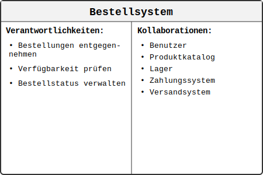
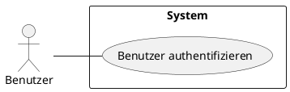

## 3.2. Methoden der Anforderungserhebung und -beschreibung

Jetzt wird es praktisch. Wie kommen wir an die Anforderungen? Es reicht selten aus, den Kunden einfach zu fragen: "Was willst du?" Oft wissen die Stakeholder selbst nicht im Detail, was möglich ist oder was sie genau benötigen. Unsere Aufgabe ist es, wie ein Detektiv die wahren Bedürfnisse zu ermitteln.

Stellen Sie sich vor, Sie sollen ein "besseres Klassenzimmer" gestalten. Sie würden nicht nur den Lehrer fragen. Sie würden Schüler beobachten, den Hausmeister interviewen, vielleicht sogar eine Umfrage machen. Genau das tun wir hier auch, nur mit anderen Techniken.

Man unterscheidet grob zwischen **Erhebungstechniken** (Wie komme ich an die Information?) und **Beschreibungstechniken** (Wie halte ich die Information fest?).

### 3.2.1. Wichtige Erhebungstechniken

-   **Interview:** Das direkte Gespräch mit einem Stakeholder. Es ist ideal, um tiefes Wissen von Einzelpersonen zu erhalten.
    -   *Vorteil:* Flexibel, ermöglicht Nachfragen.
    -   *Nachteil:* Zeitaufwendig, die Meinung eines Einzelnen kann subjektiv sein.

-   **Workshop:** Ein moderiertes Treffen mit einer Gruppe von Stakeholdern. Ziel ist es, gemeinsam Anforderungen zu erarbeiten und Konflikte zu lösen.
    -   *Vorteil:* Effizient, fördert Konsens und Kreativität.
    -   *Nachteil:* Benötigt gute Moderation, kann durch dominante Teilnehmer verzerrt werden.

-   **Fragebogen/Umfrage:** Eine standardisierte Sammlung von Fragen, die an eine große Anzahl von Personen verteilt wird.
    -   *Vorteil:* Erreicht viele Personen, gut für quantitative Daten (z.B. "Wie oft nutzen Sie Funktion X?").
    -   *Nachteil:* Keine Flexibilität für Nachfragen, die Qualität hängt stark von den Fragen ab.

-   **Beobachtung (Feldbeobachtung):** Der Analyst beobachtet den Benutzer direkt in seiner Arbeitsumgebung, um zu verstehen, wie er aktuell arbeitet.
    -   *Vorteil:* Deckt unausgesprochene, selbstverständliche Arbeitsschritte auf.
    -   *Nachteil:* Anwesenheit des Beobachters kann das Verhalten der Benutzer beeinflussen.

-   **CRC-Karten (Class-Responsibility-Collaboration):** Eine kollaborative Technik zur Modellierung von Systemkomponenten und deren Verantwortlichkeiten durch physische Karten.
    -   *Vorteil:* Fördert Teamarbeit und gemeinsames Verständnis, flexibel und schnell anpassbar.
    -   *Nachteil:* Kann bei komplexen Systemen unübersichtlich werden, erfordert Erfahrung in der Moderation.

#### 3.2.1.1. Das Interview im Detail

Das Interview ist eine der fundamentalsten Techniken zur Anforderungserhebung. Es handelt sich um ein direktes, interaktives Gespräch zwischen einem Anforderungsanalysten und einem Stakeholder mit dem Ziel, Wissen, Meinungen und Wünsche zu ermitteln.

**Ziel und Zweck:**
Das Hauptziel besteht darin, tiefgehendes und spezifisches Wissen zu erlangen, das in Dokumenten oft nicht zu finden ist. Interviews eignen sich besonders gut, um:
-   Komplexe Sachverhalte und Prozesse zu verstehen.
-   Implizites Wissen (selbstverständliche Annahmen) aufzudecken.
-   Die genauen Bedürfnisse, Probleme und Prioritäten eines Stakeholders zu klären.
-   Eine vertrauensvolle Beziehung zum Gesprächspartner aufzubauen.

**Arten von Interviews:**
Je nach Grad der Vorstrukturierung unterscheidet man drei Hauptformen:

2.  **Unstrukturiertes (offenes) Interview:** Es gibt nur ein grobes Thema oder eine offene Einstiegsfrage (z.B. "Erzählen Sie mir von Ihrem Arbeitsalltag."). Das Gespräch entwickelt sich frei und eignet sich gut für die Erkundung eines neuen Themenfelds.
3.  **Semi-strukturiertes Interview:** Dies ist die häufigste und flexibelste Form im Requirement-Engineering. Der Interviewer nutzt einen Leitfaden mit offenen Fragen, kann aber die Reihenfolge anpassen, spontan nachhaken und auf interessante Punkte des Gesprächspartners eingehen.

**Ablauf (Phasen eines Interviews):**

-   **Vorbereitung:**
    -   **Zielsetzung:** Was soll nach dem Interview bekannt sein?
    -   **Recherche:** Informationen über den Stakeholder und sein Umfeld sammeln.
    -   **Leitfaden erstellen:** Offene W-Fragen (Was, Wie, Warum, Wozu?) formulieren, die zum Erzählen anregen.
    -   **Organisation:** Termin, Ort und Dauer festlegen und klären, ob eine Aufzeichnung (z.B. Audio) erlaubt ist.

-   **Durchführung:**
    -   **Eröffnung:** Vorstellung, Ziel des Gesprächs erläutern, Vertrauen schaffen.
    -   **Hauptteil:** Den Leitfaden flexibel nutzen, aktiv zuhören, Notizen machen und gezielt nachfragen.
    -   **Abschluss:** Die wichtigsten Punkte zusammenfassen, sich für die Zeit bedanken und die nächsten Schritte erläutern (z.B. Zusendung des Protokolls).

-   **Nachbereitung:**
    -   **Protokoll erstellen:** Die Notizen unmittelbar nach dem Gespräch ausarbeiten und strukturieren.
    -   **Validierung:** Das Protokoll dem Stakeholder zur Überprüfung und Freigabe zusenden.
    -   **Analyse:** Die gewonnenen Informationen auswerten und als Anforderungen formulieren.

> :bulb: **Tipp:** Aktives Zuhören ist die wichtigste Fähigkeit bei einem Interview. Das bedeutet nicht nur zu hören, was gesagt wird, sondern auch zu versuchen, die Perspektive des anderen wirklich zu verstehen und durch gezielte Rückfragen (z.B. "Habe ich richtig verstanden, dass...") sicherzustellen, dass keine Missverständnisse entstehen.

#### 3.2.1.2. Der Workshop im Detail

Stellen Sie sich vor, statt einzeln mit jedem Handwerker (Elektriker, Installateur, Maler) zu sprechen, um ein Zimmer zu renovieren, holen Sie alle an einen Tisch, um den Plan gemeinsam zu entwerfen. Genau das ist ein Workshop: ein kollaboratives Meeting, um schnell zu einem gemeinsamen, abgestimmten Ergebnis zu kommen.

Ein Workshop ist ein strukturiertes, moderiertes Arbeitstreffen, bei dem eine Gruppe von ausgewählten Stakeholdern zusammenkommt, um in kurzer Zeit ein gemeinsames, vordefiniertes Ziel zu erreichen. Im Requirement-Engineering ist dieses Ziel oft die gemeinsame Erarbeitung, Diskussion, Priorisierung und Validierung von Anforderungen.

**Ziel und Zweck:**
-   **Effizienz:** Statt vieler zeitaufwendiger Einzelinterviews werden Informationen von mehreren Personen gleichzeitig gesammelt und konsolidiert.
-   **Konsensbildung:** Unterschiedliche Sichtweisen und Interessen treffen direkt aufeinander. Widersprüche und Konflikte können sofort erkannt und im Idealfall gelöst werden.
-   **Kreativität und Qualität:** Die Gruppendynamik fördert neue Ideen (Synergieeffekt) und führt oft zu qualitativ hochwertigeren Anforderungen, da sie sofort aus verschiedenen Perspektiven beleuchtet und verfeinert werden.
-   **Commitment:** Teilnehmer, die Anforderungen gemeinsam erarbeitet haben, fühlen sich eher dafür verantwortlich und unterstützen das Projekt stärker ("Shared Ownership").

**Wichtige Rollen:**
-   **Moderator:** Eine neutrale Person, die für den Prozess, die Einhaltung der Zeit und die konstruktive Gesprächsführung verantwortlich ist. Der Moderator steuert die Diskussion, aber nicht den Inhalt.
-   **Teilnehmer:** Sorgfältig ausgewählte Repräsentanten der verschiedenen Stakeholder-Gruppen (z.B. Endanwender, Fachabteilungen, Management, IT-Experten, Tester).
-   **Protokollant:** Hält die Ergebnisse, Entscheidungen und offenen Punkte sichtbar für alle (z.B. auf einem Whiteboard oder Flipchart) fest. Diese Rolle kann vom Moderator mitübernommen werden, ist aber bei größeren Gruppen oft separat.

**Ablauf (Phasen eines Workshops):**
-   **Vorbereitung:**
    -   **Zieldefinition:** Was ist das konkrete, messbare Ergebnis des Workshops? (z.B. "Die Top 5 User Stories für das Kunden-Login sind priorisiert und ausformuliert.")
    -   **Teilnehmerauswahl:** Wer muss dabei sein, um das Ziel zu erreichen? Die Gruppe sollte nicht zu groß sein (ideal: 5-9 Personen).
    -   **Agenda und Methoden:** Einen detaillierten Zeitplan und die passenden Kreativitäts- oder Moderationstechniken auswählen (z.B. Brainstorming, Kartenabfrage, Mind-Mapping).
    -   **Organisation:** Raum, Material (Whiteboard, Stifte, Karten, Beamer) und Einladung mit Agenda vorbereiten.

-   **Durchführung:**
    -   **Eröffnung:** Begrüßung, Vorstellung, Erklärung von Ziel, Agenda und "Spielregeln" (z.B. "Jeder kommt zu Wort", "Handys sind lautlos").
    -   **Arbeitsphase:** Die eigentliche Erarbeitung der Inhalte unter Anleitung des Moderators.
    -   **Abschluss:** Ergebnisse zusammenfassen, Maßnahmen und Verantwortlichkeiten festlegen ("Wer macht was bis wann?"), Feedback zum Workshop einholen.

-   **Nachbereitung:**
    -   **Dokumentation:** Das Protokoll und die Ergebnisse (z.B. Fotos vom Whiteboard) zeitnah aufbereiten und an alle Teilnehmer verteilen.
    -   **Umsetzung:** Sicherstellen, dass die beschlossenen Maßnahmen weiterverfolgt und die erarbeiteten Anforderungen in das Requirement-Management-System überführt werden.

> :warning: **Achtung:** Ein Workshop ist nur so gut wie seine Vorbereitung und Moderation. Ohne klares Ziel und eine starke, neutrale Führung kann ein Workshop schnell zu einer unproduktiven "Quasselrunde" werden oder von dominanten Einzelpersonen gekapert werden.

#### 3.2.1.3. Der Fragebogen/Umfrage im Detail

Stellen Sie sich vor, Sie möchten die Meinung aller Schülerinnen und Schüler Ihrer Schule zu einem neuen Mensa-Angebot einholen. Einzelne Interviews oder Workshops wären viel zu aufwendig. Hier kommt der Fragebogen ins Spiel: ein Werkzeug, um schnell und standardisiert Daten von einer großen Gruppe zu sammeln.

Ein Fragebogen (oder eine Umfrage) ist eine systematische Zusammenstellung von Fragen, die einer definierten Personengruppe vorgelegt wird, um quantitative oder qualitative Daten zu einem bestimmten Thema zu erheben.

**Ziel und Zweck:**
-   **Breite Datenerfassung:** Effiziente Sammlung von Informationen von einer großen Anzahl von Personen.
-   **Quantitative Analyse:** Eignet sich hervorragend, um messbare Daten zu erhalten (z.B. "Wie viele Nutzer bewerten Funktion X als 'sehr wichtig'?"). Statistische Auswertungen werden möglich.
-   **Standardisierung:** Da alle Teilnehmer dieselben Fragen erhalten, sind die Antworten gut vergleichbar.
-   **Anonymität:** Kann anonym durchgeführt werden, was zu ehrlicheren Antworten bei sensiblen Themen führen kann.

**Arten von Fragen:**
Die Qualität eines Fragebogens hängt entscheidend von der Formulierung und Art der Fragen ab:

1.  **Geschlossene Fragen:** Geben Antwortmöglichkeiten vor.
    -   *Beispiel:* "Wie zufrieden sind Sie mit der App-Geschwindigkeit? ( ) Sehr zufrieden ( ) Zufrieden ( ) Neutral ( ) Unzufrieden ( ) Sehr unzufrieden"
    -   *Vorteil:* Leicht auszuwerten.
    -   *Nachteil:* Schränken den Antwortspielraum ein.

2.  **Offene Fragen:** Erlauben eine freie Antwort in eigenen Worten.
    -   *Beispiel:* "Welche Funktionen vermissen Sie in der aktuellen Software am meisten?"
    -   *Vorteil:* Ermöglichen unerwartete, detaillierte Einblicke.
    -   *Nachteil:* Aufwendig in der Auswertung.

3.  **Skalenfragen (Rating-Skalen):** Dienen der Bewertung von Merkmalen auf einer Skala (z.B. von 1 bis 5).
    -   *Beispiel:* "Bitte bewerten Sie die Benutzerfreundlichkeit auf einer Skala von 1 (sehr schlecht) bis 5 (sehr gut)."

**Ablauf (Phasen einer Umfrage):**
-   **Vorbereitung:**
    -   **Zieldefinition:** Welche konkreten Informationen sollen gewonnen werden?
    -   **Zielgruppendefinition:** Wer genau soll befragt werden?
    -   **Fragenentwicklung:** Fragen klar, verständlich und eindeutig formulieren. Suggestivfragen vermeiden.
    -   **Pre-Test:** Den Fragebogen mit einer kleinen Testgruppe prüfen, um Unklarheiten und Probleme zu identifizieren.

-   **Durchführung:**
    -   **Verteilung:** Den Fragebogen über geeignete Kanäle (E-Mail, Online-Tool, Papier) an die Zielgruppe verteilen.
    -   **Datensammlung:** Den Rücklauf der Antworten abwarten und überwachen.

-   **Nachbereitung:**
    -   **Datenauswertung:** Die Antworten (insbesondere bei geschlossenen Fragen) statistisch auswerten. Offene Fragen müssen kategorisiert und zusammengefasst werden.
    -   **Interpretation und Dokumentation:** Die Ergebnisse interpretieren, visualisieren (z.B. in Diagrammen) und die daraus abgeleiteten Anforderungen formulieren.

> :bulb: **Merksatz:** Ein guter Fragebogen ist wie ein präzises Messinstrument. Er liefert nur dann verlässliche Daten, wenn die Fragen sorgfältig "geeicht" (formuliert und getestet) wurden. Eine Mischung aus geschlossenen Fragen für die Statistik und einigen offenen Fragen für unerwartete Einblicke ist oft am effektivsten.

#### 3.2.1.4. CRC-Karten im Detail

Stellen Sie sich vor, Sie planen ein Theaterstück und möchten die Rollen und deren Beziehungen zueinander verstehen. Jeder Schauspieler bekommt eine Karte mit seinem Charakter, seinen Aufgaben im Stück und mit wem er interagiert. Genau so funktionieren CRC-Karten: Sie helfen dabei, die "Akteure" eines Systems und ihre Zusammenarbeit zu verstehen.

CRC-Karten (Class-Responsibility-Collaboration) sind eine kollaborative Technik zur Modellierung und zum besseren Verständnis von Systemkomponenten. Ursprünglich für die objektorientierte Programmierung entwickelt, eignen sie sich hervorragend zur Anforderungserhebung, da sie dabei helfen, die verschiedenen Teile eines Systems und deren Verantwortlichkeiten zu identifizieren.

**Ziel und Zweck:**
-   **Gemeinsames Verständnis:** Alle Stakeholder entwickeln ein einheitliches Bild davon, aus welchen Komponenten das System besteht und wie diese zusammenarbeiten.
-   **Verantwortlichkeiten klären:** Jede Systemkomponente bekommt klar definierte Aufgaben, wodurch Überschneidungen und Lücken vermieden werden.
-   **Kollaborative Entwicklung:** Das physische Arbeiten mit Karten fördert die aktive Teilnahme aller Beteiligten und macht abstrakte Konzepte greifbar.
-   **Iterative Verfeinerung:** Das System kann schrittweise entwickelt und verfeinert werden, ohne dass komplexe Diagramme neu gezeichnet werden müssen.

**Aufbau einer CRC-Karte:**
Jede CRC-Karte ist in drei Bereiche unterteilt:

1.  **Class (Klasse/Komponente):** Der Name der Systemkomponente (z.B. "Benutzer", "Bestellsystem", "Datenbank").
2.  **Responsibilities (Verantwortlichkeiten):** Was sind die Hauptaufgaben dieser Komponente? (z.B. "Benutzer authentifizieren", "Bestellungen verwalten", "Daten speichern").
3.  **Collaborations (Kollaborationen):** Mit welchen anderen Komponenten arbeitet diese zusammen? (z.B. "kommuniziert mit Datenbank", "nutzt Zahlungssystem").

**Beispiel einer CRC-Karte:**

**Ablauf einer CRC-Karten-Session:**
-   **Vorbereitung:**
    -   **Teilnehmer:** Stakeholder aus verschiedenen Bereichen (Fachexperten, Entwickler, Tester, Product Owner).
    -   **Material:** Leere Karteikarten (physisch oder digital), Stifte, große Arbeitsfläche.
    -   **Szenario:** Ein konkreter Anwendungsfall oder Geschäftsprozess als Ausgangspunkt.

-   **Durchführung:**
    -   **Brainstorming:** Sammlung aller wichtigen Systemkomponenten durch die Gruppe.
    -   **Karten erstellen:** Für jede Komponente wird eine CRC-Karte erstellt und initial befüllt.
    -   **Walkthrough:** Das Team "spielt" einen Anwendungsfall durch, indem es die Karten bewegt und die Interaktionen zwischen den Komponenten nachvollzieht.
    -   **Verfeinerung:** Während des Walkthroughs werden Verantwortlichkeiten präzisiert, neue Kollaborationen entdeckt oder überflüssige Komponenten entfernt.
    -   **Validierung:** Das Team überprüft, ob alle wichtigen Anwendungsfälle durch die erstellten Karten abgedeckt sind.

-   **Nachbereitung:**
    -   **Dokumentation:** Die finalen CRC-Karten werden fotografiert oder digital erfasst.
    -   **Ableitung von Anforderungen:** Aus den Karten werden konkrete funktionale Anforderungen, User Stories oder Use Cases abgeleitet.
    -   **Architektur-Input:** Die Karten dienen als Grundlage für die technische Systemarchitektur.

**Vorteile:**
-   **Physische Interaktion:** Das Bewegen echter Karten macht abstrakte Konzepte greifbar und fördert das Engagement.
-   **Gleichberechtigung:** Alle Teilnehmer können aktiv beitragen, da keine speziellen technischen Kenntnisse für das Erstellen von Karten erforderlich sind.
-   **Flexibilität:** Änderungen sind schnell und einfach möglich – eine neue Karte schreiben oder eine Verantwortlichkeit hinzufügen dauert Sekunden.
-   **Ganzheitlicher Blick:** Das System wird als Ganzes betrachtet, nicht nur einzelne Funktionen.

**Herausforderungen:**
-   **Skalierbarkeit:** Bei sehr komplexen Systemen mit vielen Komponenten kann die Technik unübersichtlich werden.
-   **Abstraktion:** Die richtige Abstraktionsebene zu finden (nicht zu detailliert, aber auch nicht zu oberflächlich) erfordert Erfahrung.
-   **Moderation:** Eine erfahrene, neutrale Moderation ist entscheidend, um produktive Sessions zu gewährleisten.

> :gear: **Praxis-Tipp:** CRC-Karten eignen sich besonders gut in der frühen Projektphase, um ein gemeinsames Systemverständnis zu entwickeln. Sie können auch als "Aufwärmübung" vor technischeren Workshops eingesetzt werden, um alle Teilnehmer auf den gleichen Wissensstand zu bringen.

### 3.2.2. Wichtige Beschreibungstechniken

Einmal erhoben, müssen Anforderungen klar und unmissverständlich dokumentiert werden.

-   **User Stories (Agile Welt):** Eine kurze, einfache Beschreibung einer Funktion aus der Sicht des Nutzers. Das Format ist meist:
    `Als <Rolle> möchte ich <Ziel/Wunsch>, um <Nutzen> zu erreichen.`
    -   *Beispiel:* "Als Schüler möchte ich meine Hausaufgaben online einsehen können, um zu wissen, was ich bis wann erledigen muss."

-   **Use Cases (Traditionelle Welt):** Beschreiben die Interaktion zwischen einem Akteur (Benutzer oder ein anderes System) und dem System, um ein bestimmtes Ziel zu erreichen. Sie sind oft detaillierter als User Stories und werden häufig mit Diagrammen (UML Use-Case-Diagramm) visualisiert.
    -   *Beispiel:* Ein Use Case könnte den gesamten Prozess "Hausaufgabe abgeben" beschreiben, inklusive aller Schritte und möglicher Fehlerfälle (z.B. "Datei zu groß").

-   **Lastenheft und Pflichtenheft:**
    -   **Lastenheft ("Was"):** Der Auftraggeber beschreibt die Gesamtheit der Anforderungen an das zu entwickelnde System aus seiner Sicht.
    -   **Pflichtenheft ("Wie"):** Der Auftragnehmer (das Entwicklungsteam) antwortet auf das Lastenheft und beschreibt, wie er die Anforderungen technisch umsetzen wird.

> :mag: **Vertiefung:** Die Wahl der Technik hängt vom Projekt ab. In agilen Projekten wie mit Scrum sind **User Stories** und häufige **Workshops** sehr beliebt. In großen, traditionellen Projekten sind **Interviews** und die Erstellung eines detaillierten **Pflichtenhefts** oft Standard.

#### 3.2.2.1. User Stories im Detail

Stellen Sie sich vor, Sie beschreiben einem Freund eine Filmidee. Sie würden nicht mit technischen Details zur Kameraführung beginnen, sondern mit der Geschichte aus der Sicht der Hauptfigur: "Ein junger Held *möchte* den Schatz finden, *um* sein Dorf zu retten." Genau das ist die Essenz einer User Story: eine Anforderung aus der Perspektive desjenigen zu erzählen, der sie hat.

Eine User Story ist eine kurze, einfache Beschreibung einer Funktionalität, formuliert in der Alltagssprache des Anwenders oder Kunden. Sie ist das zentrale Artefakt zur Anforderungsbeschreibung in agilen Frameworks wie Scrum.

**Ziel und Zweck:**
-   **Fokus auf den Nutzerwert:** User Stories zwingen uns, darüber nachzudenken, *warum* eine Funktion entwickelt wird und welchen Nutzen sie dem Anwender bringt.
-   **Förderung der Kommunikation:** Eine User Story ist keine vollständige Spezifikation, sondern eine "Einladung zur Konversation". Sie dient als Grundlage für Gespräche zwischen Entwicklern, Product Owner und Stakeholdern, um die Details zu klären.
-   **Planungs- und Schätzungsgrundlage:** Kleine, verständliche User Stories lassen sich gut im Team schätzen (z.B. mit Story Points) und für die Planung von Sprints oder Iterationen verwenden.
-   **Flexibilität:** Sie sind bewusst kurz und einfach gehalten, um schnell auf Änderungen reagieren zu können, ohne seitenlange Dokumente anpassen zu müssen.

**Struktur und Bestandteile (Die 3 "C"s):**
Eine gute User Story folgt dem 3-C-Modell von Ron Jeffries:

1.  **Card (Karte):** Die Anforderung wird auf eine Karte (oder ein virtuelles Ticket, z.B. in Jira) geschrieben. Sie folgt meist dem Format:
    `Als <Rolle> möchte ich <Ziel/Wunsch>, um <Nutzen> zu erreichen.`
    -   **Rolle:** Wer ist der Nutzer? (z.B. "Als registrierter Kunde...")
    -   **Ziel/Wunsch:** Was will der Nutzer tun? (z.B. "...möchte ich meinen Bestellstatus einsehen...")
    -   **Nutzen:** Warum will er das? (z.B. "...um zu wissen, wann mein Paket ankommt.")

2.  **Conversation (Konversation):** Die Details hinter der Story werden in Gesprächen zwischen dem Entwicklungsteam und dem Product Owner geklärt. Hier werden Fragen gestellt, Annahmen hinterfragt und Missverständnisse ausgeräumt.

3.  **Confirmation (Bestätigung):** Die **Akzeptanzkriterien** definieren, wann eine User Story als "fertig" gilt. Sie sind die Checkliste, anhand derer die Story getestet wird.
    -   *Beispiel für Akzeptanzkriterien:*
        -   *Gegeben sei, ich bin als Kunde angemeldet und auf der "Meine Bestellungen"-Seite.*
        -   *Wenn ich auf eine Bestellung klicke,*
        -   *Dann sehe ich den Status (z.B. "In Bearbeitung", "Versandt", "Zugestellt").*
        -   *Dann sehe ich das voraussichtliche Lieferdatum.*

> :bulb: **Merksatz (INVEST):** Gute User Stories erfüllen die INVEST-Kriterien. Sie sind:
> - **I**ndependent (Unabhängig von anderen Stories)
> - **N**egotiable (Verhandelbar, nicht in Stein gemeißelt)
> - **V**aluable (Wertvoll für den Nutzer oder Kunden)
> - **E**stimable (Schätzbar im Aufwand)
> - **S**mall (Klein genug, um in einer Iteration umsetzbar zu sein)
> - **T**estable (Testbar, d.h. es gibt klare Akzeptanzkriterien)

#### 3.2.2.2. Use Cases (Anwendungsfälle) im Detail

Wenn eine User Story die kurze, prägnante Erzählung einer Filmidee ist, dann ist ein Use Case das detaillierte Drehbuch für eine bestimmte Szene. Er beschreibt Schritt für Schritt, was passiert, wer was sagt und was bei unerwarteten Wendungen geschieht.

Ein Use Case (deutsch: Anwendungsfall) beschreibt die Interaktion zwischen einem Akteur und dem System, um ein bestimmtes, wertschöpfendes Ziel zu erreichen. Er fokussiert auf das "Was" (die funktionale Anforderung) aus einer externen Perspektive und modelliert einen vollständigen Ablauf.

**Ziel und Zweck:**
-   **Detaillierte Prozessbeschreibung:** Use Cases erfassen den gesamten Ablauf einer Interaktion, einschließlich des Standardablaufs (Happy Path) und aller möglichen Alternativen und Fehlerfälle.
-   **Klarheit über Systemgrenzen:** Sie helfen zu definieren, was Teil des Systems ist und was außerhalb liegt (Akteure).
-   **Grundlage für Testfälle:** Aus den detaillierten Schritt-für-Schritt-Beschreibungen lassen sich sehr gut systematische Testfälle ableiten.
-   **Strukturierte Dokumentation:** Sie bieten eine standardisierte und formale Methode, um funktionale Anforderungen zu dokumentieren, was besonders in komplexen oder sicherheitskritischen Projekten wichtig ist.

**Bestandteile eines Use Cases (Textuelle Beschreibung):**
Ein Use Case wird oft durch ein UML-Diagramm visualisiert, aber seine wahre Stärke liegt in der textuellen Ausformulierung. Typische Elemente sind:
-   **Name:** Ein kurzer, prägnanter Name im Aktiv-Stil (z.B. "Benutzer authentifizieren").
-   **Akteur(e):** Wer oder was interagiert mit dem System? (z.B. Kunde, Kassensystem).
-   **Vorbedingung:** Welcher Zustand muss erfüllt sein, damit der Use Case starten kann? (z.B. "Der Benutzer befindet sich auf der Login-Seite.").
-   **Nachbedingung:** Welcher Zustand ist nach erfolgreichem Abschluss erreicht? (z.B. "Der Benutzer ist eingeloggt und befindet sich auf seiner Startseite.").
-   **Standardablauf (Happy Path):** Die Schritt-für-Schritt-Beschreibung des idealen, fehlerfreien Ablaufs.
    1.  Der Benutzer gibt seine E-Mail-Adresse und sein Passwort ein.
    2.  Der Benutzer klickt auf den "Login"-Button.
    3.  Das System validiert die Anmeldedaten.
    4.  Das System leitet den Benutzer auf seine persönliche Startseite weiter.
-   **Alternative Abläufe und Fehlerfälle:** Was passiert, wenn etwas vom Standard abweicht?
    -   *3a. Ungültige Anmeldedaten:* Das System zeigt die Fehlermeldung "E-Mail oder Passwort ungültig" an. Der Use Case kehrt zu Schritt 1 zurück.
    -   *3b. Konto gesperrt:* Das System zeigt die Meldung "Ihr Konto ist gesperrt" an. Der Use Case endet.

**Visuelle Darstellung (UML Use-Case-Diagramm):**
Das Diagramm bietet einen schnellen Überblick über die Hauptfunktionen eines Systems und ihre Beziehungen zu den Akteuren.
-   **Systemgrenze:** Ein Rechteck, das das System darstellt.
-   **Akteure:** Strichmännchen außerhalb des Rechtecks.
-   **Use Cases:** Ovale innerhalb des Rechtecks.
-   **Beziehungen:** Linien, die Akteure mit den Use Cases verbinden, die sie nutzen.

> :mag: **Vertiefung: User Story vs. Use Case**
> - Eine **User Story** ist klein, auf den Nutzen fokussiert und eine "Einladung zur Konversation". Sie beschreibt ein "Stück" Funktionalität.
> - Ein **Use Case** ist detailliert, auf den Prozess fokussiert und eine "Spezifikation". Er beschreibt oft einen kompletten Geschäftsvorfall, der mehrere User Stories umfassen kann.
>
> *Beispiel:* Der Use Case "Online-Bestellung durchführen" könnte aus den User Stories "Als Kunde möchte ich Artikel in den Warenkorb legen...", "Als Kunde möchte ich meine Lieferadresse auswählen..." und "Als Kunde möchte ich mit Kreditkarte bezahlen..." bestehen.

#### 3.2.2.3. Lastenheft und Pflichtenheft im Detail

Stellen Sie sich den Bau eines Hauses vor. Das **Lastenheft** ist die detaillierte Wunschliste des Bauherrn an den Architekten: "Ich wünsche mir ein Haus mit drei Schlafzimmern, einer großen Wohnküche, bodentiefen Fenstern und einer Solaranlage auf dem Dach." Es beschreibt, *was* gewünscht wird. Das **Pflichtenheft** ist die Antwort des Architekten: "Basierend auf Ihren Wünschen entwerfe ich ein zweistöckiges Haus in Holzständerbauweise mit einer Wärmepumpe und den im Plan spezifizierten Fenstern, um Ihre Anforderungen zu erfüllen." Es beschreibt, *wie* die Wünsche umgesetzt werden.

**Das Lastenheft (Anforderungsspezifikation des Auftraggebers)**

Das Lastenheft, oft auch als Anforderungskatalog oder **User-Requirements-Spezifikation (URS)** bezeichnet, ist das Dokument, in dem der **Auftraggeber** (Kunde) die Gesamtheit seiner Anforderungen an das zu liefernde System aus seiner fachlichen Perspektive beschreibt.

-   **Zweck:**
    -   Dient als Grundlage für die Einholung von Angeboten von potenziellen Auftragnehmern.
    -   Definiert den "Scope" (Umfang) des Projekts aus Sicht des Kunden.
    -   Beschreibt das **Was** und **Wofür**, nicht das **Wie**.
-   **Inhalt (typisch):**
    -   **Ausgangssituation:** Warum wird das Projekt benötigt? Welches Problem soll gelöst werden?
    -   **Ziele:** Welche messbaren Ziele sollen mit dem neuen System erreicht werden?
    -   **Funktionale Anforderungen:** Was soll das System können? (z.B. "Das System muss Rechnungen im PDF-Format erstellen können.")
    -   **Nicht-funktionale Anforderungen:** Welche Qualitätsanforderungen gibt es? (z.B. "Das System muss 24/7 verfügbar sein.")
    -   **Randbedingungen:** Technische, organisatorische oder rechtliche Rahmenbedingungen (z.B. "Das System muss auf der vorhandenen Server-Infrastruktur laufen.", "Die DSGVO muss eingehalten werden.").
-   **Sprache:** Formuliert in der Sprache des Auftraggebers, weitgehend frei von technischen Details.

**Das Pflichtenheft (Technische Lösungsspezifikation des Auftragnehmers)**

Das Pflichtenheft, auch als technische Spezifikation oder auch als **System-Requirements-Specification (SRS)** bekannt, ist die Antwort des **Auftragnehmers** (Entwicklungsteam) auf das Lastenheft. Es beschreibt detailliert, wie die im Lastenheft genannten Anforderungen technisch und konzeptionell umgesetzt werden sollen.

-   **Zweck:**
    -   Dient als verbindliche Grundlage für die Entwicklung und Implementierung.
    -   Ist oft ein zentraler Bestandteil des Vertrags zwischen Auftraggeber und Auftragnehmer.
    -   Beschreibt das **Wie** der Umsetzung.
-   **Inhalt (typisch):**
    -   **Systemarchitektur:** Wie ist das System aufgebaut? Welche Komponenten gibt es?
    -   **Detaillierte Funktionsbeschreibung:** Wie werden die funktionalen Anforderungen konkret implementiert? (z.B. "Die PDF-Erstellung erfolgt mittels der Bibliothek 'PDF-Lib' in Version 2.1.")
    -   **Schnittstellen:** Wie kommuniziert das System mit anderen Systemen?
    -   **Datenmodell:** Wie werden die Daten strukturiert und gespeichert?
    -   **Testkonzept:** Wie wird die Qualität sichergestellt?
    -   **Projektplan:** Meilensteine, Liefertermine und Abnahmekriterien.
-   **Sprache:** Technisch präzise, richtet sich an Entwickler, Tester und Projektmanager.

> :warning: **Achtung:** In der Praxis ist die Trennung nicht immer so scharf. Oft werden beide Dokumente **in enger Zusammenarbeit** erstellt. Im agilen Vorgehen werden Lasten- und Pflichtenhefte oft durch ein kontinuierlich gepflegtes **Product Backlog** und detaillierte User Stories ersetzt. In formalen Vertragssituationen sind sie jedoch nach wie vor ein unverzichtbarer Standard.

### 3.2.3. Techniken zur Priorisierung von Anforderungen

Selten können alle Anforderungen auf einmal umgesetzt werden. Zeit, Budget und Ressourcen sind begrenzt. Daher ist es entscheidend, herauszufinden, welche Anforderungen am wichtigsten sind. Die Priorisierung hilft dem Team, sich auf das Wesentliche zu konzentrieren und den größten Nutzen für den Kunden so früh wie möglich zu liefern.

Stellen Sie sich vor, Sie packen einen Koffer für eine Reise. Sie können nicht Ihren gesamten Kleiderschrank mitnehmen. Also müssen Sie entscheiden: Die Regenjacke für die Wanderung ist ein Muss, die schicken Abendschuhe sind vielleicht nur "nice to have". Genau das tun wir bei der Anforderungspriorisierung.

#### 3.2.3.1. Das Kano-Modell

Das Kano-Modell, entwickelt von Professor Noriaki Kano, ist ein mächtiges Werkzeug, um die emotionale Wirkung von Produktmerkmalen auf die Kundenzufriedenheit zu verstehen. Es geht über die einfache Frage "Ist das wichtig?" hinaus und hilft zu erkennen, *wie* ein Merkmal die Zufriedenheit beeinflusst.

Das Modell unterscheidet fünf Arten von Merkmalen:

1.  **Basis-Merkmale (Must-haves):**
    -   **Definition:** Das sind selbstverständliche, erwartete Funktionen. Wenn sie fehlen, ist der Kunde extrem unzufrieden. Wenn sie vorhanden sind, führt das aber nicht zu besonderer Begeisterung, sondern lediglich zu einem Zustand der "Nicht-Unzufriedenheit".
    -   **Analogie (Auto):** Funktionierende Bremsen. Niemand freut sich explizit darüber, aber wehe, sie fehlen!
    -   **Im Projekt:** Diese Anforderungen müssen unbedingt umgesetzt werden, sonst ist das Produkt unbrauchbar.

2.  **Leistungs-Merkmale (Performance):**
    -   **Definition:** Hier gilt: Je mehr, desto besser. Die Kundenzufriedenheit steigt linear mit dem Erfüllungsgrad dieser Merkmale.
    -   **Analogie (Auto):** Der Benzinverbrauch. Je weniger das Auto verbraucht, desto zufriedener ist der Kunde.
    -   **Im Projekt:** Das sind die klassischen, oft explizit geforderten Funktionen, bei denen sich der Wettbewerb abspielt.

3.  **Begeisterungs-Merkmale (Delighters/Exciters):**
    -   **Definition:** Unerwartete, innovative Funktionen, die der Kunde nicht explizit gefordert hat. Wenn sie vorhanden sind, lösen sie Begeisterung aus. Wenn sie fehlen, wird sie niemand vermissen.
    -   **Analogie (Auto):** Ein Massagesitz. Man hat ihn nicht erwartet, aber wenn er da ist, ist es ein "Wow"-Erlebnis.
    -   **Im Projekt:** Mit diesen Merkmalen kann man sich vom Wettbewerb abheben und Kundenloyalität schaffen.

4.  **Unerhebliche Merkmale (Indifferent):**
    -   **Definition:** Das Vorhandensein oder Fehlen dieser Merkmale hat keinen Einfluss auf die Kundenzufriedenheit.
    -   **Analogie (Auto):** Die Farbe der Schrauben im Motorraum.
    -   **Im Projekt:** Diese Anforderungen sollte man weglassen, da sie Aufwand ohne Nutzen verursachen.

5.  **Rückweisungs-Merkmale (Reverse):**
    -   **Definition:** Das Vorhandensein dieser Merkmale führt zu Unzufriedenheit.
    -   **Analogie (Auto):** Ein Auto, das bei jedem Start eine laute Werbeansage abspielt.
    -   **Im Projekt:** Diese Merkmale müssen unbedingt vermieden werden.

> :bulb: **Merksatz:** Das Kano-Modell hilft uns zu verstehen, dass nicht alle Anforderungen gleich sind. Wir müssen zuerst die **Basis-Merkmale** erfüllen, um nicht zu scheitern, dann in **Leistungs-Merkmale** investieren, um wettbewerbsfähig zu sein, und gezielt **Begeisterungs-Merkmale** einstreuen, um Kunden zu Fans zu machen.

**Anwendung in der Praxis:**
Um herauszufinden, zu welcher Kategorie ein Merkmal gehört, werden gezielte Kundenbefragungen durchgeführt. Für jedes Merkmal werden zwei Fragen gestellt (funktionale und dysfunktionale Form):
1.  **Funktionale Frage:** "Was würden Sie empfinden, wenn das Produkt dieses Merkmal *hätte*?"
2.  **Dysfunktionale Frage:** "Was würden Sie empfinden, wenn das Produkt dieses Merkmal *nicht hätte*?"

Die Antwortmöglichkeiten sind standardisiert (z.B. "Das würde mich sehr freuen", "Das setze ich voraus", "Das ist mir egal", "Das würde mich nicht stören", "Das würde mich sehr stören"). Aus der Kombination der beiden Antworten lässt sich jedes Merkmal einer der Kano-Kategorien zuordnen.

**Dynamik des Modells:**
Die Einordnung von Merkmalen ist nicht statisch, sondern ändert sich im Laufe der Zeit durch den technologischen Fortschritt und die Gewöhnung der Kunden:
-   **Begeisterungs-Merkmale** von heute sind oft die **Leistungs-Merkmale** von morgen. (Beispiel: Die ersten Rückfahrkameras in Autos waren eine Sensation, heute sind sie ein erwartetes Leistungsmerkmal).
-   **Leistungs-Merkmale** von heute können die **Basis-Merkmale** von morgen sein. (Beispiel: Elektrische Fensterheber waren früher ein Luxus, heute sind sie Standard).

> :mag: **Vertiefung:** Diese Dynamik bedeutet, dass eine Kano-Analyse regelmäßig wiederholt werden muss, um sicherzustellen, dass das Produkt weiterhin den aktuellen Kundenerwartungen entspricht und nicht von der Konkurrenz überholt wird.

#### 3.2.3.2. Die MoSCoW-Methode

Die MoSCoW-Methode ist eine einfache und sehr verbreitete Technik zur Priorisierung von Anforderungen, insbesondere in **agilen Projekten** und bei **zeitkritischen Vorhaben**. Der Name ist ein Akronym aus den Anfangsbuchstaben der vier Prioritätskategorien:

-   **M - Must have (Muss-Anforderung):**
    -   **Definition:** Diese Anforderungen sind fundamental für das Produkt und nicht verhandelbar. Ohne sie ist das Release nicht lauffähig oder rechtlich nicht zulässig. Ein Scheitern bei der Umsetzung einer "Must-have"-Anforderung bedeutet ein Scheitern des gesamten Projekts oder Releases.
    -   **Frage:** "Funktioniert das Produkt ohne diese Anforderung?" Wenn die Antwort "Nein" ist, ist es ein "Must-have".
    -   *Beispiel:* In einer Online-Banking-App ist die Funktion "Geld überweisen" ein "Must-have".

-   **S - Should have (Soll-Anforderung):**
    -   **Definition:** Dies sind ebenfalls wichtige Anforderungen, aber nicht so kritisch wie "Must-haves". Das Produkt funktioniert auch ohne sie, aber es ist deutlich weniger nützlich oder wertvoll. Man sollte sie umsetzen, wenn es irgendwie möglich ist.
    -   **Frage:** "Ist das Produkt auch ohne diese Funktion noch sinnvoll nutzbar, wenn auch schmerzhaft?"
    -   *Beispiel:* In der Banking-App wäre "Überweisungsvorlagen speichern" ein "Should-have".

-   **C - Could have (Kann-Anforderung):**
    -   **Definition:** Diese Anforderungen sind wünschenswert, aber nicht notwendig. Sie haben einen geringeren Einfluss auf den Nutzen als "Should-haves". Man kann sie als "Nice-to-have" betrachten. Sie werden nur umgesetzt, wenn Zeit und Ressourcen es ohne Beeinträchtigung der wichtigeren Anforderungen erlauben.
    -   **Frage:** "Verbessert diese Funktion das Produkt, aber der Verzicht darauf tut nicht wirklich weh?"
    -   *Beispiel:* "Das Farbschema der App anpassen" wäre ein "Could-have".

-   **W - Won't have (Wird es nicht geben):**
    -   **Definition:** Diese Anforderungen werden in diesem spezifischen Release oder Zeitrahmen bewusst *nicht* umgesetzt. Das bedeutet nicht, dass sie für immer verworfen werden, sondern nur, dass sie für den aktuellen Fokus keine Rolle spielen. Dies ist wichtig, um die Erwartungen der Stakeholder zu managen und den "Scope" klar zu begrenzen.
    -   **Frage:** "Liegt diese Anforderung außerhalb unseres aktuellen Ziels?"
    -   *Beispiel:* "Aktienhandel integrieren" könnte für das erste Release der Banking-App ein "Won't have" sein.

> :warning: Die größte Gefahr bei der MoSCoW-Methode ist, dass zu viele Anforderungen als "Must-have" klassifiziert werden. Eine gute Regel ist, dass die **"Must-haves"** nicht mehr als **60% des Gesamtaufwands** ausmachen sollten, um Puffer für die "Should-" und "Could-haves" zu lassen.

#### 3.2.3.3. Dot-Voting (Punktabklebung)

Stellen Sie sich vor, Sie und Ihre Freunde möchten entscheiden, welches von zehn vorgeschlagenen Reisezielen als Nächstes besucht werden soll. Um schnell eine Entscheidung zu treffen, schreiben Sie alle Ziele an ein Whiteboard, und jeder erhält drei Klebepunkte, die er auf seine Favoriten verteilen kann – auch alle drei auf ein einziges Ziel. Das Ziel mit den meisten Punkten gewinnt. Genau so einfach und wirkungsvoll ist Dot-Voting.

Dot-Voting ist eine schnelle, einfache und kollaborative Priorisierungstechnik, die oft in Workshops eingesetzt wird, um schnell einen Konsens oder ein Stimmungsbild in einer Gruppe zu erhalten. Jeder Teilnehmer erhält eine begrenzte Anzahl von "Stimmen" (oft in Form von Klebepunkten), die er auf eine Liste von Optionen (z.B. Anforderungen, User Stories, Ideen) verteilen kann.

**Ziel und Zweck:**
-   **Schnelle Entscheidungsfindung:** In sehr kurzer Zeit ein klares Stimmungsbild der Gruppe zu den wichtigsten Themen erhalten.
-   **Demokratische Priorisierung:** Jede Stimme zählt gleich, was die aktive Beteiligung aller fördert und Hierarchien in den Hintergrund treten lässt.
-   **Fokus schaffen:** Hilft einer Gruppe, aus einer großen Menge von Optionen die wenigen herauszufiltern, die kollektiv als am wichtigsten angesehen werden.

**Ablauf einer Dot-Voting-Session:**
1.  **Vorbereitung:** Alle zu priorisierenden Elemente (z.B. User Stories, Features) werden für alle gut sichtbar aufgeschrieben (z.B. auf einem Whiteboard, Flipchart oder auf einzelnen Karten).
2.  **Stimmen verteilen:** Jeder Teilnehmer erhält eine festgelegte, kleine Anzahl von Klebepunkten (üblich sind 3 bis 5).
3.  **Abstimmung:** Die Teilnehmer kleben ihre Punkte auf die Elemente, die sie für am wichtigsten halten. Sie können ihre Stimmen beliebig verteilen: alle auf ein Element, oder auf mehrere verschiedene.
4.  **Auswertung:** Die Elemente werden nach der Anzahl der erhaltenen Punkte sortiert. Das Ergebnis ist eine priorisierte Liste, die den kollektiven Willen der Gruppe widerspiegelt.

**Vorteile:**
-   **Einfach und schnell:** Die Methode ist selbsterklärend und in wenigen Minuten durchführbar.
-   **Kollaborativ und transparent:** Der Prozess ist für alle sichtbar und fördert das Gefühl einer gemeinsamen Entscheidung.
-   **Engagierend:** Die physische Interaktion (das Kleben der Punkte) macht Spaß und bindet die Teilnehmer aktiv ein.

**Herausforderungen:**
-   **Keine Berücksichtigung des Aufwands:** Ein populäres, aber sehr aufwendiges Feature kann genauso viele Stimmen erhalten wie ein einfaches.
-   **Gruppendynamik:** Teilnehmer können sich von den ersten abgegebenen Stimmen beeinflussen lassen ("Anker-Effekt").
-   **Oberflächlichkeit:** Die Methode fördert eine schnelle Bauchentscheidung, aber keine tiefergehende Diskussion über den strategischen Wert oder die Abhängigkeiten einer Anforderung.

> :gear: **Praxis-Tipp:** Dot-Voting eignet sich hervorragend als erster Schritt, um eine lange Liste von Anforderungen grob zu sortieren. Das Ergebnis sollte jedoch nicht als endgültige Priorisierung gesehen werden, sondern als Grundlage für eine tiefere Diskussion über die Top-Kandidaten, bei der dann auch Aufwand und strategischer Nutzen berücksichtigt werden.

