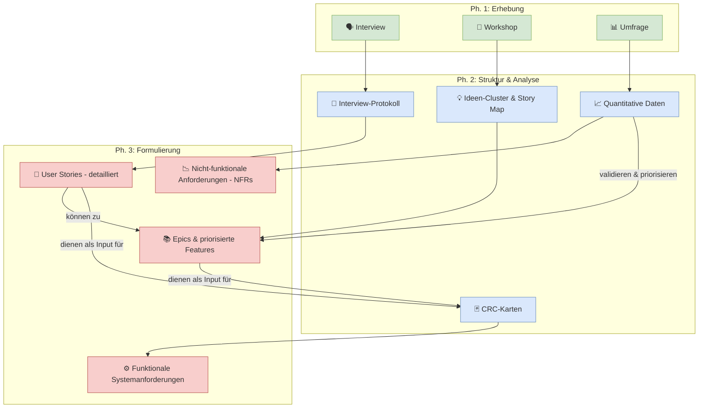

### 3.3.6. Zusammenfassung: Den richtigen Transformationspfad wählen

Wir haben nun verschiedene Wege kennengelernt, um von rohen Informationen zu strukturierten Anforderungen zu gelangen. Doch welcher Weg ist der richtige für welche Situation? Dieses Kapitel fasst die Transformationspfade zusammen und gibt eine Entscheidungshilfe.

Stellen Sie sich vor, Sie haben einen Werkzeugkasten: Hammer, Schraubenzieher, Zange und Maßband. Jedes Werkzeug ist für eine bestimmte Aufgabe optimiert. Sie würden keinen Nagel mit einer Zange in die Wand schlagen. Genauso verhält es sich mit den Methoden der Anforderungsanalyse: Jede hat ihre spezifischen Stärken. Der Schlüssel zum Erfolg liegt darin, sie geschickt zu kombinieren.

#### 3.3.6.1. Die Transformationspfade im Überblick

Das folgende Diagramm visualisiert, wie die verschiedenen Erhebungsmethoden und Analyse-Techniken ineinandergreifen, um unterschiedliche Arten von Anforderungen zu erzeugen.

**Interpretation des Diagramms:**
-   **Interviews** sind ein exzellenter Startpunkt für detaillierte **User Stories**.
-   **Workshops** eignen sich hervorragend, um aus vielen Ideen **Epics** und ein priorisiertes Backlog (via Story Mapping) zu erstellen.
-   **Umfragen** liefern die harten Fakten, um **Prioritäten zu validieren** und wichtige **nicht-funktionale Anforderungen** (wie Performance-Ziele oder Geräte-Support) abzuleiten.
-   **CRC-Karten** sind der Brückenschlag von den nutzerzentrierten User Stories zu konkreten, technischen **Systemanforderungen**, indem sie die interne Struktur und die Verantwortlichkeiten des Systems klären.

#### 3.3.6.2. Entscheidungstabelle: Welche Methode für welches Ziel?

| Methode | Hauptziel | Stärken | Schwächen | Typisches Ergebnis |
| :--- | :--- | :--- | :--- | :--- |
| **Interview** | **Tiefe Einblicke** gewinnen, individuelle Bedürfnisse und Schmerzpunkte verstehen. | - Sehr detailliert - Aufdecken impliziter Anforderungen - Flexibel im Gesprächsverlauf | - Subjektiv - Zeitaufwendig - Nicht repräsentativ | Detaillierte User Stories, Personas, Szenarien |
| **Workshop** | **Konsens schaffen**, Ideen generieren und gemeinsam priorisieren. | - Kreativ & kollaborativ - Löst Stakeholder-Konflikte - Schafft gemeinsames Verständnis | - Gruppendynamik kann Ergebnis beeinflussen - Moderations-Know-how nötig | Epics, Story Map, priorisiertes Backlog |
| **Umfrage** | **Hypothesen validieren**, Meinungen quantifizieren und repräsentative Daten erheben. | - Große Reichweite - Objektive, statistische Daten - Effizient auswertbar | - Ungeeignet für neue Ideen - Keine Rückfragemöglichkeit - Geringe Detailtiefe | Priorisierte Feature-Listen, NFRs, quantitative Belege |
| **CRC-Karten** | **Systemstruktur entwerfen**, Verantwortlichkeiten klären und technische Machbarkeit prüfen. | - Frühes Architektur-Feedback - Fördert objektorientiertes Denken - Brücke zwischen Analyse & Design | - Sehr technisch, für Endanwender ungeeignet - Benötigt technisches Team - Abstrakt | Detaillierte Systemanforderungen, Klassendiagramm-Skizzen |

#### 3.3.6.3. Das Fazit: Es gibt keinen "einen" Weg

Wie das Beispiel der Schulbibliothek gezeigt hat, führt selten eine einzelne Methode zum Ziel. Der Erfolg liegt in der intelligenten Kombination:

1.  **Start mit dem Tiefgang:** Ein **Interview** mit der Bibliothekarin (Frau Müller) legte das Fundament und deckte die Kernprobleme auf.
2.  **Erweiterung in die Breite:** Ein **Workshop** mit Schülern und Lehrern brachte zusätzliche Perspektiven ein und half, die Ideen zu einem großen Ganzen (der Story Map) zu formen.
3.  **Validierung durch die Menge:** Eine **Umfrage** unter allen Schülern und Lehrern lieferte die nötigen Daten, um die im Workshop erarbeiteten Prioritäten zu bestätigen und wichtige technische Rahmenbedingungen (Mobile First) festzulegen.
4.  **Konkretisierung für die Technik:** Eine **CRC-Karten-Session** half dem Entwicklungsteam, die priorisierten User Stories in eine technische Struktur zu übersetzen und daraus detaillierte Systemanforderungen abzuleiten.

> :bulb: **Merksatz:** Requirements Engineering ist kein linearer Prozess, sondern ein Zyklus aus Erheben, Verstehen, Strukturieren und Validieren. Die Kunst besteht darin, für jede Phase das passende Werkzeug auszuwählen und die Ergebnisse der einzelnen Schritte miteinander zu verknüpfen, um ein vollständiges und robustes Anforderungsdokument zu erstellen.

***
Quellen

- [User Story Mapping - Jeff Patton](https://www.jpattonassociates.com/user-story-mapping/)
- [A Laboratory for Teaching Object-Oriented Thinking - Kent Beck & Ward Cunningham](http://c2.com/doc/oopsla89/paper.html)
- [IEEE Std 830-1998 - IEEE Recommended Practice for Software Requirements Specifications](https://standards.ieee.org/ieee/830/1222/)