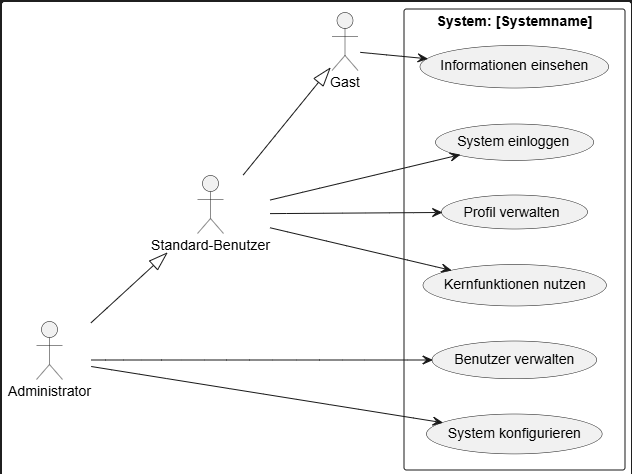

# User Requirements Document (URD) - Vorlage

**Projekttitel:** [Name des Projekts]

**Dokumentenversion:** 1.0

**Erstellungsdatum:** YYYY-MM-DD

**Autor(en):** [Name/n des/der Autoren]

**Genehmigende Personen/Rollen:** [Name/n oder Rolle/n, z.B. Projektleiter, Product Owner]

---

## Dokumentenhistorie

| Version | Datum        | Autor         | Änderungsbeschreibung                               |
| :------ | :----------- | :------------ | :-------------------------------------------------- |
| 1.0     | YYYY-MM-DD   | [Autor]       | Initiale Erstellung des Dokuments.                  |
|         |              |               |                                                     |

---

## 1. Einleitung

### 1.1. Zweck des Dokuments
Dieses Dokument definiert die User-Anforderungen (User Requirements) für das Software-System [Systemname]. Es dient als formale Vereinbarung zwischen dem Projektteam und den Stakeholdern und als Grundlage für das Design, die Entwicklung und die Tests des Systems.

### 1.2. Projektumfang (Scope)

#### In Scope (im Umfang enthalten)
- [Funktion oder Feature A]
- [Funktion oder Feature B]
- ...

#### Out of Scope (nicht im Umfang enthalten)

- [Funktion oder Feature C, das explizit ausgeschlossen wird]
- [Funktion oder Feature D, das für eine spätere Version geplant ist]
- ...

### 1.3. Zielgruppe

Dieses Dokument richtet sich an:
- Projektmanager
- Product Owner
- Entwicklerteam
- Test- & QA-Team
- Stakeholder / Auftraggeber
- Endbenutzer-Vertreter

### 1.4. Definitionen, Akronyme und Abkürzungen

| Begriff | Beschreibung |
| :--- | :--- |
| URD | User Requirements Document |
| UI | User Interface |
| ... | ... |

---

## 2. Allgemeine Beschreibung

### 2.1. Produktperspektive

Das zu entwickelnde System [Systemname] ist ein [z.B. eigenständiges System, Modul des bestehenden Systems Y, Ersatz für das Altsystem Z]. Es wird mit folgenden anderen Systemen interagieren:
- [System A]
- [System B]

### 2.2. Geschäftlicher Kontext & Problemstellung

Das Projekt wurde initiiert, um [beschreiben Sie das geschäftliche Problem, z.B. "den manuellen Prozess der Rechnungsstellung zu automatisieren"] oder [beschreiben Sie die Chance, z.B. "einen neuen digitalen Vertriebskanal zu erschließen"]. Das Ziel ist es, [beschreiben Sie den erwarteten Nutzen, z.B. "die Bearbeitungszeit um 50% zu reduzieren"].

### 2.3. Benutzercharakteristika (User Roles)

| Rolle | Beschreibung der Aufgaben | Technische Kenntnisse | Verantwortlichkeiten |
| :--- | :--- | :--- | :--- |
| **Administrator** | Verwaltet Benutzer und Systemeinstellungen. | Hoch | Konfiguration des Systems. |
| **Standard-Benutzer** | Nutzt die Kernfunktionen des Systems zur täglichen Arbeit. | Gering bis mittel | Dateneingabe und -pflege. |
| **Gast** | Kann öffentliche Informationen einsehen. | Gering | Keine. |

### 2.4. Annahmen und Abhängigkeiten

**Annahmen:**
- Es wird angenommen, dass alle Benutzer über einen modernen Webbrowser verfügen.
- ...

**Abhängigkeiten:**
- Das Projekt ist von der rechtzeitigen Bereitstellung der API für [System A] abhängig.
- ...

### 2.5. Allgemeine Einschränkungen (Constraints)

- **Technisch:** Das System muss auf der bestehenden Linux-Server-Infrastruktur lauffähig sein.
- **Rechtlich:** Die Vorgaben der Datenschutz-Grundverordnung (DSGVO) müssen vollständig umgesetzt werden.
- **Budget:** Das Gesamtbudget für die Entwicklung darf [Betrag] nicht überschreiten.

---

## 3. Spezifische Anforderungen

### 3.1. Funktionale Anforderungen (Functional Requirements)

Jede Anforderung hat eine eindeutige ID zur Nachverfolgbarkeit.

| ID | Anforderung | Priorität (MoSCoW) |
| :--- | :--- | :--- |
| **FR-001** | Das System soll eine Benutzerregistrierung per E-Mail und Passwort ermöglichen. | Must |
| **FR-002** | Das System soll eine Login-Funktion für registrierte Benutzer bereitstellen. | Must |
| **FR-003** | Als Standard-Benutzer möchte ich meine Profildaten (Name, Adresse) ändern können, um meine Informationen aktuell zu halten. | Should |
| ... | ... | ... |

### 3.2. Nicht-funktionale Anforderungen (Non-Functional Requirements)

| ID | Kategorie | Anforderung | Priorität |
| :--- | :--- | :--- | :--- |
| **NFR-001** | **Performance** | Die durchschnittliche Ladezeit für alle Seiten muss unter 2 Sekunden liegen. | Must |
| **NFR-002** | **Usability** | Ein neuer Benutzer muss in der Lage sein, eine Kernfunktion [z.B. Bestellung aufgeben] ohne vorherige Schulung durchzuführen. | Must |
| **NFR-003** | **Sicherheit** | Alle Benutzerpasswörter müssen sicher (gehasht und gesalzen) gespeichert werden. | Must |
| **NFR-004** | **Zuverlässigkeit** | Das System muss eine Verfügbarkeit von 99,5% während der Geschäftszeiten (Mo-Fr, 8-18 Uhr) aufweisen. | Should |
| ... | ... | ... | ... |

### 3.3. Schnittstellenanforderungen (Interface Requirements)

- **UI-001:** Das User Interface muss dem Corporate Design Guide [Link zum Guide] entsprechen.
- **SI-001:** Das System muss Daten über eine REST-API im JSON-Format von [System A] abrufen.

---

## 4. Anwendungsfälle (Use Cases) / Benutzerszenarien

### 4.1. Use Case: Benutzerregistrierung

- **ID:** UC-001
- **Akteur:** Gast (nicht eingeloggter Benutzer)
- **Beschreibung:** Dieser Use Case beschreibt, wie sich ein neuer Benutzer im System registriert.
- **Schritte:**
  1. Benutzer öffnet die Startseite und klickt auf "Registrieren".
  2. Das System zeigt ein Formular mit den Feldern E-Mail, Passwort und Passwort bestätigen an.
  3. Benutzer füllt die Felder aus und klickt auf "Konto erstellen".
  4. Das System validiert die Eingaben.
  5. Das System erstellt das Benutzerkonto und sendet eine Bestätigungs-E-Mail.
  6. Das System leitet den Benutzer zur Login-Seite weiter.
- **Ausnahmen:**
  - Falls die E-Mail-Adresse bereits existiert, zeigt das System eine Fehlermeldung an.
  - Falls die Passwörter nicht übereinstimmen, zeigt das System eine Fehlermeldung an
  

## 5. Anhänge
- **Anhang A:** [Link zu Wireframes oder Mockups]
- **Anhang B:** [Link zum Business Case Dokument]
- **Anhang C:** [Link zu relevanten Prozessdiagrammen]
